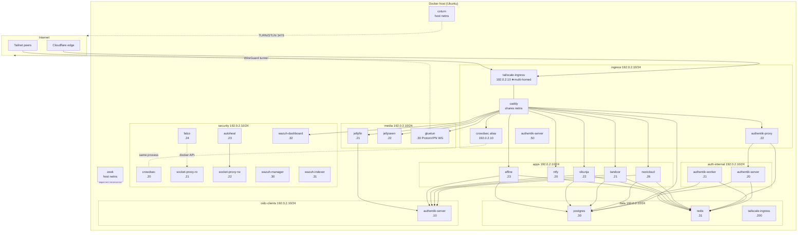
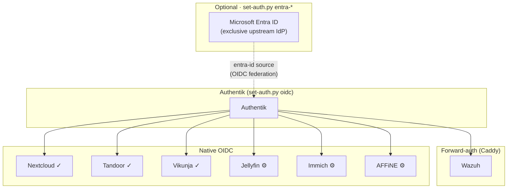
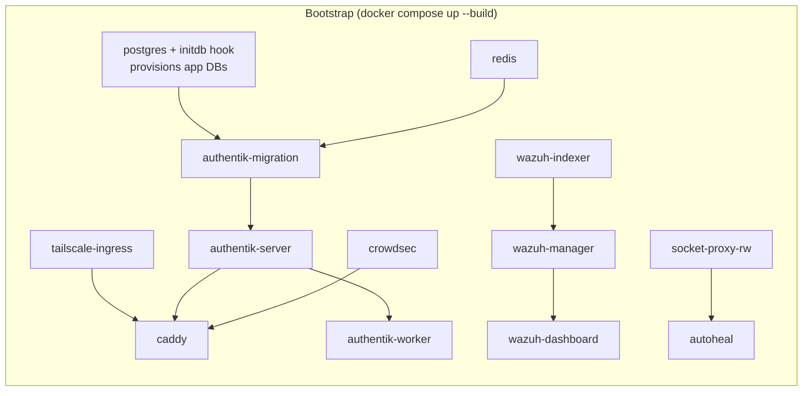

<!--kb:start-->
# OpeNirvana

> Unified self-hosted homelab stack — one `docker compose up` launches ingress hardening, SSO, SIEM, runtime security, network monitoring, shared data layer, and optional media/productivity profiles.

## Knowledge base — docs/kb/

- [Overview](docs/kb/overview.md) — purpose, motivation, architecture summary, key constraints
- [CLI reference](docs/kb/cli.md) — all operator scripts: validate.py, gen-secrets.py, check-stack.py, set-auth.py, maintain.py, profiles.py, undo-entra.py, add-service.py
- [Errors](docs/kb/errors.md) — exit code table (0–3) with triggers and fixes
- [Config](docs/kb/config.md) — .env variables, config files, Docker Compose profiles, host directory layout
- [Architecture](docs/kb/architecture.md) — modules, network topology, request/logging data flow, security model
- [Dev loop](docs/kb/dev-loop.md) — validation gate, test, lint/type-check, preferred agentic loop

## Vault card

- [OpeNirvana project card](Q:\knowledge-base\02-projects\OpeNirvana.md) — Obsidian hub card with Dataview rollups and wikilink graph
<!--kb:end-->

# Unified Stack

Single-command self-hosted foundation: one `docker compose up` brings up Caddy (custom build with Crowdsec, Coraza WAF, forward-auth, Souin cache, Brotli, L4 proxy), a Tailscale ingress sidecar, shared Postgres + Redis, Wazuh SIEM, Crowdsec LAPI, Falco runtime-security monitoring, Zeek network-security monitoring, Authentik SSO, Nextcloud, and optional media + productivity stacks — all accessible on both `*.example.com` (public, via Cloudflare) and `*.your-tailnet.example` (Tailnet).

**Priority order:** Functionality > Security > Efficiency > Stability.

**Profiles:**
- *(no profile)* — Core stack: Authentik, Nextcloud, Wazuh, Falco, Zeek, Crowdsec, Caddy
- `--profile media` — Jellyfin, Jellyseerr, Prowlarr, Radarr, Sonarr, Lidarr, qBittorrent, FlareSolverr (all via ProtonVPN)
- `--profile apps` — ntfy, Tandoor, Vikunja, AFFiNE

---

## Architectural diagrams

### Network topology



### Request flow (public)


> **OIDC exception:** Nextcloud, Vikunja, and AFFiNE skip step 8. Caddy proxies the
> request directly to the app; if the user has no session the app itself redirects to
> Authentik (`example.com`) for OIDC login, then back to the original URL.

### Authentik integration modes

Each service uses one of two auth models. `set-auth.py oidc` provisions **all** OIDC services automatically; the chart notes where a manual step is still needed after the script runs.



> **Legend:**  `✓` = `set-auth.py oidc` completes configuration end-to-end.  `⚙` = script provisions the Authentik provider/app and writes credentials to `.env`; one in-app step remains.

### Bootstrap order



### Logging pipeline


---

## Host directory layout

```
/dock/
├── conf/                    # configuration (RO in most containers)
│   ├── caddy/{Caddyfile, snippets/, coraza/, data/, logs/, souin/}
│   ├── crowdsec/{config.yaml, acquis.yaml, profiles.yaml, notifications/, db/}
│   ├── authentik/{media/, custom-templates/, certs/}
│   ├── wazuh/{manager/, indexer/, dashboard/, certs/, decoders/, rules/}
│   ├── falco/{falco.yaml, rules.d/, events.log}
│   ├── zeek/{local.zeek, node.cfg, networks.cfg, intel/, logs/current/}
│   ├── jellyfin/            # (profile: media)
│   ├── jellyseerr/          # (profile: media)
│   ├── qbittorrent/qBittorrent/qBittorrent.conf   # pre-seeds LocalHostAuth=false
│   └── ntfy/                # (profile: apps)
├── data/                    # application data (non-DB)
│   ├── authentik/
│   ├── nextcloud/               # owned 33:33 (www-data inside container)
│   ├── wazuh/{indexer/, manager/}
│   ├── jellyfin/            # (profile: media)
│   ├── ntfy/{cache/, data/} # (profile: apps)
│   ├── tandoor/{media/, static/}  # owned 1000:1000 (profile: apps)
│   ├── vikunja/             # owned 1000:1000 (profile: apps)
│   └── affine/{config/, storage/}   # (profile: apps)
├── db/                      # databases
│   ├── postgres/{data/, init.d/}
│   └── redis/
├── tail/
│   └── ingress/
└── backups/
    ├── postgres/            # maintain.py backup output
    └── redis/
```

All paths owned `svc-user:media (1010:1010)`, mode `770` (DB dirs `700`).

---

## Security model

### Ingress path

```
Internet → Cloudflare → Host UFW → Caddy (via Tailscale netns)
       → @cloudflare matcher → Crowdsec bouncer → Coraza WAF
       → Authentik forward-auth → App container          (Wazuh, *arr, qBittorrent, …)
       → App container (native OIDC redirect to Authentik)  (Nextcloud, Tandoor, Vikunja, AFFiNE)
Parallel observation: Falco (runtime) + Zeek (network)
```

### Threat × mitigation matrix

| Threat | Primary mitigation | Backup |
|---|---|---|
| Public DDoS | Cloudflare edge | CF allowlist drops non-CF traffic |
| Credential stuffing | Authentik rate-limit + MFA | Crowdsec auth-brute scenarios |
| Zero-day web exploit | Coraza OWASP CRS | Egress isolation (data + app layers separate) |
| Container escape (unknown) | Falco: terminal-shell, write-below-root, unexpected-privileged | Host UFW + kernel hardening |
| Malicious DNS exfiltration | Zeek dns.log + Intel hits → Wazuh correlation | Crowdsec egress blocklist scenarios |
| TLS-fingerprint C2 beaconing | Zeek ssl.log JA3/JA4 anomalies | Cloudflare WAF on ingress |
| Supply-chain (post-install) | Falco: execution from /tmp, unexpected outbound | Image pinning, review updates |
| Socket-proxy abuse | Falco: unauthorized Docker API; RO/RW proxy split | Proxy permission env vars |
| Leaked .env in git | .gitignore .env + CI secret scanning | Keys regenerable by docker-host-config.sh |
| Container escape (generic) | user:1010:1010, read_only, cap_drop ALL, no-new-privileges, seccomp | Falco + host UFW |
| DB exfiltration | data layer isolation, per-app DB/role, no published ports | Wazuh rule on external :5432 |
| Lateral movement | Apps never share layers; only Caddy multi-homes | Crowdsec intra-network + Zeek conn.log |
| Log tampering | Logs bind-mounted to host, Wazuh Agent reads outside Docker | Append-only from host |
| Silent backup failure | pg-backup.sh level-12 alert; skips pruning on fail | Retention floor = manual delete only |
| Tailscale key leak | Ephemeral + reusable-disabled keys | Re-issue + bounce sidecar |
| Authentik outage locks out admins | AUTHENTIK_BOOTSTRAP_TOKEN via API | Direct psql reset procedure |

---

## Quickstart

**Prerequisites** (Ubuntu 24.04+, 2+ cores, 8+ GB RAM):
- Cloudflare account managing your `PUBLIC_FQDN` zone; API token with `Zone:Read` + `DNS:Edit`.
- Tailscale account with the host already enrolled; authkey from the admin console.
- Router port-forwards to the host (see [Port Forward](#port-forward) below).

### Port Forward

Forward these ports at your router to prod-host's LAN IP:

| Port(s) | Protocol | Service | Why |
|---------|----------|---------|-----|
| 80 | TCP | Caddy | HTTP → HTTPS redirect + ACME HTTP-01 fallback |
| 443 | TCP + UDP | Caddy | HTTPS (TLS) + HTTP/3 (QUIC) |
| 3478 | TCP + UDP | coturn | STUN signaling for Nextcloud Talk WebRTC |
| 5349 | TCP + UDP | coturn | TURN over TLS (STUNS/TURNS) |
| 49152–49200 | UDP | coturn | TURN relay media range |
| 20000–20100 | UDP | Janus Gateway | WebRTC media for Nextcloud Talk video |

> **Tailscale** punches its own hole — no port forward needed for Tailnet access.
>
> **80 / 443** — if your router supports source-IP rules, restrict these to [Cloudflare's IP ranges](https://www.cloudflare.com/ips/). The `@cloudflare` matcher in the Caddyfile already enforces this at the application layer.
>
> **TURN / WebRTC ports** (3478, 5349, 49152–49200, 20000–20100) must point **directly** at the host — do not proxy them through Cloudflare. Cloudflare does not relay UDP, and these ports require a direct path for WebRTC media. coturn validates callers with time-limited HMAC credentials; no unauthenticated relay is possible.

**Steps:**

1. Clone and run the host bootstrap (creates `/dock/` tree, installs Docker, sets ownership):
   ```bash
   git clone <repo-url> ~/git/openirvana
   sudo ~/git/openirvana/unified-stack/docker-host-config.sh
   ```

2. Create `.env` from the example and set the two external keys:
   ```bash
   cd ~/git/openirvana/unified-stack
   cp .env.example .env
   # Edit .env — set TAILSCALE_AUTHKEY and CLOUDFLARE_API_TOKEN.
   # All other secrets are generated in the next step.
   # Uncomment the resource-limit tier block that matches your host.
   ```

3. Generate random secrets (pre-launch pass — Postgres, Redis, Wazuh, Authentik, Nextcloud):
   ```bash
   python3 scripts/gen-secrets.py .env
   ```
   Two secrets cannot be generated until the stack is running — `CROWDSEC_BOUNCER_API_KEY`
   (issued by CrowdSec) and `AUTHENTIK_OUTPOST_TOKEN` (issued by Authentik). Both are
   fetched automatically in step 5.

4. Bring up the stack:
   ```bash
   # Core stack only (Authentik, Nextcloud, Wazuh, Caddy, etc.):
   docker compose up -d

   # All profiles — core + media + productivity apps:
   # Requires PROTONVPN_WIREGUARD_PRIVATE_KEY in .env for --profile media.
   docker compose --profile media --profile apps up -d
   ```

5. Fetch container-issued secrets and restart the affected services:
   ```bash
   python3 scripts/gen-secrets.py .env
   docker compose up -d --no-deps --force-recreate authentik-proxy caddy
   ```
   `gen-secrets.py` is idempotent — re-run safely at any time. The second pass queries
   the running CrowdSec and Authentik containers to fill in the two remaining secrets,
   then the recreate picks them up. Re-run with `--apply` after any secret rotation to
   also sync Postgres passwords and re-seed the Wazuh OpenSearch security index.

6. Visit (replace `example.com` with your `PUBLIC_FQDN`):
   - `https://example.com` — Authentik (first run: set MFA, create users)
   - `https://example.com` — Wazuh (gated by Authentik forward-auth)
   - `https://example.com` — Nextcloud (OIDC login via Authentik — see step 6)

**Boot persistence:** `sudo systemctl enable --now compose-stack.service`

7. **Post-deploy SSO configuration** (after Authentik is reachable and users are created):

   **Authentik outpost token** — fetched automatically by `gen-secrets.py` in step 5. If
   `authentik-proxy` is still restarting after step 5, re-run:
   ```bash
   python3 scripts/gen-secrets.py .env
   docker compose up -d --no-deps --force-recreate authentik-proxy
   ```

   **OIDC setup** (`scripts/set-auth.py oidc`) — provisions Authentik OAuth2/OIDC providers for Nextcloud, Tandoor, AFFiNE, Jellyfin, Immich, and Vikunja; writes all credentials into `.env`; restarts running containers; and outputs `/dock/conf/oidc-setup-output.txt` with any remaining manual steps.

   **Before running:**

   | Requirement | How to satisfy |
   |---|---|
   | Authentik running and healthy | `docker compose up -d` — wait for healthcheck green |
   | At least one Authentik user created | `example.com` → Admin → Users → Create |
   | Jellyfin SSO plugin installed | Jellyfin admin → Plugins → Catalog → **SSO Authentication** → Install, then restart Jellyfin |
   | `JELLYFIN_API_KEY` in `.env` | Jellyfin admin → Dashboard → API Keys → New Key — paste into `.env` |
   | `IMMICH_API_KEY` in `.env` | Immich → Account Settings → API Keys → New Key — paste into `.env` |

   The last two are optional — the script prompts `[y/N]` and skips auto-config for the affected service if either key is absent. Re-run the script any time after adding missing keys.

   ```bash
   sudo python3 scripts/set-auth.py oidc
   ```

   **After running:**

   | Service | Automated? | Remaining manual step |
   |---|---|---|
   | Nextcloud | Provider + app provisioned, credentials in `.env` | Install the **OpenID Connect user backend** (`user_oidc`) app in Nextcloud admin → Apps, then run the `occ` command from `oidc-setup-output.txt` |
   | Tandoor | **Fully automatic** | None — credentials written, container restarted |
   | Vikunja | **Fully automatic** | None — credentials written, container restarted |
   | Jellyfin | **Automatic** if `JELLYFIN_API_KEY` was set | If key was missing: install SSO plugin, add key to `.env`, re-run script; or follow the `curl` command in `oidc-setup-output.txt` |
   | Immich | **Automatic** if `IMMICH_API_KEY` was set | If key was missing: add key to `.env`, re-run script; or follow the `curl` command in `oidc-setup-output.txt` |
   | AFFiNE | Provider + app provisioned, credentials in `.env` | Paste the JSON block from `oidc-setup-output.txt` into **AFFiNE Admin Panel → Settings → OAuth → OIDC OAuth provider config** |

   The output file contains exact commands and credentials for every manual step and is safe to re-generate at any time.

   > **Harden AFFiNE after deployment:** AFFiNE allows anyone to sign up and access
   > the demo workspace by default. Once SSO is configured, disable open registration:
   > **AFFiNE Admin Panel → Settings → Auth → "Whether allow new registrations" → Disable.**

### Step 8 (optional) — Entra ID federation

Gates every service behind a Microsoft Entra ID group. Skip entirely if you want Authentik local accounts only.

**Prerequisites:**

| Requirement | Notes |
|-------------|-------|
| `ENTRA_TENANT_ID` in `.env` | Azure portal → Entra ID → Overview → Tenant ID |
| Microsoft account with **Global Admin** or **Application Administrator** role | Needed during `--setup` only; used interactively via device-code, never stored |
| `pip install msal` | Only third-party dependency |
| Authentik running with break-glass local admin account active | Verified automatically by the script |

**Setup:**

```bash
# Set your tenant ID in .env first:
# ENTRA_TENANT_ID=xxxxxxxx-xxxx-xxxx-xxxx-xxxxxxxxxxxx

pip install msal
python3 scripts/set-auth.py entra-setup .env
# Follow the device-code prompt to sign in with a Global Admin account
```

**After setup:** All services require an Entra account in the configured access group (`openirvana-homies` by default). Local Authentik logins are disabled for end users; the break-glass superuser account remains active via `/if/admin/`.

**Sync group members (run on cron or manually):**

```bash
python3 scripts/set-auth.py entra-sync .env
```

**Restore local logins (recovery):**

```bash
python3 scripts/undo-entra.py .env
```

**Media stack** (optional — Jellyfin, Jellyseerr, Prowlarr, Radarr, Sonarr, Lidarr, FlareSolverr, qBittorrent via ProtonVPN):
```bash
# 1. Add PROTONVPN_WIREGUARD_PRIVATE_KEY to .env (from ProtonVPN dashboard → WireGuard config).
# 2. Ensure MEDIA_PATH and DOWNLOADS_PATH exist on the host with storage mounted.
# 3. Add DNS CNAMEs in Cloudflare: media/requests/prowlarr/radarr/sonarr/lidarr/qbit → @ (proxied).
# 4. Start the media profile:
sudo docker compose --profile media up -d
```
Jellyfin serves media directly (no VPN — accessed by users). All *arr and qBittorrent outbound
traffic (indexer requests, torrent peers) is tunneled through ProtonVPN. FlareSolverr is
internal-only; configure it in Prowlarr as `http://localhost:8191`. Jellyfin and Jellyseerr use
their own auth — no Authentik forward-auth gate (media player API clients need direct access).

**Productivity stack** (optional — ntfy, Tandoor, Vikunja, AFFiNE):
```bash
# 1. Verify productivity DB vars are set in .env (gen-secrets.py fills them).
# 2. Add DNS CNAMEs in Cloudflare: ntfy/recipes/tasks/note → @ (proxied).
# 3. Start the apps profile:
sudo docker compose --profile apps up -d
```
Tandoor, Vikunja, and AFFiNE use native Authentik OIDC (see step 6 above for setup).
ntfy uses its own token auth.

> **First-run notes:**
> - `docker-host-config.sh` creates `/dock/data/nextcloud` owned `33:33`
>   (www-data inside the container). Nextcloud will fail to start if that directory
>   is owned by anyone else. If you skipped the bootstrap script, fix it manually:
>   `sudo chown 33:33 /dock/data/nextcloud`
> - Nextcloud installs on first request (~60 s). The admin account is set by
>   `NEXTCLOUD_ADMIN_USER` / `NEXTCLOUD_ADMIN_PASSWORD` in `.env`.
> - **Auth model:** Authentik forward-auth gates services that have no native auth
>   (Wazuh, observability dashboards). Nextcloud, Tandoor, Vikunja, and AFFiNE own
>   their own login page and authenticate users via Authentik OIDC — see step 6 above.
>   Nextcloud app passwords (for desktop/mobile sync) work without going through the
>   OIDC browser flow.
> - Wazuh requires configuring the API connection inside the dashboard UI on first login.
> - **Nextcloud Talk / TURN:** After first login, go to
>   `Admin → Talk → TURN servers` (`/settings/admin/talk`) and add:
>   - Scheme: `turn`, Server: `<your-host-IP>:3478`, Secret: value of `COTURN_SECRET` in `.env`, Protocol: `UDP and TCP`.
>   Use the "Test server" button to verify connectivity. The TURN server is required for
>   WebRTC calls where both peers are behind NAT.

---

## Per-layer service index

| Layer | Service | Role |
|---|---|---|
| ingress | tailscale-ingress | Tailnet presence |
| ingress | caddy | TLS, WAF, bouncer, forward-auth |
| auth | authentik-server | SSO UI + API |
| auth | authentik-worker | Background jobs |
| auth | authentik-proxy | Forward-auth outpost (Caddy → Authentik gate) |
| auth | authentik-migration | One-shot DB migration |
| data | postgres | Shared Postgres cluster (pgvector) |
| data | redis | Shared Redis (logical DBs) |
| observability | crowdsec | Behavioral bans + blocklist |
| observability | socket-proxy-ro | Read-only Docker API |
| observability | socket-proxy-rw | R/W Docker API (Autoheal only) |
| observability | autoheal | Restart unhealthy containers |
| observability | falco | Runtime container security |
| observability | wazuh-manager | SIEM event ingest |
| observability | wazuh-indexer | OpenSearch index |
| observability | wazuh-dashboard | Web UI |
| host-net | zeek | Network security monitoring |
| host-net | coturn | TURN/STUN server for Nextcloud Talk WebRTC |
| apps | nextcloud | File sync + collaboration |
| apps | gluetun | ProtonVPN WireGuard gateway *(profile: media)* |
| apps (via gluetun) | prowlarr | Indexer manager *(profile: media)* |
| apps (via gluetun) | radarr | Movie management *(profile: media)* |
| apps (via gluetun) | sonarr | TV show management *(profile: media)* |
| apps (via gluetun) | lidarr | Music management *(profile: media)* |
| apps (via gluetun) | flaresolverr | Cloudflare bypass for indexers — internal only *(profile: media)* |
| apps (via gluetun) | qbittorrent | BitTorrent client *(profile: media)* |
| apps | jellyfin | Media server — GPU transcoding *(profile: media)* |
| apps | jellyseerr | Media request management *(profile: media)* |
| productivity | ntfy | Push notification server *(profile: apps)* |
| productivity | tandoor | Recipe manager *(profile: apps)* |
| productivity | vikunja | Task/project management *(profile: apps)* |
| productivity | affine | Collaborative workspace *(profile: apps)* |

---

## Scripts reference

All scripts live in `unified-stack/scripts/`. Run them from the `unified-stack/` directory unless noted otherwise.

| Script | Purpose | When to run | Idempotent | Root/sudo |
|--------|---------|-------------|:----------:|:---------:|
| `gen-secrets.py` | Fill blank secrets in `.env`; fetch container-issued keys on second pass | (1) Before `compose up`; (2) after stack is running; (3) after any secret rotation | Yes | No |
| `set-auth.py oidc` | Provision Authentik OIDC providers for all apps; write credentials to `.env`; optionally create paired Entra/Authentik security groups and sync membership (`--sync`) | After Authentik is healthy and users exist; re-run to add missing services | Yes | No |
| `set-auth.py entra-*` | Federate Authentik with Microsoft Entra ID; gate all logins on an Entra group | `--setup` once to enable; `--sync` on cron for membership updates | Yes | No |
| `undo-entra.py` | Disable Entra ID federation; restore local password login | Entra lockout recovery or to roll back federation | Yes | No |
| `maintain.py` | Postgres backup, Zeek intel refresh, and Wazuh agent sync — unified daily maintenance | Nightly via cron; individually as needed | Yes | Docker socket / **Yes** (wazuh) |
| `fix-permissions.sh` | Fix bind-mount ownership for services that run as a non-standard UID with `cap_drop:ALL` | After adding a new service; after an `EACCES` error on a bind-mount path | Yes | **Yes** |
| `check-stack.py` | Audit every subdomain (Caddyfile, DNS, auth gate, HTTP probe) + container health table | After deploy, after DNS changes, or to diagnose service issues | Yes (read-only) | No |

---

### `gen-secrets.py`

**Why:** Blank secrets cause containers to reject startup or use insecure defaults. This script is the safe, idempotent alternative to setting secrets by hand — it never overwrites a value that is already populated.

**Two-pass workflow:**

**Pass 1 — before `docker compose up`:** Generates random values for every blank secret: Postgres superuser and per-app DB passwords, Redis auth token, Wazuh API and indexer passwords, Authentik bootstrap token and secret key, Nextcloud admin password, coturn HMAC secret, and more.

**Pass 2 — after the stack is running:** Queries the running CrowdSec container for a bouncer API key (`CROWDSEC_BOUNCER_API_KEY`) and the Authentik container for the embedded outpost token (`AUTHENTIK_OUTPOST_TOKEN`). Both are required by Caddy and `authentik-proxy` respectively and cannot be generated until their issuing containers are healthy.

```bash
# Pass 1 — fill random secrets before first launch
python3 scripts/gen-secrets.py .env

# Pass 2 — fetch container-issued secrets; restart affected services
python3 scripts/gen-secrets.py .env
docker compose up -d --no-deps --force-recreate authentik-proxy caddy

# After any secret rotation — also syncs Postgres passwords and reseeds Wazuh index
python3 scripts/gen-secrets.py .env --apply

# Set a single key if currently empty (used internally by docker-host-config.sh)
python3 scripts/gen-secrets.py .env --set HOST_PUBLIC_IP=1.2.3.4
```

Idempotent: any variable that is already non-empty is printed as `skip` and left unchanged.

---

### `set-auth.py oidc`

**Why:** Each OIDC-capable app requires a registered OAuth2 provider in Authentik (with a generated client ID and secret) *and* the credentials written into the app's own config. Doing this manually means eight Authentik API calls per service plus editing `.env` by hand. This script automates all of it end-to-end.

**What it does:** Creates an Authentik OAuth2/OIDC provider and application for each service, writes the generated credentials into `.env`, restarts any affected running containers, and outputs `oidc-setup-output.txt` containing exact commands for any remaining manual step (Nextcloud `occ`, AFFiNE admin UI JSON, Jellyfin/Immich curl commands).

Services covered: **Nextcloud, Tandoor, Vikunja, AFFiNE, Jellyfin** (requires `JELLYFIN_API_KEY` in `.env`), **Immich** (requires `IMMICH_API_KEY` in `.env`). The script prompts `[y/N]` for Jellyfin and Immich if their API keys are absent and skips auto-config for those services — re-run after adding the keys.

```bash
# Authentik must be healthy and at least one user must exist
sudo python3 scripts/set-auth.py oidc

# Also provision Entra + Authentik security groups and bind OIDC access policies
# (requires OIDC_ENTRA_* vars in .env — see "Entra App Registration" section below)
python3 scripts/set-auth.py oidc

# Provision + sync Entra group members into Authentik users/groups
python3 scripts/set-auth.py oidc --sync

# Re-run at any time; services with an existing CLIENT_ID are skipped
```

Idempotent: any service whose `_CLIENT_ID` variable is already populated is skipped.

---

### Entra App Registration for OIDC Group Management

**What this App Registration does**

Creates per-service security groups in Microsoft Entra (Azure AD) and mirrors their membership into Authentik. This is separate from `set-auth.py entra-*`'s `Authentik-Sync` App Registration (which federates *authentication*). This registration is only about *authorisation groups* — it lets you control which users can access which services by managing Entra group membership.

**Pre-requisites**

- `set-auth.py oidc` has already run successfully (Authentik OIDC providers exist).
- An Azure account with permission to create App Registrations and grant admin consent.

**Step-by-step: create the App Registration**

1. Azure portal → Entra ID → App registrations → New registration
2. Name: `Authentik-OIDC-Groups` (or any name)
3. Supported account types: **Single tenant**
4. Redirect URI: none
5. After creation, note the **Application (client) ID** and **Directory (tenant) ID**
6. Certificates & secrets → New client secret → note the **Value** (shown once)
7. API permissions → Add a permission → Microsoft Graph → **Application permissions** → add:

| Permission | Purpose |
|---|---|
| `Group.ReadWrite.All` | Create and read per-service security groups |
| `GroupMember.Read.All` | List group members for `--sync` |
| `User.Read.All` | Resolve member UPN/email for Authentik user lookup |

8. Grant admin consent for your organisation.

**`.env` configuration**

```
OIDC_ENTRA_TENANT_ID=<Directory (tenant) ID>
OIDC_ENTRA_CLIENT_ID=<Application (client) ID>
OIDC_ENTRA_CLIENT_SECRET=<client secret value>

# Optional — change group naming prefixes (defaults shown)
ENTRA_GROUP_PREFIX=authentik
AUTHENTIK_GROUP_PREFIX=entra
```

**Running**

```bash
# Provision OIDC providers and create/bind groups (no member sync)
python3 scripts/set-auth.py oidc

# Provision + sync Entra group members into Authentik users/groups
python3 scripts/set-auth.py oidc --sync
```

Without `--sync`, only group creation and policy binding run. With `--sync`, provisioning runs first then member sync follows. Add `--sync` to the daily cron in `docker-host-config.sh` to keep group membership current.

---

### `set-auth.py entra-*`

**Why:** Centralises identity management in Microsoft Entra ID so that user provisioning and deprovisioning are managed once in your Microsoft tenant. All stack services automatically enforce Entra group membership through Authentik, with zero per-app changes.

**What `--setup` does:**
1. Opens a device-code browser session — always required so the script can read and patch the App Registration (Application.* Graph permissions are not available to client credentials)
2. Creates or finds the App Registration and reconciles redirect URIs
3. Generates a client secret and writes it to `.env` (first run only; existing secret is preserved on re-run)
4. Creates per-service Entra security groups and Authentik groups with access policy bindings
5. Creates an Authentik OIDC source pointing at the Entra tenant with the correct authentication and enrollment flows
6. Creates an expression policy that gates all logins on Entra group membership
7. Enforces Entra-only login (removes local password form; preserves break-glass admin at `/if/admin/`)
8. Verifies a break-glass superuser account exists in Authentik before enforcing (prevents self-lockout)

**What `--sync` does:** Reads transitive group members from Entra and upserts matching Authentik users (create, update, or deactivate). Uses client credentials — no browser required.

**Required App Registration permissions** (Application type, admin consent required):

| Permission | Used by | Purpose |
|---|---|---|
| `Application.Read.All` | `--setup` | Look up App Registration by appId to check redirect URIs |
| `Application.ReadWrite.OwnedBy` | `--setup` | Patch missing redirect URIs on re-runs |
| `Group.ReadWrite.All` | `--setup` | Create and manage per-service Entra security groups |
| `GroupMember.Read.All` | `--sync` | Read transitive group membership |
| `User.Read.All` | `--sync` | Read user profiles (email, display name, enabled state) |

`--setup` automatically grants admin consent for all five during initial setup (phase 1). If consent was granted manually in the portal, re-running `--setup` skips already-granted roles.

**Application owner:** `Application.ReadWrite.OwnedBy` only allows the service principal to manage App Registrations it *owns*. After initial setup, add the app's service principal as an owner of its own App Registration so this permission is effective:

> Azure Portal → **App registrations** → [your app] → **Owners** → **Add owners** → search the app's display name → select the **service principal** entry → Save.

This is a one-time step. Without it, redirect URI updates during re-runs will return 403 even with the permission granted.

```bash
# Prerequisites: set ENTRA_TENANT_ID in .env, then:
pip install msal
python3 scripts/set-auth.py entra-setup .env
# Follow the device-code prompt — sign in with a Global Admin account

# Sync group membership (run on cron):
python3 scripts/set-auth.py entra-sync .env

# Cron example (daily at 5 AM — run from unified-stack/ to print the entry):
#   echo "0 5 * * * root cd $(realpath .) && python3 scripts/set-auth.py entra-sync .env"
```

Idempotent: existing App Registration, groups, and Authentik source are detected and reused on re-run. `--sync` is always safe to run multiple times.

---

### `undo-entra.py`

**Why:** If Entra ID becomes unavailable or misconfigured after running `set-auth.py entra-*`, local Authentik logins are blocked. This script restores the password login form without touching your Entra tenant and without destroying synced user accounts.

**What it does:** Disables the `entra-id` Authentik source (stops Entra-federated logins) and removes the expression policy that was gating logins on group membership. Synced user accounts and the App Registration in Entra are left untouched.

```bash
python3 scripts/undo-entra.py .env
```

Idempotent: disabling an already-disabled source is a no-op. Re-run `set-auth.py entra-setup` to re-enable federation.

> **Note:** This script only modifies Authentik. To delete the App Registration from Entra itself, remove it manually in the Azure portal.

---

### MFA setup (part of `docker-host-config.sh`)

**Why:** SSH password authentication is the most common attack vector on internet-facing Linux hosts. This step enforces key + TOTP two-factor authentication in a single guided interactive session.

**What it does:**
1. Installs `libpam-google-authenticator`
2. Runs `google-authenticator` interactively — generates a TOTP secret, displays a QR code to scan in an authenticator app (Authy, Google Authenticator, 1Password, etc.), and writes `~/.google_authenticator`
3. (Optional) Generates an `ed25519` SSH key for the host user and prints the public key
4. (Optional) Disables SSH password authentication and configures PAM to require TOTP on every login

MFA setup is called automatically at the end of `docker-host-config.sh`. It is skipped on re-runs if `~/.google_authenticator` already exists (TOTP setup is not idempotent). SSH key generation is also skipped if a key already exists at `~/.ssh/id_ed25519`.

> **IMPORTANT:** Keep your existing SSH session open. Verify key + TOTP login works in a *second* terminal before closing the first. If locked out, use host console or VNC access to restore `/etc/ssh/sshd_config`.

---

### `maintain.py`

**Why:** Three nightly maintenance tasks — Postgres backup, Zeek intel refresh, and Wazuh agent sync — are unified into a single entry point with subcommands, so cron has one job, logs go to one place, and operators learn one tool.

**Subcommands:**

| Subcommand | What it does | Requires root |
|------------|-------------|:-------------:|
| `backup` | `pg_dumpall` → zstd compress → timestamped dump in `/dock/backups/postgres/`. Prunes dumps older than `POSTGRES_BACKUP_RETENTION_DAYS` (default 14). On failure, emits a CRITICAL JSON event to the CrowdSec decisions log for Wazuh to alert on. | Docker socket |
| `intel` | Downloads URLhaus, Feodo Tracker, and CrowdStrike domain feeds; converts each to Zeek Intel TSV using Python's `csv` module; atomically replaces the previous file only if download + conversion succeed; calls `zeekctl deploy` to reload the Intel framework. | Docker socket |
| `wazuh` | Diffs repo decoders/rules against `/var/ossec/etc/` file-by-file; copies changed XML files with `root:wazuh 640` ownership; splices `agent-host.conf` localfile stanzas into `ossec.conf` once; restarts `wazuh-agent` only when something changed. | **Yes** |
| `all` | Runs `backup → intel → wazuh` in sequence. | Docker socket + **Yes** |

```bash
# Run all maintenance tasks
sudo python3 scripts/maintain.py all

# Individual subcommands
sudo python3 scripts/maintain.py backup
python3 scripts/maintain.py intel
sudo python3 scripts/maintain.py wazuh

# Cron (nightly at 2 AM — docker-host-config.sh installs this automatically):
# To install manually, run from unified-stack/ to print the entry:
#   echo "0 2 * * * root python3 $(realpath scripts/maintain.py) all >> /var/log/maintain.log 2>&1"
```

**Restore a Postgres backup:**
```bash
zstd -d /dock/backups/postgres/dump-YYYYMMDD-HHMMSS.sql.zst --stdout \
  | docker exec -i postgres psql -U <POSTGRES_SUPERUSER>
```

**Prerequisites for `wazuh`:** Host-level `wazuh-agent` must be installed. Install from [Wazuh's package repository](https://documentation.wazuh.com/current/installation-guide/wazuh-agent/index.html). `/var/ossec/bin/wazuh-control` must exist and be executable.

---

### `fix-permissions.sh`

**Why:** Docker containers that use `cap_drop: ALL` lose the `DAC_OVERRIDE` capability. This means their root user (UID 0) is bound by normal Unix permission checks and cannot access directories it does not own — unlike a full-privilege root that bypasses DAC entirely. Services in this category fail at startup with `EACCES` on their bind-mount paths, even though the container is running as root.

The standard `docker-host-config.sh` creates all `/dock/conf/<svc>` and `/dock/data/<svc>` directories as `svc-user:media` (1010:1010). That works for most containers. Containers that run as UID 0 with `cap_drop: ALL` need their directories owned by `root:root` instead.

**Currently patched services:**

| Service | Container UID | Why exception needed |
|---------|:---:|---|
| AFFiNE | 0 (root) | Runs as root with `cap_drop: ALL` — restricted root cannot traverse `1010:1010 770` storage directory |

**What it does:** Applies `svc-user:media` to all standard service directories, then overrides known exceptions to the correct UID:GID for that service.

```bash
sudo bash scripts/fix-permissions.sh
# Then restart affected services:
docker compose --profile apps up -d --no-deps --force-recreate affine
```

**When to add a new exception:** If a new service fails with `EACCES` on a bind-mount path, run `python3 scripts/check-stack.py --logs <service>` to confirm, then check the container's UID with `docker run --rm --entrypoint id <image>`. If it runs as a non-standard UID with `cap_drop: ALL`, add an entry to `fix-permissions.sh`.

---

### `check-stack.py`

**Why:** After a deployment or DNS change it is easy to miss a misconfigured Caddyfile route, a missing DNS record, or an auth gate that is not firing. A forward-auth service returning `200` without credentials is a security hole. This script gives a single-command, colour-coded full-stack health view — covering both external reachability and local container state.

**What it does:**

*Service audit table* — for every `*_SUBDOMAIN` variable in `.env`:
1. Looks up the Caddyfile handler and upstream backend
2. Queries Cloudflare DNS for a matching record
3. Determines the auth mode — `forward-auth`, `native-OIDC`, or `identity-provider`
4. Probes the URL without credentials — forward-auth services must return `302 → auth`, not `200`
5. Probes the URL with `Authorization: Bearer <AUTHENTIK_BOOTSTRAP_TOKEN>` — expects `200` or a service-own redirect
6. Lists orphan DNS records (Cloudflare records with no matching `_SUBDOMAIN` var) and orphan Caddyfile backends (handler defined but no env var)

*Container health table* — runs `docker compose ps` and prints every container with its state (`running` / `exited`), healthcheck status (`healthy` / `unhealthy` / `starting`), and uptime string. Containers that are restarting or unhealthy are highlighted red.

Output is a colour-coded table. Green = OK, yellow = warning, red = misconfiguration.

```bash
# Full audit — DNS + live HTTP probes + container health
python3 scripts/check-stack.py

# Config-only audit — no live HTTP calls, still shows container health
python3 scripts/check-stack.py --no-probe

# Skip container health table (useful from a remote workstation)
python3 scripts/check-stack.py --no-containers

# Tail logs for a specific container (50 lines by default)
python3 scripts/check-stack.py --logs vikunja
python3 scripts/check-stack.py --logs gluetun --tail 100

# Plain text output for logging or narrow terminals
python3 scripts/check-stack.py --no-color | tee audit.txt
```

`CLOUDFLARE_API_TOKEN` and `AUTHENTIK_BOOTSTRAP_TOKEN` must be set in `.env` for DNS and HTTP probes respectively. Both can be omitted when using `--no-probe`. Container health requires `docker compose` to be available on PATH.

---

## Troubleshooting

- **Caddy stuck on ACME**: check `docker logs caddy`; verify Cloudflare token has `Zone:read + DNS:edit` on the zone.
- **Wazuh indexer OOM**: check tier block; MED/LOW tiers halve JVM heap; or add swap.
- **Falco eBPF driver fails to load**: set `FALCO_DRIVER=ebpf` in `.env` (legacy probe) and restart falco.
- **Authentik admin lockout**: `docker exec -it authentik-server ak shell` → `from authentik.core.models import User; u = User.objects.get(username='akadmin'); u.set_password('newpass'); u.save()`. If locked out via Entra ID (not local password), run `python3 scripts/undo-entra.py .env` to restore the password login form without touching Entra or synced users.
- **Postgres backup failed alert**: check `/var/log/pg-backup.log`; pruning is paused until next success.
- **Zeek not logging**: `docker exec zeek zeekctl status`; if `crashed`, check `/dock/conf/zeek/logs/current/stderr.log`.
- **GlueTUN not connecting**: check `docker logs gluetun`; verify `PROTONVPN_WIREGUARD_PRIVATE_KEY` is the raw base64 key (not a config file path). If connecting but leaking: confirm `FIREWALL_OUTBOUND_SUBNETS=192.0.2.10/8` is set.
- **\*arr can't reach indexers / qBittorrent not seeding**: VPN tunnel may be down. Run `docker exec gluetun wget -qO- https://ifconfig.io` — if it returns your ISP's IP instead of the VPN IP, GlueTUN needs to reconnect.
- **Nextcloud Talk TURN test fails**: confirm 3478/UDP+TCP and 49152–49200/UDP are port-forwarded at the router to the host IP. Check `docker logs coturn` for authentication errors. Verify `COTURN_SECRET` in `.env` matches the secret entered in Talk admin settings.
- **Jellyfin no GPU transcoding**: ensure the host has `/dev/dri` (Intel: `intel-media-va-driver`, AMD: `mesa-va-drivers`). Check `docker logs jellyfin` for permission errors on `/dev/dri/renderD128`.
- **Tandoor 500 on startup**: `docker logs tandoor` — usually a missing `SECRET_KEY` or DB not yet provisioned. Run `gen-secrets.py` and verify `TANDOOR_DB_NAME/USER/PASSWORD` are set.
- **Vikunja "JWT secret must be set"**: `VIKUNJA_JWT_SECRET` is empty. Run `python3 scripts/gen-secrets.py .env` to fill it.
- **AFFiNE WebSocket disconnects / CORS errors**: `AFFINE_SERVER_EXTERNAL_URL` must exactly match the URL in the browser (scheme + hostname, no trailing slash). Update `.env` and restart affine.
- **ntfy push not delivered**: check `docker logs ntfy`. Ensure `NTFY_BASE_URL` matches the public URL. Confirm the topic's subscriber is connected and `NTFY_AUTH_DEFAULT_ACCESS=deny-all` is working with the correct token.

#### Entra ID lockout (can't sign in via Microsoft)

If Entra ID is unavailable or misconfigured after running `set-auth.py entra-setup`, restore local logins without touching Entra:

```bash
python3 scripts/undo-entra.py .env
```

This disables the `entra-id` Authentik source and restores the password login form. Synced users are preserved; the App Registration in Entra is untouched. Re-run `set-auth.py entra-setup` to re-enable federation.

#### `check-stack.py`

| Symptom | Likely cause | Fix |
|---------|-------------|-----|
| `.env` not found | Wrong working directory | Run from `unified-stack/`: `python3 scripts/check-stack.py` |
| All services show `UNAUTH: skipped` | `AUTHENTIK_BOOTSTRAP_TOKEN` blank in `.env` | Run `python3 scripts/gen-secrets.py .env` to generate the token |
| DNS column shows `skipped` for all rows | `CLOUDFLARE_API_TOKEN` not set in `.env` | Set it, or use `--no-probe` for a config-only run |
| Forward-auth service shows `200 OPEN` | Auth gate not firing — request reaching the app without authentication | Check that the service subdomain is **not** listed in the `@requires-auth-pub` exclusion block in the Caddyfile |
| All services show `unreachable (0)` | Stack not running, or script run from a machine with no internet access | Script probes public `*.example.com` URLs — run from a machine that can reach them; or run on prod-host with `--no-probe` for config-only |
| Service shows `502` on authed probe | Service container is down or misconfigured | Rerun with `--logs <service>` to see the container crash reason |
| `AUTHED: 401` | Bootstrap token rejected | Token may have been rotated; re-run `python3 scripts/gen-secrets.py .env` to refresh |
| Orphan DNS records listed at the bottom | Stale Cloudflare records from removed services, or records that pre-date `.env` vars | Delete stale records in the Cloudflare dashboard, or add the matching `_SUBDOMAIN` var to `.env` |
| Orphan Caddyfile backends listed | Caddyfile handler defined for a service whose `_SUBDOMAIN` var is not in `.env` | Enable the profile that sets the var (`--profile media` / `--profile apps`) or add the var manually |
| Column widths misaligned | Terminal width below ~160 chars | Use `--no-color` and pipe through `less -S`, or redirect to a file |
| Container health table shows `(no containers found)` | Stack not running, or wrong project path | Run from `unified-stack/`; verify `--compose` points to `docker-compose.yml` |
| Container shows `Restarting` in health table | Container crash-looping | Run `python3 scripts/check-stack.py --logs <service>` to inspect the crash reason |

#### `tests/test_setup_entra.py` (pytest)

The test suite runs entirely in-process using `unittest.mock` — no live network calls, no Authentik connection, and no Entra or Azure credentials required.

```bash
# Install pytest if not present (Ubuntu)
sudo apt-get install -y python3-pytest

# Run all tests from unified-stack/
python3 -m pytest tests/test_setup_entra.py -v

# Run a single test
python3 -m pytest tests/test_setup_entra.py::test_msal_guard_exits_when_missing -v
```

| Symptom | Likely cause | Fix |
|---------|-------------|-----|
| `No module named pytest` | pytest not installed | `sudo apt-get install python3-pytest` or `pip install pytest` |
| `ModuleNotFoundError: No module named 'scripts.setup_entra'` | Test run from wrong directory | Run from `unified-stack/`, not from repo root |
| `collected 0 items` | pytest cannot find tests | Verify test function names start with `test_`; check for syntax errors in the test file |
| `AttributeError: module has no attribute 'X'` | A function in `set-auth.py entra-*` was renamed | Check `set-auth.py entra-*` for the current function name and update the corresponding `@patch` target in the test |
| `SystemExit not raised` | Script guard condition changed | The test asserts `pytest.raises(SystemExit, match=...)` — verify the guard in `set-auth.py entra-*` still calls `sys.exit(1)` on the expected condition |
| msal-related test fails despite msal being installed | Import path in `@patch` does not match the import in the script | The patch target must be `scripts.setup_entra.msal`, not `msal` — match the module path where msal is imported, not where it is defined |

---

## Adding a new app (Phase 3+)

1. Add a new section in `.env` with `<APP>_DB_NAME`, `<APP>_DB_USER`, `<APP>_DB_PASSWORD` (leave password empty — `docker-host-config.sh` fills it on next run).
2. Add a new handle block in `templates/caddy/Caddyfile` for both site stanzas. Choose
   the auth model that fits the app:

   **Caddy forward-auth** (app has no auth of its own — e.g. Wazuh):
   ```caddyfile
   @newapp host newapp.{$PUBLIC_FQDN}
   handle @newapp {
       reverse_proxy newapp:<port>
   }
   ```
   The global `forward_auth` directive already gates everything that isn't listed in the
   `@requires-auth-pub` / `@requires-auth-ts` exclusion blocks — no extra import needed.

   **Native OIDC** (app handles its own login — e.g. Nextcloud, Vikunja, AFFiNE):
   ```caddyfile
   @newapp host newapp.{$PUBLIC_FQDN}
   handle @newapp {
       reverse_proxy newapp:<port>
   }
   ```
   Then add `not host {$NEWAPP_SUBDOMAIN}.{$PUBLIC_FQDN}` to the `@requires-auth-pub`
   and `@requires-auth-ts` matchers, and configure OIDC inside the app itself.

3. Add the app's service in `docker-compose.yml`. Join its own layer (create one if needed:
   `192.0.2.10/24` for media, `192.0.2.10/24` for apps, etc.) + `data` for
   Postgres/Redis access. For native-OIDC apps also add the `oidc-clients` network so the
   app can reach `authentik-server:9000` for token validation without exposing authentik-worker.
4. Add tailscale-ingress multi-home: add the new layer to its `networks:` list.
5. Restart: `docker compose up -d --build`.

---

## `add-service.py` (repo root)

Scaffolds and fully provisions a new service in one command. For unified+Authentik services every
external-facing dependency — Caddy routing, DNS, Authentik app registration, and env vars — is
wired automatically.

```
python add-service.py <name> [options]
```

### Options

| Flag | Default | Description |
|------|---------|-------------|
| `--port PORT` | `80` | Internal container port |
| `--image IMAGE` | placeholder | Docker image |
| `--type {standalone,unified}` | `standalone` | `standalone` = dev/ Tailscale-sidecar; `unified` = Caddy + Authentik |
| `--auth {authentik,native-oidc,none}` | `authentik` | Auth gate for unified type |
| `--db {none,postgres,redis,both}` | `none` | Add local DB sidecar(s) — standalone only |
| `--subdomain SLUG` | service name | External subdomain slug (e.g. `hoard` → `example.com`) |
| `--out DIR` | `./dev/<name>` or `./unified-stack/services/<name>` | Output base directory |
| `--dry-run` | off | Print what would happen without writing files or calling external APIs |
| `--no-host-setup` | off | Skip SSH host provisioning (print manual commands instead) |
| `--ssh-host USER@HOST` | `admin@prod-host` | SSH target for host provisioning |
| `--ssh-key PATH` | `~/.ssh/prod-host` | SSH identity file |
| `--repo-path PATH` | `/home/admin/openirvana` | Repo path on the Docker host |

### Prerequisites for cloud provisioning

For `--type unified --auth authentik` the script reads these vars from `unified-stack/.env`:

| Variable | Purpose |
|----------|---------|
| `CLOUDFLARE_API_TOKEN` | Create the public CNAME record for the service |
| `AUTHENTIK_BOOTSTRAP_TOKEN` | Register the proxy provider + application in Authentik |
| `AUTHENTIK_SUBDOMAIN` | Authentik's own subdomain (used to build the API base URL) |
| `PUBLIC_FQDN` | Root domain (e.g. `example.com`) |
| `TAILNET_FQDN` | Tailnet FQDN for Caddy's tailnet site block |

These are already present for normal stack operation; no extra setup is required.

### What it does automatically

**For all types** (non-`--dry-run`):

- Generates service files in `unified-stack/services/<name>/` (unified) or `dev/<name>/` (standalone)
- SSHes to the Docker host and runs `fix-permissions.sh --service <name>` to create
  `/dock/conf/<name>` and `/dock/data/<name>` with `svc-user:media 770`

**Additionally for `--type unified --auth authentik`**, the following 7 provisioning steps run
automatically after scaffold. Each step is idempotent — re-running skips anything already done:

| Step | What happens |
|------|-------------|
| **1. Caddyfile** | Inserts `(backend-<name>)` snippet, public `@<name>` handle, and tailnet `@<name>-ts` handle into `templates/caddy/Caddyfile` |
| **2. `.env`** | Appends `<NAME>_SUBDOMAIN=<slug>` to `unified-stack/.env` if not already set |
| **3. `.env.example`** | Inserts `<NAME>_SUBDOMAIN=<slug>` after the last `_SUBDOMAIN=` line in `.env.example` |
| **4. Caddy reload** | Runs `docker exec caddy caddy reload --config /etc/caddy/Caddyfile` if the Caddyfile changed |
| **5. Cloudflare DNS** | Creates a proxied CNAME `<subdomain>.<domain>` pointing at the same target as `auth.<domain>` |
| **6. Authentik** | Creates a `forward_single` proxy provider + application, assigns it to the embedded outpost |
| **7. Health check** | Runs `check-stack.py` so you see live status of all services immediately |

### What requires manual follow-up

| Step | Standalone | Unified (authentik) |
|------|-----------|---------------------|
| Set the Docker image | Edit `IMAGE_URL` in `dev/<name>/.env` | Edit `image:` in the generated service block in `docker-compose.yml` |
| Set the Tailscale auth key | Edit `TS_AUTHKEY` in `dev/<name>/.env` | N/A — unified uses the shared ingress |
| Add service block to compose | N/A | Paste the printed block into `unified-stack/docker-compose.yml` |
| Start the service | `docker compose --env-file dev/<name>/.env -f dev/<name>/docker-compose.yml up -d` | `docker compose up -d <name>` |
| OIDC integration | N/A | If the service uses Authentik SSO, run `python3 scripts/set-auth.py oidc` after start |
| Special UID permissions | N/A | If the service runs as a non-standard UID with `cap_drop:ALL`, add it to `fix-permissions.sh` and re-run |

### Re-provisioning an existing service

If `unified-stack/services/<name>` already exists the script skips scaffold and runs provisioning
only. This is useful to repair a partially-provisioned service or to apply any step that was
missed (e.g. because `CLOUDFLARE_API_TOKEN` was not set at creation time):

```bash
python add-service.py hoarder --port 3000 --type unified
# → "hoarder already exists — skipping scaffold, running provisioning only"
# All 7 steps run; already-done steps are silently skipped.
```

### Examples

```bash
# Standalone service (Tailscale-sidecar, Postgres + Redis sidecars):
python add-service.py paperless --port 8000 --type standalone --db both

# Unified service — scaffold + full provisioning (DNS, Authentik, Caddyfile, env):
python add-service.py hoarder --port 3000 --type unified

# Unified service with a custom subdomain slug:
python add-service.py actual-budget --port 5006 --type unified --subdomain budget

# Unified service with native OIDC (service handles its own login, no Authentik proxy):
python add-service.py gitea --port 3000 --type unified --auth native-oidc

# Preview everything without writing files or calling external APIs:
python add-service.py myapp --port 9000 --type unified --dry-run

# Write files but skip SSH host provisioning:
python add-service.py myapp --port 9000 --no-host-setup
```
