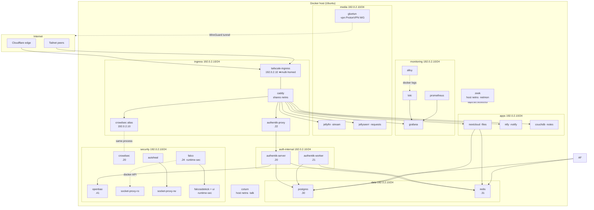
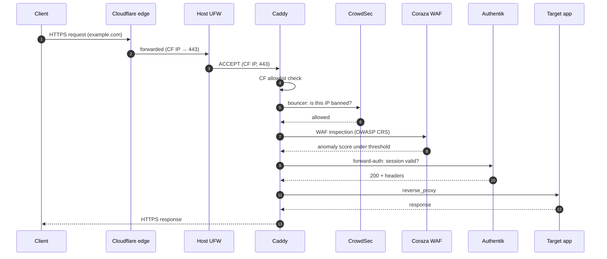
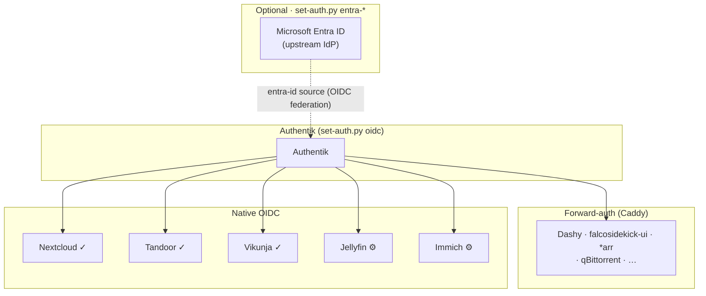
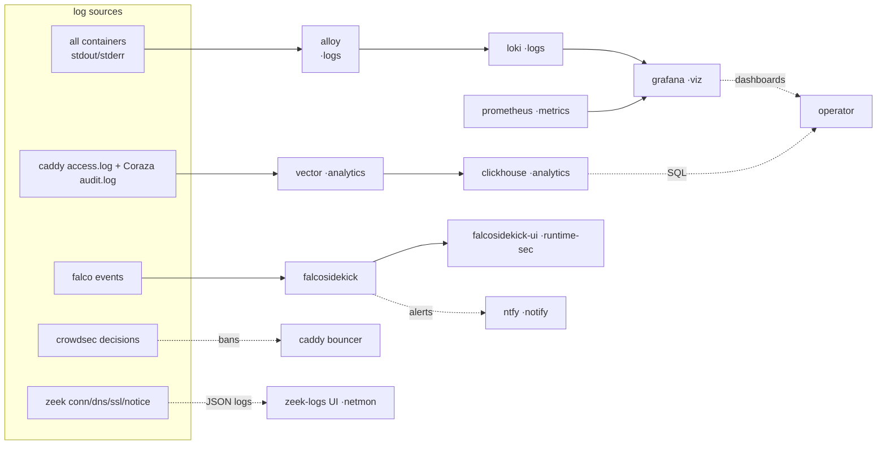
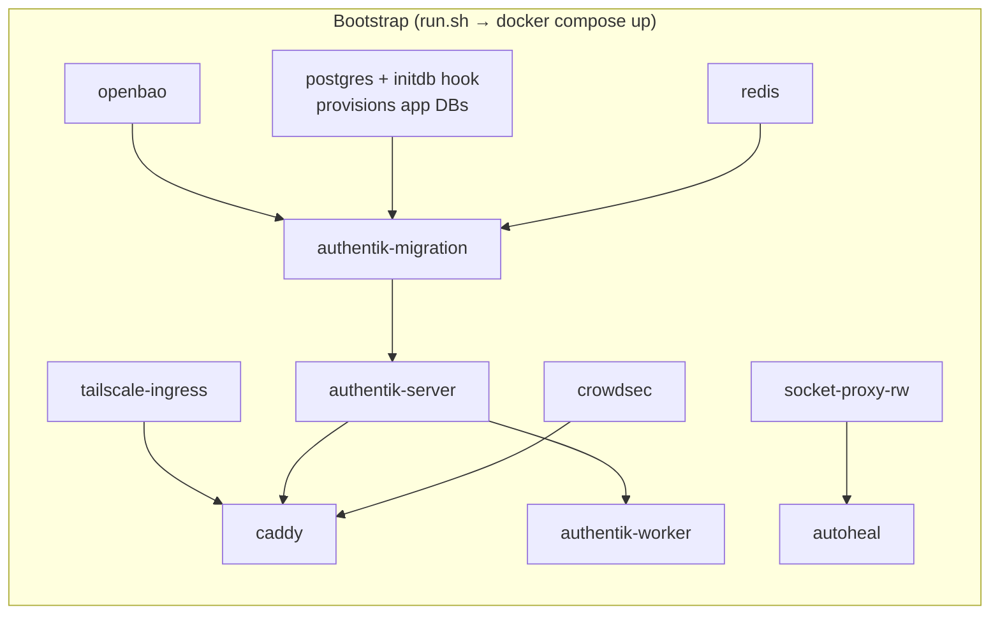

<!--kb:start-->
# OpeNirvana

> Unified self-hosted homelab stack — one `docker compose up` launches ingress hardening, SSO, SIEM, runtime security, network monitoring, shared data layer, and optional media/productivity profiles.

## Knowledge base — docs/kb/

- [Overview](docs/kb/overview.md) — purpose, motivation, architecture summary, key constraints
- [CLI reference](docs/kb/cli.md) — all operator scripts: validate.py, gen-secrets.py, check-stack.py, set-auth.py, maintain.py, profiles.py, undo-entra.py, add-service.py
- [Errors](docs/kb/errors.md) — exit code table (0–3) with triggers and fixes
- [Config](docs/kb/config.md) — .env variables, config files, Docker Compose profiles, host directory layout
- [Architecture](docs/kb/architecture.md) — modules, network topology, request/logging data flow, security model
- [Dev loop](docs/kb/dev-loop.md) — validation gate, test, lint/type-check, preferred agentic loop

## Vault card

- [OpeNirvana project card](Q:\knowledge-base\02-projects\OpeNirvana.md) — Obsidian hub card with Dataview rollups and wikilink graph
<!--kb:end-->

# Unified Stack

A profile-gated, self-hosted **security + productivity** stack for a single Ubuntu host.
One command brings up the whole thing:

```bash
bash <(curl -fsSL https://example.com)
```

**What it does, in three lines:**

- **Caddy** (custom build: CrowdSec bouncer, Coraza WAF, forward-auth, Souin cache, Brotli, L4) terminates TLS and is the only ingress.
- **Authentik** provides SSO — forward-auth for services with no native login, native OIDC for the rest (optionally federated to Microsoft Entra ID).
- **Tailscale** gives every service a second, private door, so each UI is reachable on both `*.example.com` (public, via Cloudflare) and `*.your-tailnet.example` (Tailnet) — and **never** directly on the internet.

Everything past the always-on `core` is opt-in: pick **profiles** or **bundles**, then fine-tune
with per-service toggles. The host's RAM picks a **resource tier** automatically.

**Priority order:** Security > Functionality > Stability > Efficiency.

---

## Quickstart

**Prerequisites** (Ubuntu 24.04+, see [Resource requirements](#resource-requirements) for sizing):

- Cloudflare account managing your `PUBLIC_FQDN` zone; API token with `Zone:Read` + `DNS:Edit`.
- Tailscale account with the host enrolled; an authkey from the admin console.
- Router port-forwards to the host (see [Port forward](#port-forward)).

### Zero-touch (recommended)

```bash
bash <(curl -fsSL https://example.com)
```

`run.sh` clones the repo, runs `docker-host-config.sh` (creates the `/dock/` tree, installs
Docker, fixes ownership, installs the controlled PyPI deps), generates secrets, detects the
host's RAM to set `RESOURCE_TIER`, computes the service set from your profiles, and brings the
stack up. It is idempotent — safe to re-run on a live host.

### Manual (step-by-step)

1. **Host bootstrap** — creates `/dock/`, installs Docker, sets ownership:
   ```bash
   git clone <repo-url> ~/openirvana
   sudo ~/openirvana/unified-stack/docker-host-config.sh
   ```

2. **Configure `.env`** — set the two external keys and choose what to deploy:
   ```bash
   cd ~/openirvana/unified-stack
   cp .env.example .env
   # Required: TAILSCALE_AUTHKEY and CLOUDFLARE_API_TOKEN.
   # Choose deployment: STACK_PROFILES, optional SERVICE_ENABLE / SERVICE_DISABLE.
   # RESOURCE_TIER is auto-detected by run.sh if left blank.
   ```

3. **Generate secrets** (pre-launch pass — Postgres, Redis, Authentik, Nextcloud, OpenBao, …):
   ```bash
   python3 scripts/gen-secrets.py .env
   ```
   Two secrets cannot exist until the stack is running — `CROWDSEC_BOUNCER_API_KEY` (issued by
   CrowdSec) and `AUTHENTIK_OUTPOST_TOKEN` (issued by Authentik). Both are fetched in step 5.

4. **Bring up the stack:**
   ```bash
   bash run.sh        # interactive — confirms the resolved service set
   bash run.sh -y     # unattended (CI / cron)
   ```
   `run.sh` reads `STACK_PROFILES` (+ toggles) from `.env`, always forces `core` on, and starts
   exactly the resolved service set.

5. **Fetch container-issued secrets and restart the affected services:**
   ```bash
   python3 scripts/gen-secrets.py .env
   docker compose up -d --no-deps --force-recreate authentik-proxy caddy
   ```
   `gen-secrets.py` is idempotent. The second pass queries the running CrowdSec and Authentik
   containers for the two remaining secrets; the recreate picks them up. Add `--apply` after a
   rotation to also sync Postgres passwords.

6. **Visit** (replace `example.com` with your `PUBLIC_FQDN`):
   - `https://example.com` — Authentik (first run: set MFA, create users)
   - `https://example.com` — Nextcloud, if the `files` profile is enabled (OIDC login via Authentik)
   - `https://example.com` — Dashy landing page, if the `home` profile is enabled

**Boot persistence:** `sudo systemctl enable --now compose-stack.service`

Then configure SSO ([OIDC](#set-authpy-oidc) and optional [Entra federation](#entra-id-federation)).

### Port forward

A forwarded router port is the **only** way the public internet reaches this host, so forward the
*minimum*. **Tailscale needs none** — it punches out via NAT traversal, so everything reachable
over the Tailnet works with zero open ports. The list splits into a **web tier** (the public
`*.example.com` UIs) and a **WebRTC tier** (Nextcloud Talk calls — needed *only* if a caller is ever
off-Tailnet; see the decision box). Then read **[Minimizing forwarded-port
exposure](#minimizing-forwarded-port-exposure)** — every entry here is attack surface that skips
Tailscale's identity layer.

**Web tier — forward to the host's LAN IP:**

| Port | Proto | → | Why | Forward? |
|------|-------|---|-----|----------|
| 443 | TCP | Caddy (in `tailscale-ingress` netns) | Cloudflare connects to the origin here for every proxied request | **Required** |
| 80 | TCP | Caddy | HTTP→HTTPS redirect. Certs use **DNS-01**, so 80 is *not* needed for ACME; Cloudflare "Always Use HTTPS" can also redirect at the edge | Recommended |
| 443 | UDP | Caddy | HTTP/3 / QUIC. **Not needed behind the Cloudflare proxy** — CF terminates HTTP/3 at its edge and reaches the origin over TCP 443. Forward only for direct (non-CF) HTTP/3 | Optional — skip |

**WebRTC tier — Nextcloud Talk audio/video (`talk` profile only).** Media never traverses the
Cloudflare proxy (CF does not relay arbitrary UDP), so these point **directly** at the host, on
**DNS-only / grey-cloud** records, validated by coturn's time-limited HMAC credentials:

| Port(s) | Proto | Service | Why |
|---------|-------|---------|-----|
| 3478 | TCP + UDP | coturn | STUN/TURN — NAT discovery + TURN control |
| 49152–49200 | UDP | coturn | TURN relayed media (fallback when peer-to-peer fails) |
| 20000–20049 | UDP | janus | WebRTC SFU media for group video *(narrowed from 20000–20100 — see Minimizing exposure)* |

> **Do you need the WebRTC tier? — decision procedure.** Forward it **only if a call will ever
> include a participant who is *not* on your Tailnet** (a public/guest browser, a phone on
> cellular, an external colleague). To decide:
> 1. **List who joins Talk calls.** If every participant's device is enrolled in your Tailnet,
>    the Tailnet carries the media end-to-end — **forward nothing**, leave these closed.
> 2. **If any caller is off-Tailnet** (you share a public Talk link, guests dial in, you join from
>    a device you can't enroll), external clients can't reach a Tailnet-only media path, so you
>    must forward the WebRTC tier — or relay through a public TURN such as **Cloudflare Realtime**
>    (Minimizing exposure, method #5).
> 3. **Test it empirically.** With these ports *not* forwarded, place a call between two Tailnet
>    devices (should work), then from a phone on cellular with Wi-Fi/VPN **off** (fails *only* if a
>    forward is genuinely required). If the cellular test succeeds, you don't need the forward.
>
> **Default to closed.** This stack assumes Tailnet-only calls; opening the WebRTC tier is an
> explicit opt-in costing ≈90 UDP ports of exposure — minimize it per method #5 if you must.

> **80 / 443 source-IP restriction:** restricting these at the router to
> [Cloudflare's IP ranges](https://www.cloudflare.com/ips/) is good defence-in-depth, but note it
> is **coarse** (those ranges are shared by every Cloudflare tenant). In-stack, the equivalent L3
> kernel allowlist is implemented in the `DOCKER-USER` chain (auto-applied on deploy — the ufw
> `INPUT` rule cannot reach Docker's DNAT'd ports), the L2 Caddy `remote_ip` allowlist is disabled
> pending redesign (PR #63), and the real origin control — **Authenticated Origin Pulls (AOP)
> mTLS** — is an explicit post-deploy operator step. See **Minimizing forwarded-port exposure**
> below and **Origin lockdown** under [Security model](#security-model).

### Minimizing forwarded-port exposure

Treat the forward list as a budget to drive toward zero. Two facts shape the strategy:

**1. Published *container* ports bypass UFW.** Docker publishes a port by inserting a `DNAT` rule
evaluated in the kernel's `PREROUTING`/`FORWARD` path — *before* UFW's `INPUT` chain. So
`ufw allow from <cidr> to any port 443` does **not** filter traffic to a published container port;
it only filters the host's own listening sockets. On this host:

- **80 / 443** (DNAT'd into the `tailscale-ingress` netns where Caddy runs) and **janus
  20000–20049** (DNAT'd to the janus container) are **not** constrained by the rules you see in
  `ufw status` — that traffic never enters the `INPUT` chain those rules live in.
- **coturn (3478, 49152–49200)** and **Zeek (9991–9997)** use `network_mode: host`, so they *do*
  hit `INPUT` and UFW governs them correctly (coturn is intentionally open; Zeek's ports are
  default-denied and never forwarded — internal cluster comms only).

This is exactly why the L3 CF-CIDR lock is programmed in the **`DOCKER-USER`** chain (evaluated on
`FORWARD`, where DNAT'd traffic actually flows), not via `ufw allow` — see [Origin
lockdown](#origin-lockdown--cloudflare-only-ingress--origin-mtls-adr-0020) L3.

**2. The Cloudflare-only origin lock — layer status:** L3 (kernel CF-CIDR in `DOCKER-USER`)
auto-applies on deploy; L2 (Caddy `remote_ip`) is disabled after a boot-crash (PR #63); **L1 (AOP
mTLS) is the real control and is an explicit post-deploy step** (staged off until activated).
**What this does and doesn't mean:** Caddy still terminates TLS and Authentik still gates every
forward-auth'd app even on a direct origin hit — so this is **not** open data access. Until L1 is
activated, the real
exposure is (a) the origin IP is reachable directly → Cloudflare's WAF, rate-limiting and
bot-management can be bypassed and the origin can be DDoS'd directly, and (b) any route *not* behind
forward-auth (native-OIDC apps, health endpoints) is reachable without the edge in front.

#### Methods, ordered by security value

| # | Method | Effort | Effect | Trade-off |
|---|--------|--------|--------|-----------|
| 1 | **Activate AOP origin mTLS (L1)** — follow the 7-step [Provisioning AOP](#provisioning-aop) runbook (generate cert → provision → verify CF presents it → stage `CLOUDFLARE_MTLS_MODE` `request`→`require_and_verify`) | Low, one-time | **The real origin authentication** — Caddy rejects any TLS not presenting Cloudflare's client cert, so only the CF edge reaches the origin regardless of IP | Stage carefully (lock-out risk); zero end-user impact |
| 2 | **Cloudflare Tunnel (`cloudflared`)** for the web tier | Medium | Eliminates the **80/443 inbound forward entirely** — the tunnel dials *out*, so there is no origin IP to scan or DDoS and nothing to port-forward | Adds a daemon; **HTTP(S) only — does not carry WebRTC UDP**; must point at **Caddy**, not at backends, or Authentik forward-auth is bypassed |
| 3 | **L3 CF-CIDR lock in `DOCKER-USER`** *(implemented — auto-applies on deploy)* — see [Activating the L3 DOCKER-USER lock](#activating-the-l3-docker-user-lock-kernel-cf-cidr-pre-filter) | Low (automatic) | Kernel pre-filter drops non-Cloudflare traffic to DNAT'd 80/443 — where the ufw `INPUT` rule could not reach | **Coarse, not auth** — CF's CIDRs are shared across all tenants, so it only stops non-CF scanners; #1 is the control |
| 4 | **Close the WebRTC tier (Tailnet-only calls)** | None (config) | Removes ≈90 UDP forwarded ports — the single largest surface | Only valid if no off-Tailnet participants (decision box above) |
| 5 | **Collapse WebRTC to TURN-over-TLS** — force-relay all media through coturn on TCP **5349/443** and drop the wide UDP ranges; or offload to **Cloudflare Realtime** TURN | Medium | One TCP port instead of ≈90 UDP, or zero origin UDP | Higher latency/CPU (all media relayed); CF Realtime is an external/paid dependency |
| 6 | **Narrow + bind what remains** — janus range cut to real concurrency; drop the unused origin UDP 443 publish; keep internal listeners off `0.0.0.0` | Low | Smaller surface and blast radius | Caps max concurrent call-media streams (generous for a homelab) |

**Recommended path:** **#1 (AOP) is the origin authentication — do it first**; it makes the
IP-reachability concerns moot. Layer **#3** beneath it as a cheap pre-filter and **#6** as routine
hygiene. Keep calls **Tailnet-only (#4)** unless you've confirmed external participants; if you
need them, prefer **#5** over opening raw UDP ranges. **#2 (Tunnel)** is the strongest web-tier
answer if you want zero inbound forwards — but it solves *only* the web tier; the WebRTC decision is
independent.

> **Already applied in this repo (low-risk hygiene, #6):** the janus media range is narrowed
> `20000–20100` → `20000–20049` (compose + `janus.jcfg`), halving the DNAT'd UDP surface while
> leaving generous group-call capacity (~1 port per concurrent stream). The architectural options
> (#1, #2, #5) and the live firewall change (#3) are **operator decisions** — apply them via a
> staged change, not silently, since each is a live, externally-visible modification of the origin.

---

## Choose your deployment

The stack selects services from three layered controls, all in `.env`. `profiles.toml` is the
single source of truth for what each profile contains; `profiles.py` is its only reader; `run.sh`
resolves the final list (governed by **ADR-0015**).

### 1. `RESOURCE_TIER` — how big your limits are

`run.sh` reads `/proc/meminfo` and writes `RESOURCE_TIER` **only if it is blank** (a human value
always wins). The tier is **advisory**: it does **not** change *which* services run, and it is
**not** auto-applied to memory limits. Each tier maps to an **optional** per-service `*_MEM_LIMIT`
preset block in `.env` (the `PERFORMANCE TIERING` section) that you uncomment; on a small host
`run.sh` warns when you are still on the generous default limits.

| Tier | Host RAM | `.env` preset block to use | Intent |
|------|----------|----------------------------|--------|
| `MICRO` | ≤ 12 GB | uncomment `LOW` block + trim `STACK_PROFILES` to ~core | `core` only, or core + a sliver of observability |
| `LOW` | ≤ 20 GB | uncomment `LOW` block | core + the `observability` bundle |
| `MED` | ≤ 44 GB | uncomment `MED` block | core + observability + productivity |
| `HIGH` | ≤ 96 GB | keep the active (default) block | full stack minus the heaviest media |
| `MAX` | > 96 GB | keep the active (default) block | everything |

The active (uncommented) `*_MEM_LIMIT` block in `.env` is the baseline — it ships at the `HIGH`
preset; swap in a smaller block for a smaller host. Set `RESOURCE_TIER` by hand to override the
auto-detect.

### 2. `STACK_PROFILES` — what to deploy

A comma-separated list of **fine profile names** *or* **bundle names**. `core` is always forced on
and cannot be listed away. Bundles expand to their fine profiles before resolution.

```bash
# Casual: bundles
STACK_PROFILES=observability,media

# Power user: fine profiles
STACK_PROFILES=metrics,viz,logs,netmon,files,tasks
```

**Bundles** (convenience meta-groups; see [Service catalog](#service-catalog) for members):

| Bundle | Expands to |
|--------|-----------|
| `observability` | `metrics`, `exporters`, `logs`, `viz` |
| `security` | `netmon`, `runtime-sec`, `tor` |
| `productivity` | `files`, `talk`, `photos`, `notes`, `tasks`, `recipes` |
| `media` | `vpn`, `downloads`, `indexers`, `movies`, `tv`, `audio`, `stream`, `requests`, `captcha` |

### 3. `SERVICE_ENABLE` / `SERVICE_DISABLE` — per-service surgery

Two comma-separated lists for adding or removing individual services on top of the selected
profiles/bundles. The resolver computes `(union of profiles ∪ core) + SERVICE_ENABLE − SERVICE_DISABLE`.

```bash
STACK_PROFILES=observability,media
SERVICE_DISABLE=lidarr            # want all media except the music *arr
SERVICE_ENABLE=dashy              # add the landing page without enabling the whole `home` profile
```

**Rules (fail-closed):**

- **`core` is irreducible** — `SERVICE_DISABLE` may not remove `caddy`, `authentik-*`, `postgres`,
  `redis`, `crowdsec`, `openbao`, the socket-proxies, `autoheal`, or `tailscale-ingress`. Attempting
  it is an error.
- **HARD dependency violated → abort.** Disabling a service that an enabled service hard-depends on
  (e.g. `SERVICE_DISABLE=gluetun` while any *arr is enabled) errors out before any compose action.
- **SOFT dependency gap → warn and proceed** (e.g. `viz` without `logs` — Grafana starts but has no
  Loki data). See [Dependencies](#dependencies).

Validate a selection offline before deploying:

```bash
python3 scripts/profiles.py --list                                   # full catalog
python3 scripts/profiles.py --check --profiles "observability,media" # dependency doctor (exits ≠0 on HARD violation)
```

---

## Resource requirements

All figures are **approximate** per-service `mem_limit` ceilings at the shipped (`HIGH`) preset;
smaller tiers have optional lower preset blocks you uncomment in `.env`. The full stack's memory
ceiling is **~46 GB**; `core` alone is **~15 GB**.

### Per tier

| Tier | Host RAM | Practical ceiling | Typical `STACK_PROFILES` |
|------|----------|-------------------|--------------------------|
| `MICRO` | 8 GB | ~6 GB (core, `LOW` preset + trim) | *(none — core only)* |
| `LOW` | 16 GB | ~12 GB | `observability,home,notify` |
| `MED` | 32 GB | ~28 GB | `observability,security,home,notify,automation,files,tasks,recipes` |
| `HIGH` | 64 GB | ~45 GB | most profiles, light media |
| `MAX` | 128 GB+ | ~46 GB + headroom | all profiles / bundles |

> `MICRO` runs `core` only — uncomment the `LOW` preset block and trim `STACK_PROFILES` toward
> core so the baseline fits a small host with swap headroom. Add observability/productivity only
> as RAM allows.

### Per group (RAM ceiling, compose defaults)

CPU is governed by a shared `cpus: ${DEFAULT_CPU_LIMIT:-2}` anchor on every long-running service,
with explicit 2-vCPU overrides on `caddy` and `postgres`. Plan ~1–2 vCPU per active service group;
ingress + auth + Postgres are the busiest.

| Profile / bundle | Services | RAM ceiling |
|------------------|----------|:-----------:|
| **`core`** *(always on)* | tailscale-ingress, caddy, crowdsec, authentik ×4, postgres, redis, socket-proxy ×2, autoheal, openbao | **~15 GB** |
| `netmon` | zeek, zeek-logs | ~1.1 GB |
| `runtime-sec` | falco, falcosidekick, falcosidekick-ui, redis-falco | ~1.1 GB |
| `tor` | torproxy | ~0.25 GB |
| **`security`** *(bundle)* | netmon + runtime-sec + tor | **~2.5 GB** |
| `metrics` | prometheus, alertmanager | ~1.1 GB |
| `exporters` | cadvisor, node-exporter, postgres-exporter, redis-exporter | ~0.6 GB |
| `logs` | loki, alloy | ~0.75 GB |
| `viz` | grafana | ~0.5 GB |
| **`observability`** *(bundle)* | metrics + exporters + logs + viz | **~3 GB** |
| `analytics` | clickhouse, vector | ~4.5 GB |
| `container-mgmt` | komodo (core+mongo+periphery) | ~1.0 GB |
| `home` | dashy | ~0.25 GB |
| `automation` | n8n | ~1 GB |
| `notify` | ntfy | ~0.25 GB |
| `files` | nextcloud, notify-push | ~2.2 GB |
| `talk` | spreed-signaling, janus, coturn | ~1 GB |
| `photos` | immich-server, immich-machine-learning | ~4 GB |
| `notes` | couchdb | ~0.5 GB |
| `tasks` | vikunja | ~0.5 GB |
| `recipes` | tandoor | ~0.5 GB |
| **`productivity`** *(bundle)* | files + talk + photos + notes + tasks + recipes | **~8.6 GB** |
| `vpn` | gluetun | ~0.25 GB |
| `downloads` | qbittorrent | ~1 GB |
| `indexers` | prowlarr | ~0.5 GB |
| `movies` / `tv` / `audio` | radarr / sonarr / lidarr | ~0.5 GB each |
| `stream` | jellyfin | ~4 GB |
| `requests` | jellyseerr | ~0.5 GB |
| `captcha` | flaresolverr | ~0.5 GB |
| **`media`** *(bundle)* | vpn + downloads + indexers + movies + tv + audio + stream + requests + captcha | **~8.25 GB** |

### Storage

There is no single storage number — it depends on what you run and how much data you keep:

- **Baseline:** the OS, Docker, and pulled images (~10–20 GB depending on profiles).
- **Stateful volumes** under `/dock/`: Postgres, Redis, Authentik, Loki and Prometheus retention,
  ClickHouse (analytics), Nextcloud, and Immich grow with use — provision generously and monitor.
- **Media:** `MEDIA_PATH` and `DOWNLOADS_PATH` are operator-mounted (often a separate large disk or
  NAS). Size these to your library, not to the stack.

---

## Dependencies

Resolved centrally in `profiles.toml` and enforced by `run.sh` (fail-closed on HARD, warn on SOFT).
Ordered roughly universal → niche.

### HARD (target cannot start without the dependency)

| If you enable… | You must also have… | Why |
|----------------|---------------------|-----|
| `viz` (grafana) | `metrics` (prometheus) | `depends_on` — Grafana's required datasource |
| `talk` (spreed-signaling) | `files` (nextcloud) | signaling server `depends_on` nextcloud |
| `requests` (jellyseerr) | `stream` (jellyfin) | jellyseerr `depends_on` jellyfin (healthy) |
| `downloads` (qbittorrent) | `vpn` (gluetun) | `network_mode: service:gluetun` |
| `indexers` (prowlarr) | `vpn` (gluetun) | `network_mode: service:gluetun` |
| `movies` (radarr) | `vpn` (gluetun) | `network_mode: service:gluetun` |
| `tv` (sonarr) | `vpn` (gluetun) | `network_mode: service:gluetun` |
| `captcha` (flaresolverr) | `vpn` (gluetun) | `network_mode: service:gluetun` |

> `lidarr` (`audio`) also routes through `gluetun` at the service level — it carries the same HARD
> edge even though `audio` is not listed as a profile-level `hard_dep`. The resolver knows this from
> the service-level dependency map.

### SOFT (starts, but degraded or no data)

| If you enable… | Consider also… | Otherwise |
|----------------|----------------|-----------|
| `viz` (grafana) | `logs` (loki) | Grafana has no Loki datasource data |
| `exporters` | `metrics` (prometheus) | nothing scrapes the exporters |
| `metrics` (alertmanager) | `notify` (ntfy) | Alertmanager can't deliver to ntfy |
| `requests` (jellyseerr) | `movies`, `tv` | jellyseerr has no *arr to drive |
| `indexers` (prowlarr) | `captcha` (flaresolverr) | some indexers can't solve Cloudflare challenges |

---

## Architecture

### Network topology



> Services tagged `·<profile>` are opt-in (only present when their profile is selected). `core`
> services carry no tag. Not every container is drawn — see the [Service catalog](#service-catalog)
> for the full list.

### Request flow (public)



> **OIDC exception:** Nextcloud, Tandoor, and Vikunja skip the forward-auth step. Caddy
> proxies straight to the app; with no session the app itself redirects to Authentik
> (`example.com`) for OIDC login, then back to the original URL.

### Authentik integration modes

Each service uses one of two auth models. `set-auth.py oidc` provisions **all** OIDC services
automatically.



> **Legend:** `✓` = `set-auth.py oidc` completes configuration end-to-end. `⚙` = the script
> provisions the Authentik provider/app and writes credentials to `.env`; one in-app step remains.

### Logging & telemetry pipeline

Two independent paths — operational logs to Loki/Grafana, high-volume HTTP/WAF events to
ClickHouse — plus runtime security alerts from Falco.



> Alloy and Loki ship with the `logs` profile; Grafana with `viz`; Prometheus with `metrics`;
> ClickHouse + Vector with `analytics`; Falco's pipeline with `runtime-sec`; Zeek with `netmon`.
> CrowdSec is `core` (Caddy's bouncer hard-depends on it).

### Bootstrap order



---

## Security model

### Ingress path

```text
Internet → Cloudflare → [origin lock: AOP mTLS / CF-CIDR — see Origin lockdown] → Caddy (via Tailscale netns)
       → @cloudflare matcher → CrowdSec bouncer → Coraza WAF
       → Authentik forward-auth → App container          (Dashy, *arr, qBittorrent, …)
       → App container (native OIDC redirect to Authentik)  (Nextcloud, Tandoor, Vikunja)
Parallel observation: Falco (runtime, ·runtime-sec) + Zeek (network, ·netmon)
```

### Origin lockdown — Cloudflare-only ingress + origin mTLS (ADR-0020)

ADR-0020 specifies three stacked layers intended to make the Cloudflare edge the *only* path to the
public origin. **Each is annotated with its status. L3 auto-applies on deploy; L1 (the real control)
is an explicit post-deploy operator step (the runbook below); L2 is disabled pending redesign — so
until L1 is activated the origin IP is still reachable directly.** Impact is bounded: Caddy still
terminates TLS and Authentik still forward-auths protected apps even on a direct hit, so this is
**not** open data access — the real exposure is Cloudflare WAF/rate-limit/bot-management bypass,
direct origin DDoS, and any non-forward-auth route. See **[Minimizing forwarded-port
exposure](#minimizing-forwarded-port-exposure)** for the remediation path.

1. **Authenticated Origin Pulls (AOP, zone-level mTLS)** — Cloudflare's edge presents
   *our* client certificate; Caddy `client_auth` verifies it against our CA. Zone-level
   (own CA) defeats the orange-cloud bypass. Zero end-user device impact. **This is the real
   origin authentication.** *Status: **staged off by default** (no-op snippet,
   `CLOUDFLARE_MTLS_MODE=request`) — activate via Provisioning AOP, below.*
2. **Caddy `remote_ip` allowlist** — only Cloudflare's published CIDRs (+ optional
   `EXTRA_ALLOWED_IP`) may reach the public site blocks. *Status: **disabled** after a boot-crash
   (PR #63); the `remote_ip` redesign is an open follow-up. Coarse regardless — CF CIDRs are shared
   across all CF tenants.*
3. **Kernel CF-CIDR allowlist** — 80/443 open only from Cloudflare CIDRs (weekly refresh).
   Implemented in the **`DOCKER-USER`** chain (`FORWARD`): Docker publishes 80/443 via
   `DNAT`/`FORWARD`, bypassing the ufw `INPUT` chain where `ufw allow` rules live, so the lock is
   programmed where the DNAT'd traffic actually flows. Auto-applied by `harden_ufw` on every deploy.
   *Status: **applies automatically on deploy** — see [Activating the L3 DOCKER-USER
   lock](#activating-the-l3-docker-user-lock-kernel-cf-cidr-pre-filter). A coarse pre-filter (CF
   CIDRs are shared across all CF tenants), not auth — L1 is the control.*

#### Provisioning AOP

AOP is provisioned with the vendored, project-agnostic **`scripts/cf-origin-pull.py`**
(canonical home: the private `cloudflare-toolkit`; vendored here so the deploy — and the
public OpeNirvana mirror — is self-contained, per toolkit ADR-0001). During a live deploy
it reads the token straight from `.env` — no keyring needed on the host.

AOP is **deliberately not auto-enabled** by `run.sh`/host-config — it is a lockout-capable,
externally-visible Cloudflare mutation, so it is an explicit post-deploy operator step with a
staged `request → require_and_verify` rollout. Run these on the host, in order. **Recovery is
always available** throughout: `:22`, Tailscale, and the Tailnet (`*.TAILNET_FQDN`) site blocks are
never gated by AOP, and the host is vCenter-snapshot-capable — a mistaken flip is reverted in
seconds (Step 7).

**Prerequisite:** the AOP token is in `.env` — `CLOUDFLARE_ORIGIN_TLS_RW_TOKEN` (or the
`CLOUDFLARE_API_TOKEN` fallback) carrying `Zone:Read` + `SSL and Certificates:Edit`. See the token
sections below.

**Step 1 — Generate a self-signed origin-pull client cert and place it where provision reads it**
(root-owned, 0600). One self-signed leaf is sufficient: Caddy trusts that exact cert as its own
anchor. *(A separate CA is optional — only if you want to rotate client certs without re-touching
Caddy; place its `ca.pem` in the same dir and it becomes the trust anchor instead. The anchor is
read from `/dock/conf/cloudflare/origin-pull/` — `ca.pem` if present, else `client.pem` — NOT from
`templates/`.)*

```bash
sudo install -d -m 700 /dock/conf/cloudflare/origin-pull
tmp=$(mktemp -d); cd "$tmp"
openssl genrsa -out client.key 2048
openssl req -x509 -new -nodes -key client.key -sha256 -days 1825 \
    -subj "/CN=$PUBLIC_FQDN origin pull" -out client.pem
sudo install -m 600 client.key client.pem /dock/conf/cloudflare/origin-pull/
cd /; rm -rf "$tmp"
```

**Step 2 — Provision:** upload the cert to the zone, enable zone-level AOP, render the Caddy
`(cf-origin-mtls)` snippet active. `provision_origin_pull` reads the token from `.env`
(fall-through `CLOUDFLARE_ORIGIN_TLS_RW_TOKEN → CLOUDFLARE_API_TOKEN`) and, on success, calls
`render_cf_origin_mtls` (installs the trust anchor into the snippets dir, recreates Caddy). The
snippet stays in `request` mode (compose default) — **no enforcement yet, zero ingress risk.**

```bash
cd ~/openirvana/unified-stack
sudo bash scripts/docker-host-config.sh provision_origin_pull
```

A `403` means the token lacks `SSL and Certificates:Edit` — fix the token (sections below) and
re-run; the cert files persist, so a re-run completes the whole chain.

**Step 3 — Confirm AOP is enabled at Cloudflare** (read-only probe — `aop_enabled:true` + a
non-empty `cert_ids` proves the upload + enable worked):

```bash
python3 scripts/cf-origin-pull.py --store env --env-path .env --fqdn "$PUBLIC_FQDN" --status
```

**Step 4 — Empirically verify Cloudflare presents OUR cert — the gate that makes the flip safe.**
`aop_enabled:true` is necessary but **not** sufficient: it does not prove the cert CF presents
matches Caddy's trust anchor, and `request` mode requests-but-skips-verification so a working
`curl` does not prove it either. Confirm the actual handshake before flipping. The active snippet
in `request` mode lets Caddy log the presented client-cert subject — drive a request through CF and
read it back:

```bash
curl -sS -o /dev/null https://<any-public-host>.$PUBLIC_FQDN/
docker logs caddy --since 30s 2>&1 | grep -i "client.*subject" | tail -3
```

You must see the subject `CN = $PUBLIC_FQDN origin pull` (the Step-1 cert). No client subject, or a
different one → **do not flip** (CF is not presenting our cert — AOP not applied to this hostname,
or a cert mismatch); resolve first. *(If Caddy does not surface the subject, temporarily add a
`log` directive with a `{http.request.tls.client.subject}` field to one public site block,
`docker compose up -d caddy`, re-curl, then revert.)*

**Step 5 — Flip to enforcement.** Set `CLOUDFLARE_MTLS_MODE=require_and_verify` in `.env` and **recreate**
Caddy. Use `compose up -d`, **not** `docker restart` — a restart keeps the old container env, so
the mode would silently stay `request` (a false "I flipped it").

```bash
grep -q '^CLOUDFLARE_MTLS_MODE=' .env \
    && sed -i 's/^CLOUDFLARE_MTLS_MODE=.*/CLOUDFLARE_MTLS_MODE=require_and_verify/' .env \
    || printf '\nCLOUDFLARE_MTLS_MODE=require_and_verify\n' >> .env
docker compose up -d caddy
```

**Step 6 — Verify enforcement end-to-end.** Ingress through Cloudflare still works; a direct
non-CF hit to the origin IP is now rejected at the TLS layer:

```bash
curl -sI https://<public-host>.$PUBLIC_FQDN/ | head -1                       # via CF → 200/302
curl -skI --resolve <public-host>.$PUBLIC_FQDN:443:<ORIGIN_IP> \
    https://<public-host>.$PUBLIC_FQDN/                                      # direct → TLS error
```

Tailnet (`*.$TAILNET_FQDN`) and SSH are unaffected — they never traverse the AOP'd public blocks.

**Step 7 — Rollback** (if anything breaks): revert the mode and recreate. This fully restores
ingress regardless of CF-side AOP state, because Caddy stops *requiring* the cert:

```bash
sed -i 's/^CLOUDFLARE_MTLS_MODE=.*/CLOUDFLARE_MTLS_MODE=request/' .env && docker compose up -d caddy
```

#### Token: scopes + fall-through

`cf-origin-pull` resolves its token by **fall-through** — a dedicated least-privilege token
first, then the monolithic one — so either model works:

| `.env` key | Role | Required scope |
|---|---|---|
| `CLOUDFLARE_ORIGIN_TLS_RW_TOKEN` *(preferred)* | Dedicated AOP token, distinct from the DNS/ACME token | `Zone · SSL and Certificates · Edit` + `Zone · Zone · Read` |
| `CLOUDFLARE_API_TOKEN` *(fallback)* | Monolithic token carrying every scope the deploy needs | the above **plus** the ACME `Zone · DNS · Edit` |

Override the order/keys with `--token-key KEY` (repeatable) for any other project.

> **Add the operator key to `.env`** (the harness cannot edit `.env`/`.env.example`):
> append `CLOUDFLARE_ORIGIN_TLS_RW_TOKEN=""` (leave blank to fall back to `CLOUDFLARE_API_TOKEN`).

#### Token *kind*: user-owned vs account-owned

The scopes above are identical regardless of token *kind*. `cf-origin-pull` works with
**either** kind — it only sends a bearer token to zone-scoped endpoints and never
introspects it, so the kind is transparent to the tool. Cloudflare offers two:

| Kind | Created at | Best for | Trade-off |
|---|---|---|---|
| **Account-owned** *(recommended)* — secret prefixed `cfat_` | **Manage Account → Account API Tokens** (Superadmin only) | Unattended services — decoupled from any one person; survives offboarding / permission changes | Account context only: cannot call `/user/*` endpoints (irrelevant here — AOP is entirely zone-scoped) |
| **User-owned** | **My Profile → API Tokens** | A token tied to your own login | Inherits your max permissions; revoked if your user is removed |

**Recommendation — least privilege on both axes:** a **dedicated, account-owned token
scoped to the single `PUBLIC_FQDN` zone**, carrying *only* `Zone:Read` +
`SSL and Certificates:Edit`, stored in `CLOUDFLARE_ORIGIN_TLS_RW_TOKEN`. That satisfies the
RO/RW split (distinct from the DNS/ACME `CLOUDFLARE_API_TOKEN`) and the service-credential
model (no human identity in the loop).

**Least-friction alternative:** add `SSL and Certificates:Edit` (and `Zone:Read` if
absent) to the existing `CLOUDFLARE_API_TOKEN`; the fall-through lands on it as the
fallback. Simpler, but the AOP credential is then neither least-privilege nor RO/RW-split.

Verification is the same `cf-origin-pull … --status` capability probe for either kind.

#### Manual token creation (Cloudflare dashboard)

1. **Start a Custom Token.** Account-owned *(recommended, secret prefixed `cfat_`)*: **Manage
   Account → Account API Tokens → Create Token**. User-owned (equally valid — identical least
   privilege, just tied to your login): **My Profile → API Tokens → Create Token**. Either way,
   choose **Create Custom Token**. Both permissions below are **Zone-category** and available to
   *both* token kinds — the kind is not the constraint, the permission group + zone scope are.
2. **Permissions — add exactly these two rows, nothing else:**
   - **`SSL and Certificates`** · **Edit**  ← authorizes the cert upload + AOP enable
   - **`Zone`** · **Read**  ← lets the tool resolve the zone ID
   **Do NOT pick a `DNS …` row** (`DNS`, `DNS Firewall`, `DNS Views`, `Account DNS Settings`) —
   those are a different group, grant **no** zone visibility and **no** SSL write, and are the
   common mis-pick. There is no *account*-level AOP permission; `SSL and Certificates` is Zone-scoped.
3. **Zone Resources — the step that's easy to miss:** **`Include` · `Specific zone` · `example.com`**.
   This is what makes the zone *visible* to the token. **Without a zone in scope the token lists
   zero zones and provisioning fails at `resolve_zone_id` ("No Cloudflare zone found") even with the
   right permissions.** For an account-owned token, its account must be the one that holds the zone.
4. **Continue → Create → copy the token.** Store it securely on the host (next subsection) — do
   **not** paste it into a chat/ticket or commit it.

> **Verify capability, don't read the token's scopes.** `cf-origin-pull … --status` is the probe:
> a clean JSON with a `zone_id` proves resolve + SSL read; the upload's `SSL:Edit` is then exercised
> by `provision_origin_pull`. Reading a token's own permission groups (`GET /user/tokens/{id}`)
> needs `User API Tokens Read` — which an AOP-only token must not have, and an account-owned token
> *structurally* cannot (no user context). Scope intent lives in the `cloudflare-toolkit`
> (`cf-token-audit.py` `REQUIRED_SCOPES["aop"]`, `docs/aop-origin-pull.md`).

#### Storing the AOP token securely on the host

The token is a **write-capable secret** — it lives only in the host `.env` (read by
`cf-origin-pull --store env`), never in git, a chat transcript, or a ticket. SSH to the host and set
it there yourself so the value never leaves the host:

```bash
ssh -i ~/.ssh/prod-host admin@prod-host
cd ~/openirvana/unified-stack
# append the key (or edit the existing line); the value stays on the host:
printf '\n# AOP origin mTLS (ADR-0020 L1) — Zone:Read + SSL:Edit, example.com only\nCLOUDFLARE_ORIGIN_TLS_RW_TOKEN="cfat_…"\n' >> .env
# confirm it resolves the zone + has SSL read (clean JSON, no 403):
python3 scripts/cf-origin-pull.py --store env --env-path .env --fqdn "$PUBLIC_FQDN" --status
```

Leave `CLOUDFLARE_ORIGIN_TLS_RW_TOKEN` blank to fall back to `CLOUDFLARE_API_TOKEN` (which then needs
`SSL:Edit` added). If the token ever leaks, **rotate it in the dashboard first**, then update `.env`.

#### Activating the L3 DOCKER-USER lock (kernel CF-CIDR pre-filter)

Layer 3 drops non-Cloudflare traffic to the DNAT-published 80/443 at the kernel, in the
**`DOCKER-USER`** chain — the ufw `INPUT` allowlist cannot, because Docker-published ports traverse
`FORWARD`, not `INPUT`. **This is automatic on every deploy:** `harden_ufw` (host-prep) and the
weekly `refresh_cf_ufw` cron both call `_docker_user_lock_cf_origin`, keyed on the WAN interface so
it is container-IP-agnostic and never touches Tailnet/inter-container traffic. **No manual step is
needed for a fresh deploy.** It is a **coarse pre-filter, not authentication** — CF CIDRs are
shared across all CF tenants; L1 AOP mTLS is the control.

Operator commands (inspection / manual re-apply on a running host):

```bash
cd ~/openirvana/unified-stack
# Preview the exact rules without mutating (auto-detects the WAN iface + reads the live CF CIDRs):
CF_L3_DRYRUN=1 sudo -E bash scripts/docker-host-config.sh lock_cf_origin_forward
# Apply / re-apply now (idempotent — strips prior cf-origin-l3 rules, re-adds the current set):
sudo bash scripts/docker-host-config.sh lock_cf_origin_forward
# Verify the rules are live:
sudo iptables -L DOCKER-USER -n --line-numbers | grep cf-origin-l3
```

Verify no legitimate path breaks: `curl -sI https://<public-host>.$PUBLIC_FQDN/` (via CF) still
succeeds, Tailnet `*.$TAILNET_FQDN` still loads, SSH is unaffected, and janus WebRTC UDP stays
open. **Fail-open by design:** if the CF CIDR list is empty/missing the `DROP` rules are skipped
(origin stays reachable) rather than locking out — a pre-filter must never be the layer that severs
ingress. **Reboot caveat:** Docker recreates `DOCKER-USER` empty on `dockerd` restart; the rules
re-apply on the next deploy / weekly cron (fail-open until then). IPv6 is skipped (origin is
IPv4-only); a public AAAA origin would need an `ip6tables` variant (ADR-0020 re-eval trigger).

### Threat × mitigation matrix

| Threat | Primary mitigation | Backup |
|---|---|---|
| Public DDoS | Cloudflare edge (proxied DNS) | AOP origin mTLS *once activated* — the CF-CIDR allowlist is coarse and currently bypassed (see Origin lockdown) |
| Credential stuffing | Authentik rate-limit + MFA | CrowdSec auth-brute scenarios |
| Zero-day web exploit | Coraza OWASP CRS | Egress isolation (data + app layers separate) |
| Container escape (unknown) | Falco: terminal-shell, write-below-root, unexpected-privileged | Host UFW + kernel hardening |
| Malicious DNS exfiltration | Zeek `dns.log` + Intel hits → Grafana/Loki correlation | CrowdSec egress blocklist scenarios |
| TLS-fingerprint C2 beaconing | Zeek `ssl.log` JA3/JA4 anomalies | Cloudflare WAF on ingress |
| Supply-chain (post-install) | Falco: execution from /tmp, unexpected outbound | Image pinning, version-check alerts |
| Socket-proxy abuse | Falco: unauthorized Docker API; RO/RW proxy split | Proxy permission env vars |
| Leaked .env in git | `.gitignore .env` + CI secret scanning | Keys regenerable by `gen-secrets.py` |
| Container escape (generic) | `user:1010:1010`, `read_only`, `cap_drop: ALL`, `no-new-privileges`, seccomp | Falco + host UFW |
| DB exfiltration | data-layer isolation, per-app DB/role, no published ports | postgres-exporter + Prometheus alert on external `:5432` |
| Lateral movement | apps never share layers; only Caddy multi-homes | CrowdSec intra-network + Zeek `conn.log` |
| Log tampering | container logs shipped to Loki by Alloy; Caddy/Coraza to ClickHouse by Vector | append-only retention; off-host export |
| Silent backup failure | `maintain.py backup` CRITICAL alert; skips pruning on failure | retention floor = manual delete only |
| Secret sprawl | OpenBao backend (sealed at rest) | secrets never baked into images |
| Tailscale key leak | ephemeral + reusable-disabled keys | re-issue + bounce sidecar |
| Authentik outage locks out admins | `AUTHENTIK_BOOTSTRAP_TOKEN` via API | direct `psql` reset procedure |

---

## Host directory layout

```text
/dock/
├── conf/                    # configuration (RO in most containers)
│   ├── caddy/{Caddyfile, snippets/, coraza/, data/, logs/, souin/}
│   ├── crowdsec/{config.yaml, acquis.yaml, profiles.yaml, notifications/, db/}
│   ├── authentik/{media/, custom-templates/, certs/}
│   ├── openbao/config/
│   ├── falco/{falco.yaml, rules.d/, events.log}          # profile: runtime-sec
│   ├── zeek/{local.zeek, node.cfg, networks.cfg, intel/, logs/current/}  # profile: netmon
│   ├── loki/loki.yml · alloy/config.alloy · grafana/provisioning/    # observability
│   ├── prometheus/ · alertmanager/                       # observability
│   ├── clickhouse/init/ · vector/vector.toml             # profile: analytics
│   ├── nextcloud/ · ntfy/                                # productivity / notify
│   └── …                                                 # per-service, created on demand
├── data/                    # application data (non-DB)
│   ├── authentik/ · openbao/{data,audit}/
│   ├── nextcloud/           # owned 33:33 (www-data inside container)
│   ├── loki/ · prometheus/ · grafana/ · clickhouse/
│   ├── immich/ · couchdb/ · vikunja/ · tandoor/{media,static}/
│   └── …
├── db/
│   ├── postgres/{data/, init.d/}
│   └── redis/
├── tail/ingress/
└── backups/postgres/        # maintain.py backup output
```

Most paths are owned `svc-user:media (1010:1010)`, mode `770` (DB dirs `700`). A few services
run as a different UID (e.g. Nextcloud `33:33`, CouchDB `5984:5984`) — see
[`fix-permissions.sh`](#fix-permissionssh).

---

## Service catalog

The authoritative catalog lives in [`scripts/profiles.toml`](scripts/profiles.toml); inspect it
with `python3 scripts/profiles.py --list`. Services group into seven coarse RBAC categories.

| Category | Profiles | Notable services |
|----------|----------|------------------|
| *(infra)* | `core` | tailscale-ingress, caddy, crowdsec, authentik ×4, postgres, redis, socket-proxy ×2, autoheal, openbao |
| `netsec` | `netmon`, `runtime-sec`*, `tor` | zeek, zeek-logs, torproxy |
| `edr` | `runtime-sec` | falco, falcosidekick, falcosidekick-ui, redis-falco |
| `health` | `metrics`, `exporters`, `logs`, `viz`, `analytics` | prometheus, alertmanager, grafana, loki, alloy, clickhouse, vector, cadvisor, node/postgres/redis exporters |
| `admin` | `container-mgmt`, `home`, `automation` | komodo, dashy, n8n |
| `notifications` | `notify` | ntfy |
| `life` | `files`, `talk`, `photos`, `notes`, `tasks`, `recipes` | nextcloud, notify-push, spreed-signaling, janus, coturn, immich ×2, couchdb, vikunja, tandoor |
| `media` | `vpn`, `downloads`, `indexers`, `movies`, `tv`, `audio`, `stream`, `requests`, `captcha` | gluetun, qbittorrent, prowlarr, radarr, sonarr, lidarr, jellyfin, jellyseerr, flaresolverr |

> \* RBAC categories are coarse and may differ from a service's deployment profile. `crowdsec`
> deploys with `core` but its UI is governed by the `netsec` category; `openbao` deploys with `core`
> but its control surface is `admin`. These overrides live in `profiles.toml` `[overrides]`, exposed
> by `profiles.py:rbac_category()`.

The *arr stack (`prowlarr`, `radarr`, `sonarr`, `lidarr`), `flaresolverr`, and `qbittorrent` all run
inside the `gluetun` (`vpn`) network namespace — their outbound traffic is tunneled through
ProtonVPN. Jellyfin serves media directly (no VPN); Jellyfin and Jellyseerr use their own auth, not
the forward-auth gate.

---

## Scripts reference

All scripts live in `unified-stack/scripts/`. Run them from `unified-stack/` unless noted.

| Script | Purpose | When | Idempotent | Root/sudo |
|--------|---------|------|:----------:|:---------:|
| `gen-secrets.py` | Fill blank secrets in `.env`; fetch container-issued keys on the second pass | (1) before launch; (2) after the stack is up; (3) after any rotation | Yes | No |
| `set-auth.py` | Unified auth driver — `authentik`, `oidc`, `nextcloud-oidc`, `entra-setup`, `entra-nesting`, `entra-sync`, `entra-report`, `entra-policies`, `all` | After Authentik is healthy and users exist | Yes | No |
| `undo-entra.py` | Disable Entra federation; restore local password login | Entra lockout recovery / rollback | Yes | No |
| `maintain.py` | Unified daily maintenance with subcommands (see below) | Nightly via cron; subcommands as needed | Yes | Docker socket (some need root) |
| `fix-permissions.sh` | Fix bind-mount ownership for non-standard-UID `cap_drop: ALL` services | After adding a service, or on an `EACCES` bind-mount error | Yes | **Yes** |
| `check-stack.py` | Audit every subdomain (Caddyfile, DNS, auth gate, HTTP probe) + container-health table | After deploy / DNS changes / to diagnose | Yes (read-only) | No |
| `profiles.py` | Loader for `profiles.toml`; `--list`, `--check`, dependency resolver | Validate a deployment selection offline | Yes (read-only) | No |

### `gen-secrets.py`

Blank secrets cause containers to reject startup or fall back to insecure defaults. This is the
idempotent alternative to hand-setting secrets — it **never overwrites a populated value**.

- **Pass 1 (before launch):** random values for every blank secret — Postgres superuser + per-app DB
  passwords, Redis token, Authentik bootstrap token + secret key, Nextcloud admin password, OpenBao
  keys, coturn HMAC secret, and more.
- **Pass 2 (after the stack is up):** queries the running CrowdSec container for
  `CROWDSEC_BOUNCER_API_KEY` and Authentik for `AUTHENTIK_OUTPOST_TOKEN` — neither can exist until
  their issuing container is healthy.

```bash
python3 scripts/gen-secrets.py .env                       # pass 1 and pass 2 (idempotent)
docker compose up -d --no-deps --force-recreate authentik-proxy caddy
python3 scripts/gen-secrets.py .env --apply               # after rotation — also syncs Postgres pwds
python3 scripts/gen-secrets.py .env --set HOST_PUBLIC_IP=1.2.3.4   # set one key if currently empty
```

### `set-auth.py oidc`

Each OIDC-capable app needs an OAuth2 provider registered in Authentik (client ID + secret) **and**
those credentials written into the app's config. This automates all of it.

It creates an Authentik OAuth2/OIDC provider + application per service, writes credentials into
`.env`, restarts affected running containers, and emits `oidc-setup-output.txt` with exact commands
for any remaining manual step (Nextcloud `occ`, Jellyfin/Immich curl).

Services covered: **Nextcloud, Tandoor, Vikunja, Jellyfin** (needs `JELLYFIN_API_KEY`),
**Immich** (needs `IMMICH_API_KEY`). For Jellyfin/Immich, the script prompts `[y/N]` and skips
auto-config if the API key is absent — re-run after adding it.

```bash
sudo python3 scripts/set-auth.py oidc        # Authentik must be healthy + ≥1 user
python3 scripts/set-auth.py oidc --sync       # also sync Entra group members into Authentik
```

Idempotent: any service whose `_CLIENT_ID` is already set is skipped.

| Service | Automated? | Remaining manual step |
|---|---|---|
| Nextcloud | Provider + app provisioned, credentials in `.env` | Install the `user_oidc` app in Nextcloud → Apps, then run the `occ` command from `oidc-setup-output.txt` |
| Tandoor / Vikunja | **Fully automatic** | None |
| Jellyfin | **Automatic** if `JELLYFIN_API_KEY` set | Install SSO plugin, add key, re-run; or follow the `curl` in the output file |
| Immich | **Automatic** if `IMMICH_API_KEY` set | Add key, re-run; or follow the `curl` in the output file |

### Entra ID federation

Centralises identity in Microsoft Entra ID so user provisioning/deprovisioning is managed once in
your tenant; all services enforce Entra group membership through Authentik. Skip entirely for
Authentik-local accounts. See `.claude/CLAUDE.md` → *Entra Variable Convention* and *RBAC Model* for
the read/write app-registration split and nested-group model.

```bash
# Prereq: set ENTRA_TENANT_ID (+ ENTRA_WRITE_CLIENT_ID/SECRET) in .env. msal is pre-installed.
python3 scripts/set-auth.py entra-setup       # device-code sign-in with a Global Admin
python3 scripts/set-auth.py entra-nesting     # build the nested RBAC groups
python3 scripts/set-auth.py entra-sync        # sync membership (run on cron — no browser)
```

`entra-setup` opens a device-code session (Application.* Graph permissions need delegated consent),
creates/reconciles the app registration, provisions per-service Entra + Authentik groups with policy
bindings, creates an Authentik OIDC source for the tenant, gates logins on group membership, and
verifies a break-glass superuser exists before enforcing (prevents self-lockout). `entra-sync` reads
transitive group members and upserts matching Authentik users (client credentials, no browser).

**Recovery — restore local logins without touching Entra:**

```bash
python3 scripts/undo-entra.py .env
```

Disables the `entra-id` Authentik source and removes the login-gate policy. Synced users and the
Entra app registration are untouched. Re-run `set-auth.py entra-setup` to re-enable.

### `maintain.py`

A single nightly entry point with many subcommands, so cron has one job and logs go to one place.

| Subcommand | What it does | Root |
|------------|--------------|:----:|
| `backup` | `pg_dumpall` → zstd → timestamped dump in `/dock/backups/postgres/`; prunes past `POSTGRES_BACKUP_RETENTION_DAYS` (default 14); CRITICAL alert on failure | Docker socket |
| `intel` | Downloads URLhaus / Feodo / CrowdStrike feeds → Zeek Intel TSV (atomic replace) → `zeekctl deploy` | Docker socket |
| `prune` | Prunes dangling images / stopped containers / unused volumes | Docker socket |
| `cloudflare` / `cloudflare-hsts` | Reconcile Cloudflare DNS / set HSTS + edge-cert fields via API | No |
| `nextcloud` | Nextcloud housekeeping (file-scan, mimetype repair — slow, skipped in `all`) | No |
| `dashy` | Regenerate the Dashy landing-page config from `.env` subdomains | No |
| `grafana` | Reconcile Grafana provisioning | No |
| `manageability` | Audit healthcheck / autoheal / `mem_limit` + routed-backend coverage | No |
| `versions` | Check images for newer upstream releases; log JSONL for Loki → Grafana | No |
| `entra-sync` | Sync Entra membership into Authentik (`set-auth entra-* + oidc --sync`) | No |
| `check-stack` | Probe all services; ntfy alert via n8n if any are unhealthy | No |
| `all` | Runs `backup → intel → prune → cloudflare-hsts → nextcloud(fast) → dashy → grafana → manageability → versions → entra-sync → check-stack` | mixed |

```bash
sudo python3 scripts/maintain.py all          # nightly cron target
python3 scripts/maintain.py versions          # any subcommand standalone
```

**Restore a Postgres backup:**

```bash
zstd -d /dock/backups/postgres/dump-YYYYMMDD-HHMMSS.sql.zst --stdout \
  | docker exec -i postgres psql -U <POSTGRES_SUPERUSER>
```

### `fix-permissions.sh`

Containers using `cap_drop: ALL` lose `DAC_OVERRIDE`, so even their root user is bound by normal
Unix permission checks and can't traverse a directory it doesn't own — they fail at startup with
`EACCES` on bind mounts. This script applies `svc-user:media (1010:1010)` to standard service dirs,
then overrides known exceptions to the correct UID:GID.

```bash
sudo bash scripts/fix-permissions.sh
docker compose up -d --no-deps --force-recreate <service>
```

**Add a new exception:** if a new service fails with `EACCES` on a bind mount, confirm with
`python3 scripts/check-stack.py --logs <service>`, check the container UID
(`docker run --rm --entrypoint id <image>`), and if it runs as a non-standard UID with
`cap_drop: ALL`, add an entry.

### `check-stack.py`

A single-command, colour-coded full-stack health view — external reachability **and** local
container state. For every `*_SUBDOMAIN` in `.env` it resolves the Caddyfile handler + upstream,
queries Cloudflare DNS, determines the auth mode (`forward-auth` / `native-OIDC` /
`identity-provider`), and probes the URL with and without credentials (a forward-auth service that
returns `200` without credentials is flagged as a security hole). It also runs `docker compose ps`
and prints each container's state, health, and uptime.

```bash
python3 scripts/check-stack.py                # full audit — DNS + HTTP probes + container health
python3 scripts/check-stack.py --no-probe     # config-only (no live HTTP), still shows containers
python3 scripts/check-stack.py --no-containers # skip the container table (from a remote workstation)
python3 scripts/check-stack.py --logs <svc> --tail 100   # tail a container's logs
python3 scripts/check-stack.py --no-color | tee audit.txt
```

`CLOUDFLARE_API_TOKEN` and `AUTHENTIK_BOOTSTRAP_TOKEN` are needed for DNS and authed probes; both can
be omitted with `--no-probe`.

### MFA setup (part of `docker-host-config.sh`)

SSH password auth is the most common attack vector on internet-facing hosts. The host-config script
installs `libpam-google-authenticator`, runs `google-authenticator` interactively (TOTP secret + QR
code → `~/.google_authenticator`), optionally generates an `ed25519` SSH key, and optionally disables
SSH password auth + requires TOTP via PAM. It is skipped on re-runs if `~/.google_authenticator`
already exists (TOTP setup is not idempotent).

> **IMPORTANT:** keep your existing SSH session open and verify key + TOTP login in a *second*
> terminal before closing the first. If locked out, use host console/VNC to restore
> `/etc/ssh/sshd_config`.

---

## Troubleshooting

- **Caddy stuck on ACME:** `docker logs caddy`; verify the Cloudflare token has `Zone:Read + DNS:Edit` on the zone.
- **A profiled service didn't start:** confirm its profile (or a bundle containing it) is in `STACK_PROFILES`, and that `SERVICE_DISABLE` didn't remove it. Run `python3 scripts/profiles.py --check --profiles "<your set>"` to see HARD/SOFT dependency errors.
- **HARD-dependency abort on `run.sh`:** you disabled a service something else needs (e.g. `gluetun` with an *arr enabled). Either keep the dependency or disable the dependents too.
- **Falco eBPF driver fails to load:** set `FALCO_DRIVER=ebpf` (legacy probe) in `.env` and restart falco.
- **Grafana dashboards empty:** `viz` without `metrics`/`logs` — Grafana starts but has no datasource data. Add the `observability` bundle (or `metrics`+`logs`).
- **Postgres backup-failed alert:** check the `maintain.py backup` log; pruning is paused until the next success.
- **Zeek not logging:** `docker exec zeek zeekctl status`; if `crashed`, check `/dock/conf/zeek/logs/current/stderr.log`.
- **gluetun not connecting:** `docker logs gluetun`; verify `PROTONVPN_WIREGUARD_PRIVATE_KEY` is the raw base64 key (not a file path), and `FIREWALL_OUTBOUND_SUBNETS=192.0.2.10/8` is set.
- **\*arr can't reach indexers / qBittorrent not seeding:** the VPN tunnel may be down. `docker exec gluetun wget -qO- https://ifconfig.io` — if it returns your ISP IP, gluetun needs to reconnect.
- **Nextcloud Talk TURN test fails:** confirm 3478/UDP+TCP and 49152–49200/UDP are forwarded to the host; check `docker logs coturn`; verify `COTURN_SECRET` matches the secret in Talk admin settings.
- **Jellyfin no GPU transcoding:** ensure the host has `/dev/dri` (Intel `intel-media-va-driver`, AMD `mesa-va-drivers`); check `docker logs jellyfin` for `/dev/dri/renderD128` permission errors.
- **Tandoor 500 on startup:** usually a missing `SECRET_KEY` or unprovisioned DB. Run `gen-secrets.py`; verify `TANDOOR_DB_*` are set.
- **Vikunja "JWT secret must be set":** `VIKUNJA_JWT_SECRET` is empty — run `gen-secrets.py`.
- **CouchDB (notes) sync fails from Obsidian:** a `401` means the obsidian-livesync credentials don't match `COUCHDB_USER`/`COUCHDB_PASSWORD` (the sync API uses CouchDB-native auth, not Authentik). A CORS error means the client origin isn't in the allow-list — `templates/couchdb/local.d/10-livesync.ini` enables CORS for `app://obsidian.md` / `capacitor://localhost`; restart couchdb after editing it.
- **ntfy push not delivered:** `docker logs ntfy`; ensure `NTFY_BASE_URL` matches the public URL and the topic subscriber is connected.
- **Authentik admin lockout:** `docker exec -it authentik-server ak shell` → reset via `User.objects.get(username='akadmin')`. If locked out via Entra (not local), run `python3 scripts/undo-entra.py .env`.

### `check-stack.py` symptoms

| Symptom | Likely cause | Fix |
|---------|-------------|-----|
| `.env` not found | Wrong working directory | Run from `unified-stack/` |
| All services `UNAUTH: skipped` | `AUTHENTIK_BOOTSTRAP_TOKEN` blank | Run `gen-secrets.py` |
| DNS column `skipped` for all rows | `CLOUDFLARE_API_TOKEN` not set | Set it, or use `--no-probe` |
| Forward-auth service shows `200 OPEN` | Auth gate not firing (security hole) | Ensure the subdomain is **not** in the `@requires-auth-pub` exclusion block in the Caddyfile |
| All services `unreachable (0)` | Stack down, or run from a host that can't reach the public URLs | Run on the host, or use `--no-probe` |
| Orphan DNS / Caddyfile backends listed | Stale records, or a profile not enabled | Delete stale records, or enable the profile that sets the `_SUBDOMAIN` var |
| Container table `(no containers found)` | Stack not running / wrong project path | Run from `unified-stack/` |

---

## Adding a service

### Automated — `add-service.py` (repo root)

Scaffolds and fully provisions a service in one command. For `--type unified --auth authentik`,
Caddy routing, DNS, Authentik registration, and env vars are all wired automatically.

```bash
python add-service.py <name> [--port PORT] [--image IMAGE] \
  [--type {standalone,unified}] [--auth {authentik,native-oidc,none}] \
  [--subdomain SLUG] [--dry-run]
```

For `--type unified --auth authentik` it reads `CLOUDFLARE_API_TOKEN`, `AUTHENTIK_BOOTSTRAP_TOKEN`,
`AUTHENTIK_SUBDOMAIN`, `PUBLIC_FQDN`, and `TAILNET_FQDN` from `unified-stack/.env` (already present
for normal operation), then runs 7 idempotent steps: Caddyfile snippet + handles, `.env` /
`.env.example` subdomain entry, Caddy reload, Cloudflare CNAME, Authentik `forward_single` provider
plus app, and a `check-stack.py` health pass.

```bash
python add-service.py hoarder --port 3000 --type unified          # scaffold + full provision
python add-service.py gitea --port 3000 --type unified --auth native-oidc
python add-service.py myapp --port 9000 --type unified --dry-run   # preview, no writes/API calls
```

Re-running on an existing service skips scaffold and runs provisioning only (repairs a partial
setup). Remaining manual steps: paste the printed compose block into `docker-compose.yml`, set the
`image:`, start with `docker compose up -d <name>`, and (for SSO apps) run `set-auth.py oidc`.

### Manual

1. Add `<APP>_DB_NAME/USER/PASSWORD` to `.env` (leave the password blank — `gen-secrets.py` fills it).
2. Add a handle block in `templates/caddy/Caddyfile` for both site stanzas. **Forward-auth** (app has
   no login of its own, e.g. Dashy): just `reverse_proxy newapp:<port>` — the global `forward_auth`
   directive gates everything not in the `@requires-auth-pub`/`@requires-auth-ts` exclusion blocks.
   **Native OIDC** (app handles its own login): same handle, then add
   `not host {$NEWAPP_SUBDOMAIN}.{$PUBLIC_FQDN}` to both `@requires-auth-*` matchers and configure
   OIDC inside the app.
3. Add the service to `docker-compose.yml` with a `profiles:` label (its fine profile + the
   per-service name), join its layer + `data`, and add the new fine profile to `profiles.toml`
   (including any HARD/SOFT deps). For native-OIDC apps also join `oidc-clients`.
4. Add the new layer to `tailscale-ingress`'s `networks:` list (multi-home).
5. Restart: `docker compose up -d --build`.

> **Reminder:** `profiles.toml` is the single source of truth — a new service must be added there (a
> fine profile + any dependency edges), never only in compose. Every new service needs a
> `<SERVICE>_SUBDOMAIN` in **both** `.env.example` and the live `.env`.

---

## Verification

| Scope | Command |
|-------|---------|
| Service catalog | `python3 scripts/profiles.py --list` |
| Dependency doctor (offline) | `python3 scripts/profiles.py --check --profiles "observability,media"` |
| Python types (after any `.py` edit) | `python3 -m pyright scripts/<file>.py` |
| Test suite | `python3 -m pytest tests/ -v` |
| Compose syntax (offline) | `docker compose --env-file .env -f docker-compose.yml config` |
| Live stack | `bash run.sh` (interactive) / `bash run.sh -y` (unattended) |
| Full-stack health | `python3 scripts/check-stack.py` |
