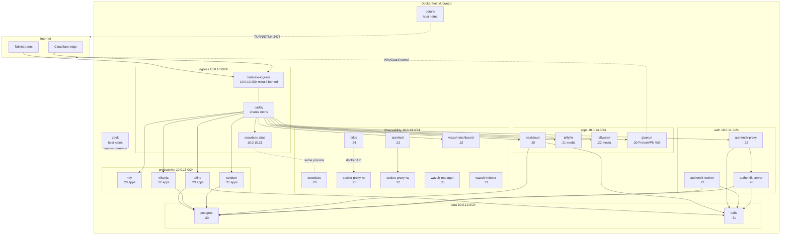
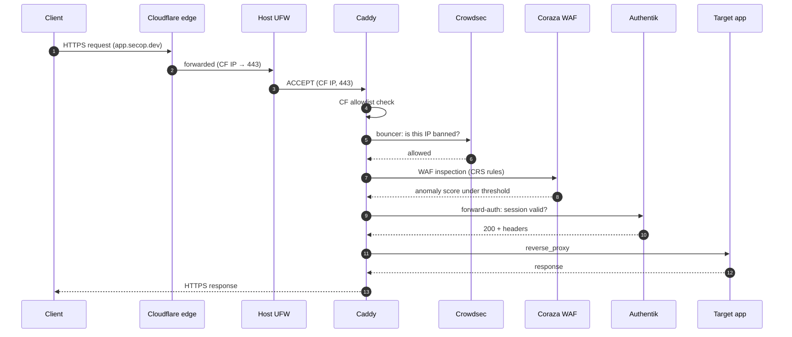
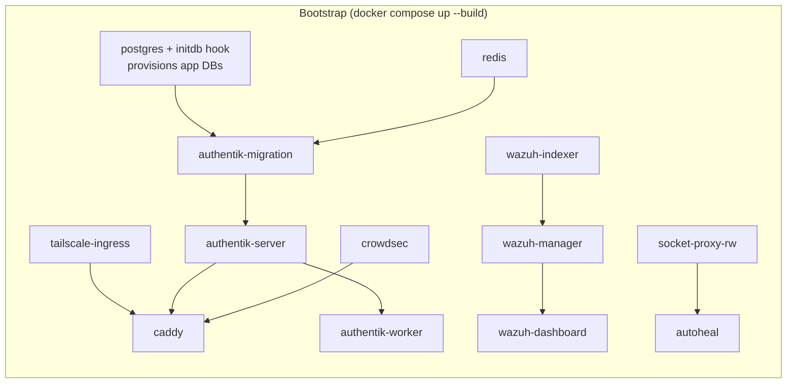
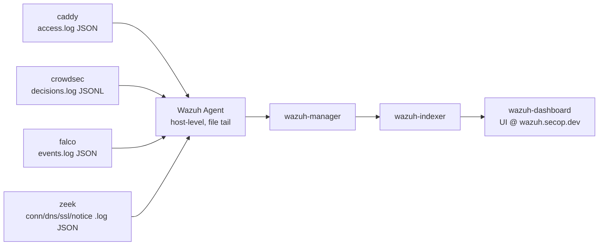

# Unified Stack

Single-command self-hosted foundation: one `docker compose up` brings up Caddy (custom build with Crowdsec, Coraza WAF, forward-auth, Souin cache, Brotli, L4 proxy), a Tailscale ingress sidecar, shared Postgres + Redis, Wazuh SIEM, Crowdsec LAPI, Falco runtime-security monitoring, Zeek network-security monitoring, Authentik SSO, Nextcloud, and optional media + productivity stacks — all accessible on both `*.secop.dev` (public, via Cloudflare) and `*.neon-lenok.ts.net` (Tailnet).

**Priority order:** Functionality > Security > Efficiency > Stability.

**Profiles:**
- *(no profile)* — Core stack: Authentik, Nextcloud, Wazuh, Falco, Zeek, Crowdsec, Caddy
- `--profile media` — Jellyfin, Jellyseerr, Prowlarr, Radarr, Sonarr, Lidarr, qBittorrent, FlareSolverr (all via ProtonVPN)
- `--profile apps` — ntfy, Tandoor, Vikunja, AFFiNE

---

## Architectural diagrams

### Network topology



### Request flow (public)



### Bootstrap order



### Logging pipeline



---

## Host directory layout

```
/dock/
├── conf/                    # configuration (RO in most containers)
│   ├── caddy/{Caddyfile, snippets/, coraza/, data/, logs/, souin/}
│   ├── crowdsec/{config.yaml, acquis.yaml, profiles.yaml, notifications/, db/}
│   ├── authentik/{media/, custom-templates/, certs/}
│   ├── wazuh/{manager/, indexer/, dashboard/, certs/, decoders/, rules/}
│   ├── falco/{falco.yaml, rules.d/, events.log}
│   ├── zeek/{local.zeek, node.cfg, networks.cfg, intel/, logs/current/}
│   ├── jellyfin/            # (profile: media)
│   ├── jellyseerr/          # (profile: media)
│   ├── qbittorrent/qBittorrent/qBittorrent.conf   # pre-seeds LocalHostAuth=false
│   └── ntfy/                # (profile: apps)
├── data/                    # application data (non-DB)
│   ├── authentik/
│   ├── nextcloud/               # owned 33:33 (www-data inside container)
│   ├── wazuh/{indexer/, manager/}
│   ├── jellyfin/            # (profile: media)
│   ├── ntfy/{cache/, data/} # (profile: apps)
│   ├── tandoor/{media/, static/}  # owned 1000:1000 (profile: apps)
│   ├── vikunja/             # owned 1000:1000 (profile: apps)
│   └── affine/{config/, storage/}   # (profile: apps)
├── db/                      # databases
│   ├── postgres/{data/, init.d/}
│   └── redis/
├── tail/
│   └── ingress/
└── backups/
    ├── postgres/            # pg-backup.sh output
    └── redis/
```

All paths owned `docktaetor:media (1010:1010)`, mode `770` (DB dirs `700`).

---

## Security model

### Ingress path

```
Internet → Cloudflare → Host UFW → Caddy (via Tailscale netns)
       → @cloudflare matcher → Crowdsec bouncer → Coraza WAF
       → Authentik forward-auth → App container
Parallel observation: Falco (runtime) + Zeek (network)
```

### Threat × mitigation matrix

| Threat | Primary mitigation | Backup |
|---|---|---|
| Public DDoS | Cloudflare edge | CF allowlist drops non-CF traffic |
| Credential stuffing | Authentik rate-limit + MFA | Crowdsec auth-brute scenarios |
| Zero-day web exploit | Coraza OWASP CRS | Egress isolation (data + app layers separate) |
| Container escape (unknown) | Falco: terminal-shell, write-below-root, unexpected-privileged | Host UFW + kernel hardening |
| Malicious DNS exfiltration | Zeek dns.log + Intel hits → Wazuh correlation | Crowdsec egress blocklist scenarios |
| TLS-fingerprint C2 beaconing | Zeek ssl.log JA3/JA4 anomalies | Cloudflare WAF on ingress |
| Supply-chain (post-install) | Falco: execution from /tmp, unexpected outbound | Image pinning, review updates |
| Socket-proxy abuse | Falco: unauthorized Docker API; RO/RW proxy split | Proxy permission env vars |
| Leaked .env in git | .gitignore .env + CI secret scanning | Keys regenerable by docker-host-config.sh |
| Container escape (generic) | user:1010:1010, read_only, cap_drop ALL, no-new-privileges, seccomp | Falco + host UFW |
| DB exfiltration | data layer isolation, per-app DB/role, no published ports | Wazuh rule on external :5432 |
| Lateral movement | Apps never share layers; only Caddy multi-homes | Crowdsec intra-network + Zeek conn.log |
| Log tampering | Logs bind-mounted to host, Wazuh Agent reads outside Docker | Append-only from host |
| Silent backup failure | pg-backup.sh level-12 alert; skips pruning on fail | Retention floor = manual delete only |
| Tailscale key leak | Ephemeral + reusable-disabled keys | Re-issue + bounce sidecar |
| Authentik outage locks out admins | AUTHENTIK_BOOTSTRAP_TOKEN via API | Direct psql reset procedure |

---

## Quickstart

**Prerequisites** (Ubuntu 22.04+, 2+ cores, 8+ GB RAM):
- Cloudflare account managing your `PUBLIC_FQDN` zone; API token with `Zone:Read` + `DNS:Edit`.
- Tailscale account with the host already enrolled; authkey from the admin console.
- Router port-forwards to the host:

| Port | Protocol | Purpose |
|------|----------|---------|
| 80 | TCP | Caddy HTTP→HTTPS redirect + ACME HTTP-01 fallback |
| 443 | TCP + UDP | HTTPS (TLS) + HTTP/3 (QUIC) |
| 3478 | UDP + TCP | TURN/STUN — Nextcloud Talk WebRTC NAT traversal (direct, bypasses Cloudflare) |
| 49152–49200 | UDP | TURN media relay — Nextcloud Talk (direct, bypasses Cloudflare) |

> Tailscale punches its own hole — no port forward needed for Tailnet access. All other
> services (Wazuh, Postgres, Redis) have no published ports and are only reachable inside
> Docker networks. If your router supports source-IP rules, restrict 80/443 to
> [Cloudflare's IP ranges](https://www.cloudflare.com/ips/) for an extra layer — the
> `@cloudflare` matcher in the Caddyfile enforces this at the application layer already.
>
> The TURN/STUN ports (3478, 49152–49200) are routed **directly** to the host — do not
> proxy them through Cloudflare (UDP relay requires a direct path). coturn binds to the
> host network and validates callers via time-limited HMAC credentials, so no
> unauthenticated relay is possible.

**Steps:**

1. Clone and run the host bootstrap (creates `/dock/` tree, installs Docker, sets ownership):
   ```bash
   git clone <repo-url> ~/git/finnsbeincaddy
   sudo ~/git/finnsbeincaddy/unified-stack/docker-host-config.sh
   ```

2. Create `.env` from the example and set the two external keys:
   ```bash
   cd ~/git/finnsbeincaddy/unified-stack
   cp .env.example .env
   # Edit .env — set TAILSCALE_AUTHKEY and CLOUDFLARE_API_TOKEN.
   # All other secrets are generated in the next step.
   # Uncomment the resource-limit tier block that matches your host.
   ```

3. Generate all secrets (Postgres, Redis, Wazuh, Authentik, Nextcloud, CrowdSec bouncer):
   ```bash
   bash scripts/gen-secrets.sh .env
   ```
   > Re-run with `--apply` after any secret rotation to sync Postgres user passwords
   > and re-seed the Wazuh OpenSearch security index:
   > `bash scripts/gen-secrets.sh .env --apply`

4. Bring up the stack:
   ```bash
   sudo docker compose up -d
   ```

5. Visit (replace `secop.dev` with your `PUBLIC_FQDN`):
   - `https://auth.secop.dev` — Authentik (first run: set MFA, create users)
   - `https://wazuh.secop.dev` — Wazuh (gated by Authentik)
   - `https://cloud.secop.dev` — Nextcloud (gated by Authentik)

**Boot persistence:** `sudo systemctl enable --now compose-stack.service`

**Media stack** (optional — Jellyfin, Jellyseerr, Prowlarr, Radarr, Sonarr, Lidarr, FlareSolverr, qBittorrent via ProtonVPN):
```bash
# 1. Add PROTONVPN_WIREGUARD_PRIVATE_KEY to .env (from ProtonVPN dashboard → WireGuard config).
# 2. Ensure MEDIA_PATH and DOWNLOADS_PATH exist on the host with storage mounted.
# 3. Add DNS CNAMEs in Cloudflare: media/requests/prowlarr/radarr/sonarr/lidarr/qbit → @ (proxied).
# 4. Start the media profile:
sudo docker compose --profile media up -d
```
Jellyfin serves media directly (no VPN — accessed by users). All *arr and qBittorrent outbound
traffic (indexer requests, torrent peers) is tunneled through ProtonVPN. FlareSolverr is
internal-only; configure it in Prowlarr as `http://localhost:8191`. Jellyfin and Jellyseerr use
their own auth — no Authentik forward-auth gate (media player API clients need direct access).

**Productivity stack** (optional — ntfy, Tandoor, Vikunja, AFFiNE):
```bash
# 1. Verify productivity DB vars are set in .env (gen-secrets.sh fills them).
# 2. Add DNS CNAMEs in Cloudflare: ntfy/recipes/tasks/affine → @ (proxied).
# 3. Start the apps profile:
sudo docker compose --profile apps up -d
```
Tandoor and AFFiNE gate on Authentik forward-auth. ntfy and Vikunja use their own auth
(API/mobile clients need direct token access).

> **First-run notes:**
> - `docker-host-config.sh` creates `/dock/data/nextcloud` owned `33:33`
>   (www-data inside the container). Nextcloud will fail to start if that directory
>   is owned by anyone else. If you skipped the bootstrap script, fix it manually:
>   `sudo chown 33:33 /dock/data/nextcloud`
> - Nextcloud installs on first request (~60 s). The admin account is set by
>   `NEXTCLOUD_ADMIN_USER` / `NEXTCLOUD_ADMIN_PASSWORD` in `.env`.
> - Authentik forward-auth gates all services at the proxy layer. Nextcloud app
>   passwords work for desktop/mobile sync clients without re-authenticating through
>   the Authentik browser flow.
> - Wazuh requires configuring the API connection inside the dashboard UI on first login.
> - **Nextcloud Talk / TURN:** After first login, go to
>   `Admin → Talk → TURN servers` (`/settings/admin/talk`) and add:
>   - Scheme: `turn`, Server: `<your-host-IP>:3478`, Secret: value of `COTURN_SECRET` in `.env`, Protocol: `UDP and TCP`.
>   Use the "Test server" button to verify connectivity. The TURN server is required for
>   WebRTC calls where both peers are behind NAT.

---

## Per-layer service index

| Layer | Service | Role |
|---|---|---|
| ingress | tailscale-ingress | Tailnet presence |
| ingress | caddy | TLS, WAF, bouncer, forward-auth |
| auth | authentik-server | SSO UI + API |
| auth | authentik-worker | Background jobs |
| auth | authentik-proxy | Forward-auth outpost (Caddy → Authentik gate) |
| auth | authentik-migration | One-shot DB migration |
| data | postgres | Shared Postgres cluster (pgvector) |
| data | redis | Shared Redis (logical DBs) |
| observability | crowdsec | Behavioral bans + blocklist |
| observability | socket-proxy-ro | Read-only Docker API |
| observability | socket-proxy-rw | R/W Docker API (Autoheal only) |
| observability | autoheal | Restart unhealthy containers |
| observability | falco | Runtime container security |
| observability | wazuh-manager | SIEM event ingest |
| observability | wazuh-indexer | OpenSearch index |
| observability | wazuh-dashboard | Web UI |
| host-net | zeek | Network security monitoring |
| host-net | coturn | TURN/STUN server for Nextcloud Talk WebRTC |
| apps | nextcloud | File sync + collaboration |
| apps | gluetun | ProtonVPN WireGuard gateway *(profile: media)* |
| apps (via gluetun) | prowlarr | Indexer manager *(profile: media)* |
| apps (via gluetun) | radarr | Movie management *(profile: media)* |
| apps (via gluetun) | sonarr | TV show management *(profile: media)* |
| apps (via gluetun) | lidarr | Music management *(profile: media)* |
| apps (via gluetun) | flaresolverr | Cloudflare bypass for indexers — internal only *(profile: media)* |
| apps (via gluetun) | qbittorrent | BitTorrent client *(profile: media)* |
| apps | jellyfin | Media server — GPU transcoding *(profile: media)* |
| apps | jellyseerr | Media request management *(profile: media)* |
| productivity | ntfy | Push notification server *(profile: apps)* |
| productivity | tandoor | Recipe manager *(profile: apps)* |
| productivity | vikunja | Task/project management *(profile: apps)* |
| productivity | affine | Collaborative workspace *(profile: apps)* |

---

## Troubleshooting

- **Caddy stuck on ACME**: check `docker logs caddy`; verify Cloudflare token has `Zone:read + DNS:edit` on the zone.
- **Wazuh indexer OOM**: check tier block; MED/LOW tiers halve JVM heap; or add swap.
- **Falco eBPF driver fails to load**: set `FALCO_DRIVER=ebpf` in `.env` (legacy probe) and restart falco.
- **Authentik admin lockout**: `docker exec -it authentik-server ak shell` → `from authentik.core.models import User; u = User.objects.get(username='akadmin'); u.set_password('newpass'); u.save()`.
- **Postgres backup failed alert**: check `/var/log/pg-backup.log`; pruning is paused until next success.
- **Zeek not logging**: `docker exec zeek zeekctl status`; if `crashed`, check `/dock/conf/zeek/logs/current/stderr.log`.
- **GlueTUN not connecting**: check `docker logs gluetun`; verify `PROTONVPN_WIREGUARD_PRIVATE_KEY` is the raw base64 key (not a config file path). If connecting but leaking: confirm `FIREWALL_OUTBOUND_SUBNETS=10.0.0.0/8` is set.
- **\*arr can't reach indexers / qBittorrent not seeding**: VPN tunnel may be down. Run `docker exec gluetun wget -qO- https://ifconfig.io` — if it returns your ISP's IP instead of the VPN IP, GlueTUN needs to reconnect.
- **Nextcloud Talk TURN test fails**: confirm 3478/UDP+TCP and 49152–49200/UDP are port-forwarded at the router to the host IP. Check `docker logs coturn` for authentication errors. Verify `COTURN_SECRET` in `.env` matches the secret entered in Talk admin settings.
- **Jellyfin no GPU transcoding**: ensure the host has `/dev/dri` (Intel: `intel-media-va-driver`, AMD: `mesa-va-drivers`). Check `docker logs jellyfin` for permission errors on `/dev/dri/renderD128`.
- **Tandoor 500 on startup**: `docker logs tandoor` — usually a missing `SECRET_KEY` or DB not yet provisioned. Run `gen-secrets.sh` and verify `TANDOOR_DB_NAME/USER/PASSWORD` are set.
- **Vikunja "JWT secret must be set"**: `VIKUNJA_JWT_SECRET` is empty. Run `bash scripts/gen-secrets.sh .env` to fill it.
- **AFFiNE WebSocket disconnects / CORS errors**: `AFFINE_SERVER_EXTERNAL_URL` must exactly match the URL in the browser (scheme + hostname, no trailing slash). Update `.env` and restart affine.
- **ntfy push not delivered**: check `docker logs ntfy`. Ensure `NTFY_BASE_URL` matches the public URL. Confirm the topic's subscriber is connected and `NTFY_AUTH_DEFAULT_ACCESS=deny-all` is working with the correct token.

---

## Adding a new app (Phase 3+)

1. Add a new section in `.env` with `<APP>_DB_NAME`, `<APP>_DB_USER`, `<APP>_DB_PASSWORD` (leave password empty — `docker-host-config.sh` fills it on next run).
2. Add a new handle block in `templates/caddy/Caddyfile` for both stanzas:
   ```caddyfile
   @newapp host newapp.{$PUBLIC_FQDN}
   handle @newapp {
       import authentik-forward-auth
       reverse_proxy newapp:<port>
   }
   ```
3. Add the app's service in `docker-compose.yml`. Join its own layer (create one if needed: `10.0.14.0/24` for media, `10.0.15.0/24` for productivity, etc.) + `data` for Postgres/Redis access.
4. Add tailscale-ingress multi-home: add the new layer to its `networks:` list.
5. Restart: `docker compose up -d --build`.
