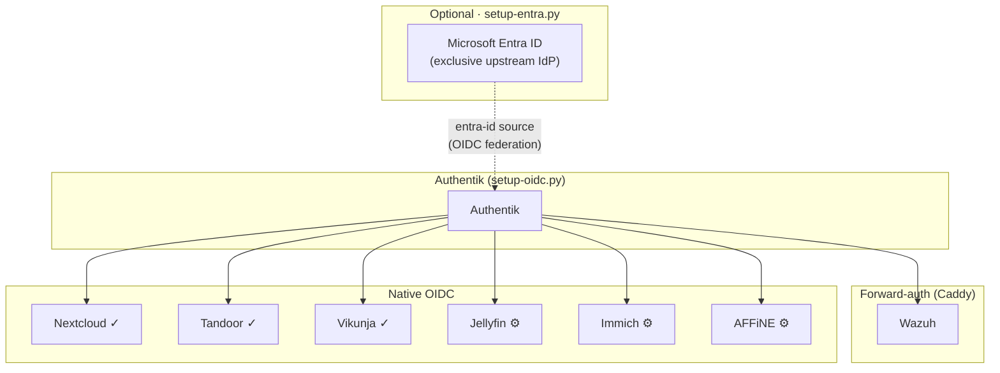

# Entra ID Integration Implementation Plan

> **For agentic workers:** REQUIRED SUB-SKILL: Use superpowers:subagent-driven-development (recommended) or superpowers:executing-plans to implement this plan task-by-task. Steps use checkbox (`- [ ]`) syntax for tracking.

**Goal:** Create `setup-entra.py` (--setup and --sync modes) and `undo-entra.py` to optionally federate Authentik with Microsoft Entra ID as the exclusive identity source, plus update `.env.example` and `README.md`.

**Architecture:** `setup-entra.py --setup` runs once interactively using MSAL device-code flow to create an App Registration in Entra ID, configure an Authentik OIDC source, enforce Entra-only login, and gate all services behind an Entra group. `setup-entra.py --sync` runs non-interactively via client credentials to reconcile Entra group members with Authentik users/groups. `undo-entra.py` reverts Authentik-side changes without touching Entra or deleting synced users.

**Tech Stack:** Python 3.10+ stdlib only + `msal` (single third-party dependency), Microsoft Graph REST API v1.0, Authentik API v3, same patterns as `setup-oidc.py` (EnvFile, AuthentikClient, urllib).

---

## File Map

| File | Action | Responsibility |
|------|--------|---------------|
| `unified-stack/scripts/setup-entra.py` | Create | `--setup` phases 1-5 and `--sync` passes 1-3 |
| `unified-stack/scripts/undo-entra.py` | Create | Revert Authentik-side Entra config |
| `unified-stack/.env.example` | Modify | Add commented Entra ID section at end |
| `unified-stack/README.md` | Modify | Optional Entra node in Mermaid chart + Step 7 quickstart + troubleshooting entry |

---

## Task 1: Scaffold setup-entra.py (argparse, msal guard, ANSI, EnvFile, AuthentikClient)

**Files:**
- Create: `unified-stack/scripts/setup-entra.py`

- [ ] **Step 1: Write a test for the `msal` presence check**

```python
# tests/test_setup_entra.py
import importlib
import sys
import pytest

def test_msal_guard_exits_when_missing(monkeypatch):
    """Script must exit 1 with pip install message before doing anything if msal is absent."""
    monkeypatch.setitem(sys.modules, "msal", None)
    with pytest.raises(SystemExit) as exc:
        import unified_stack.scripts.setup_entra as m  # noqa: F401
    assert exc.value.code == 1
```

- [ ] **Step 2: Run test to confirm it fails**

```
pytest tests/test_setup_entra.py::test_msal_guard_exits_when_missing -v
```

Expected: `ERROR` or `FAILED` (module not found or no exit yet).

- [ ] **Step 3: Create the scaffold**

```python
#!/usr/bin/env python3
"""
setup-entra.py  —  Optional Authentik ↔ Microsoft Entra ID federation.

Usage:
    python3 scripts/setup-entra.py --setup [path/to/.env]
    python3 scripts/setup-entra.py --sync  [path/to/.env]

    --setup  One-time interactive setup (device-code login, App Registration,
             Authentik source + policy, Entra-only enforcement).
    --sync   Non-interactive sync of Entra group members → Authentik users/groups.
             Safe to run on cron. Reads all credentials from .env.

Prerequisites:
    pip install msal
    ENTRA_TENANT_ID set in .env before --setup
    Authentik running with AUTHENTIK_BOOTSTRAP_TOKEN in .env
    Break-glass local Authentik admin account active

Idempotent: each phase checks its .env output vars before executing.
"""

import sys

# Guard: must be first executable statement after docstring and stdlib imports
try:
    import msal  # noqa: F401
except ImportError:
    print("ERROR: msal is not installed. Run:  pip install msal", file=sys.stderr)
    sys.exit(1)

import argparse
import json
import re
import time
import urllib.error
import urllib.parse
import urllib.request
from pathlib import Path
from typing import Optional


# ── ANSI output helpers ────────────────────────────────────────────────────────

def _c(code: str, msg: str) -> str:
    return f"\033[{code}m{msg}\033[0m"

def red(msg: str)    -> None: print(_c("31", msg), file=sys.stderr)
def green(msg: str)  -> None: print(_c("32", msg))
def yellow(msg: str) -> None: print(_c("33", msg))
def step(msg: str)   -> None: print(_c("36", f"\n==> {msg}"))


# ── .env reader / writer (identical to setup-oidc.py) ─────────────────────────

class EnvFile:
    _INLINE_COMMENT = re.compile(r"\s*#.*$")

    def __init__(self, path: Path) -> None:
        self.path = path
        self._text = path.read_text()

    def get(self, key: str) -> str:
        for line in self._text.splitlines():
            if line.startswith(f"{key}="):
                val = line[len(key) + 1:]
                return self._INLINE_COMMENT.sub("", val).strip()
        return ""

    def force_set(self, key: str, value: str) -> None:
        pattern = rf"^({re.escape(key)}=).*$"
        new, count = re.subn(
            pattern, lambda m: f"{m.group(1)}{value}", self._text, flags=re.MULTILINE,
        )
        if count:
            self._text = new
            self.path.write_text(new)
            print(f"  updated {key}")
        else:
            self._text = self._text.rstrip("\n") + f"\n{key}={value}\n"
            self.path.write_text(self._text)
            print(f"  wrote  {key} (appended)")

    def set_if_blank(self, key: str, value: str) -> None:
        key_prefix = f"{key}="
        for line in self._text.splitlines():
            if line.startswith(key_prefix):
                existing_val = self._INLINE_COMMENT.sub("", line[len(key_prefix):]).strip()
                if existing_val:
                    print(f"  skip   {key} (already set)")
                    return
                break
        pattern = rf"^({re.escape(key)}=)\s*(#[^\n]*)?\s*$"
        new, count = re.subn(
            pattern, lambda m: f"{m.group(1)}{value}", self._text, flags=re.MULTILINE,
        )
        if count:
            self._text = new
            self.path.write_text(new)
            print(f"  wrote  {key}")
        else:
            self._text = self._text.rstrip("\n") + f"\n{key}={value}\n"
            self.path.write_text(self._text)
            print(f"  wrote  {key} (appended)")


# ── Authentik API client (identical to setup-oidc.py) ─────────────────────────

class AuthentikClient:
    def __init__(self, base_url: str, token: str) -> None:
        self.base_url = base_url.rstrip("/")
        self.token = token

    def _request(self, method: str, path: str, body: Optional[dict] = None) -> dict:
        url = f"{self.base_url}/api/v3/{path.lstrip('/')}"
        data = json.dumps(body).encode() if body is not None else None
        req = urllib.request.Request(
            url, data=data, method=method,
            headers={
                "Authorization": f"Bearer {self.token}",
                "Content-Type": "application/json",
            },
        )
        try:
            with urllib.request.urlopen(req, timeout=20) as resp:
                return json.loads(resp.read())
        except urllib.error.HTTPError as exc:
            detail = exc.read().decode(errors="replace")
            raise RuntimeError(f"HTTP {exc.code} {method} {url}: {detail}") from exc

    def get(self, path: str, **params) -> dict:
        if params:
            qs = "&".join(f"{k}={urllib.parse.quote(str(v))}" for k, v in params.items())
            path = f"{path}?{qs}"
        return self._request("GET", path)

    def post(self, path: str, body: dict) -> dict:
        return self._request("POST", path, body)

    def patch(self, path: str, body: dict) -> dict:
        return self._request("PATCH", path, body)

    def delete(self, path: str) -> None:
        self._request("DELETE", path)


# ── Argument parsing ───────────────────────────────────────────────────────────

def parse_args():
    parser = argparse.ArgumentParser(
        prog="setup-entra.py",
        description="Authentik ↔ Microsoft Entra ID optional federation",
    )
    mode = parser.add_mutually_exclusive_group(required=True)
    mode.add_argument("--setup", action="store_true", help="One-time interactive setup")
    mode.add_argument("--sync", action="store_true", help="Sync Entra group members → Authentik")
    parser.add_argument(
        "env_path", nargs="?",
        default=str(Path(__file__).parent.parent / ".env"),
        help="Path to .env file (default: ../env relative to script)",
    )
    return parser.parse_args()
```

- [ ] **Step 4: Run msal guard test**

```
pytest tests/test_setup_entra.py::test_msal_guard_exits_when_missing -v
```

Expected: PASS (monkeypatching msal to None triggers the guard).

- [ ] **Step 5: Commit**

```bash
git add unified-stack/scripts/setup-entra.py tests/test_setup_entra.py
git commit -m "feat(setup-entra): scaffold — argparse, msal guard, ANSI helpers, EnvFile, AuthentikClient"
```

---

## Task 2: GraphClient — device-code delegated auth (for --setup)

**Files:**
- Modify: `unified-stack/scripts/setup-entra.py`

- [ ] **Step 1: Write a test for token acquisition failure**

Append to `tests/test_setup_entra.py`:

```python
def test_graph_client_raises_on_auth_error(monkeypatch):
    """GraphClient.authenticate() raises SystemExit when MSAL returns an error."""
    import msal

    class FakeApp:
        def initiate_device_flow(self, scopes):
            return {"message": "Go to https://microsoft.com/devicelogin and enter TESTCODE"}
        def acquire_token_by_device_flow(self, flow):
            return {"error": "authorization_declined", "error_description": "User declined"}

    monkeypatch.setattr(msal, "PublicClientApplication", lambda *a, **kw: FakeApp())

    from unified_stack.scripts.setup_entra import GraphClient
    gc = GraphClient.__new__(GraphClient)
    gc.tenant_id = "fake-tenant"
    with pytest.raises(SystemExit):
        gc.authenticate()
```

- [ ] **Step 2: Run test — expect FAIL**

```
pytest tests/test_setup_entra.py::test_graph_client_raises_on_auth_error -v
```

Expected: AttributeError or FAIL (GraphClient not defined yet).

- [ ] **Step 3: Implement GraphClient with device-code auth**

Add after `AuthentikClient` class in `setup-entra.py`:

```python
# ── Microsoft Graph client ─────────────────────────────────────────────────────

# Well-known Azure CLI public client ID — supports device-code flow without
# registering a new app. Used only for --setup (delegated permissions).
_AZ_CLI_CLIENT_ID = "04b07795-8ddb-461a-bbee-02f9e1bf7b46"

class GraphClient:
    """Microsoft Graph REST client. Call authenticate() or from_client_credentials() first."""

    def __init__(self, tenant_id: str) -> None:
        self.tenant_id = tenant_id
        self._token: Optional[str] = None

    def authenticate(self) -> None:
        """Device-code flow — interactive, for --setup."""
        app = msal.PublicClientApplication(
            _AZ_CLI_CLIENT_ID,
            authority=f"https://login.microsoftonline.com/{self.tenant_id}",
        )
        flow = app.initiate_device_flow(scopes=["https://graph.microsoft.com/.default"])
        if "error" in flow:
            red(f"Device flow error: {flow.get('error_description', flow['error'])}")
            sys.exit(1)
        print(f"\n{flow['message']}\n")
        result = app.acquire_token_by_device_flow(flow)
        if "error" in result:
            red(f"Authentication failed: {result.get('error_description', result['error'])}")
            sys.exit(1)
        self._token = result["access_token"]
        green("  Microsoft authentication complete")

    @classmethod
    def from_client_credentials(cls, tenant_id: str, client_id: str, client_secret: str) -> "GraphClient":
        """Client-credentials flow — non-interactive, for --sync."""
        gc = cls(tenant_id)
        app = msal.ConfidentialClientApplication(
            client_id,
            authority=f"https://login.microsoftonline.com/{tenant_id}",
            client_credential=client_secret,
        )
        result = app.acquire_token_for_client(scopes=["https://graph.microsoft.com/.default"])
        if "error" in result:
            red(f"Client credentials failed: {result.get('error_description', result['error'])}")
            sys.exit(1)
        gc._token = result["access_token"]
        return gc

    def _request(self, method: str, url: str, body: Optional[dict] = None) -> dict:
        data = json.dumps(body).encode() if body is not None else None
        req = urllib.request.Request(
            url, data=data, method=method,
            headers={
                "Authorization": f"Bearer {self._token}",
                "Content-Type": "application/json",
                "Accept": "application/json",
            },
        )
        try:
            with urllib.request.urlopen(req, timeout=30) as resp:
                raw = resp.read()
                return json.loads(raw) if raw else {}
        except urllib.error.HTTPError as exc:
            retry_after = exc.headers.get("Retry-After")
            if exc.code == 429 and retry_after:
                yellow(f"  Graph rate limit — sleeping {retry_after}s")
                time.sleep(int(retry_after))
                return self._request(method, url, body)
            detail = exc.read().decode(errors="replace")
            raise RuntimeError(f"HTTP {exc.code} {method} {url}: {detail}") from exc

    def get(self, path: str, **params) -> dict:
        url = f"https://graph.microsoft.com/v1.0/{path.lstrip('/')}"
        if params:
            url += "?" + urllib.parse.urlencode(params)
        return self._request("GET", url)

    def post(self, path: str, body: dict) -> dict:
        return self._request("POST", f"https://graph.microsoft.com/v1.0/{path.lstrip('/')}", body)

    def patch(self, path: str, body: dict) -> dict:
        return self._request("PATCH", f"https://graph.microsoft.com/v1.0/{path.lstrip('/')}", body)
```

- [ ] **Step 4: Run device-code auth test**

```
pytest tests/test_setup_entra.py::test_graph_client_raises_on_auth_error -v
```

Expected: PASS.

- [ ] **Step 5: Commit**

```bash
git add unified-stack/scripts/setup-entra.py tests/test_setup_entra.py
git commit -m "feat(setup-entra): GraphClient with device-code and client-credentials auth"
```

---

## Task 3: Graph API — App Registration (Phase 1, part A)

**Files:**
- Modify: `unified-stack/scripts/setup-entra.py`

These are helper functions that create-or-find the Entra App Registration, add a client secret, create the service principal, and grant admin consent.

- [ ] **Step 1: Write unit test for `_find_or_create_app`**

Append to `tests/test_setup_entra.py`:

```python
def test_find_existing_app_returns_first_result(monkeypatch):
    """_find_or_create_app returns existing app without POSTing if one is found."""
    from unittest.mock import MagicMock
    from unified_stack.scripts.setup_entra import _find_or_create_app

    gc = MagicMock()
    gc.get.return_value = {"value": [{"id": "app-id-123", "appId": "client-id-abc"}]}

    app_id, client_id = _find_or_create_app(gc, "Authentik-Sync", ["https://auth.example.com/callback/"])
    gc.get.assert_called_once()
    gc.post.assert_not_called()
    assert app_id == "app-id-123"
    assert client_id == "client-id-abc"
```

- [ ] **Step 2: Run test — expect FAIL**

```
pytest tests/test_setup_entra.py::test_find_existing_app_returns_first_result -v
```

- [ ] **Step 3: Implement Phase 1 Graph helpers**

Add to `setup-entra.py` after `GraphClient`:

```python
# ── Graph API helpers for App Registration (Phase 1) ──────────────────────────

# Microsoft Graph service principal app ID (constant across all tenants)
_GRAPH_SP_APP_ID = "00000003-0000-0000-c000-000000000000"

# Application permission role IDs on Microsoft Graph
_GRAPH_ROLES = {
    "User.Read.All":        "df021288-bdef-4463-88db-98f22de89214",
    "Group.Read.All":       "5b567255-7703-4780-807c-7be8301ae99b",
    "GroupMember.Read.All": "98830695-27a2-44f7-8c18-0c3ebc9698f6",
}


def _find_or_create_app(gc: GraphClient, app_name: str, redirect_uris: list[str]) -> tuple[str, str]:
    """Return (object_id, app_id/client_id) — creates App Registration if absent."""
    resp = gc.get("applications", **{"$filter": f"displayName eq '{app_name}'"})
    existing = resp.get("value", [])
    if existing:
        app = existing[0]
        green(f"  App Registration '{app_name}' already exists (appId={app['appId']})")
        # Ensure redirect URIs are present
        current_uris = app.get("web", {}).get("redirectUris", [])
        missing = [u for u in redirect_uris if u not in current_uris]
        if missing:
            gc.patch(f"applications/{app['id']}", {
                "web": {"redirectUris": current_uris + missing}
            })
            green(f"  Added {len(missing)} redirect URI(s)")
        return app["id"], app["appId"]

    step(f"Creating App Registration '{app_name}'")
    app = gc.post("applications", {
        "displayName": app_name,
        "signInAudience": "AzureADMyOrg",
        "web": {"redirectUris": redirect_uris},
        "requiredResourceAccess": [{
            "resourceAppId": _GRAPH_SP_APP_ID,
            "resourceAccess": [
                {"id": role_id, "type": "Role"}
                for role_id in _GRAPH_ROLES.values()
            ],
        }],
    })
    green(f"  Created App Registration (appId={app['appId']})")
    return app["id"], app["appId"]


def _add_client_secret(gc: GraphClient, object_id: str) -> str:
    """Add a 2-year client secret to an App Registration and return the secret value."""
    resp = gc.post(f"applications/{object_id}/addPassword", {
        "passwordCredential": {
            "displayName": "authentik-sync",
            "endDateTime": "2028-01-01T00:00:00Z",
        }
    })
    return resp["secretText"]


def _get_or_create_service_principal(gc: GraphClient, client_id: str) -> str:
    """Return service principal object ID, creating it if absent."""
    resp = gc.get("servicePrincipals", **{"$filter": f"appId eq '{client_id}'"})
    existing = resp.get("value", [])
    if existing:
        return existing[0]["id"]
    sp = gc.post("servicePrincipals", {"appId": client_id})
    green(f"  Created service principal (id={sp['id']})")
    return sp["id"]


def _get_graph_sp_id(gc: GraphClient) -> str:
    """Return the object ID of the Microsoft Graph service principal in this tenant."""
    resp = gc.get("servicePrincipals", **{"$filter": f"appId eq '{_GRAPH_SP_APP_ID}'"})
    return resp["value"][0]["id"]


def _grant_app_roles(gc: GraphClient, sp_id: str, graph_sp_id: str) -> None:
    """Grant all required Graph application permissions via appRoleAssignments.

    POST /servicePrincipals/{sp_id}/appRoleAssignments for each role.
    Existing assignments are skipped (Graph returns 400 on duplicate).
    Requires Global Admin on the authenticated account — exits with portal URL on 403.
    """
    existing_resp = gc.get(f"servicePrincipals/{sp_id}/appRoleAssignments")
    existing_role_ids = {a["appRoleId"] for a in existing_resp.get("value", [])}

    for perm_name, role_id in _GRAPH_ROLES.items():
        if role_id in existing_role_ids:
            green(f"  Admin consent already granted: {perm_name}")
            continue
        try:
            gc.post(f"servicePrincipals/{sp_id}/appRoleAssignments", {
                "principalId": sp_id,
                "resourceId": graph_sp_id,
                "appRoleId": role_id,
            })
            green(f"  Granted: {perm_name}")
        except RuntimeError as exc:
            if "403" in str(exc):
                portal_url = (
                    "https://portal.azure.com/#view/Microsoft_AAD_IAM/ActiveDirectoryMenuBlade"
                    "/~/RegisteredApps"
                )
                red(f"  Admin consent 403 — account lacks Global Admin role.")
                red(f"  Grant permissions manually: {portal_url}")
                red(f"  Required: {', '.join(_GRAPH_ROLES.keys())}")
                sys.exit(1)
            raise
```

- [ ] **Step 4: Run unit test**

```
pytest tests/test_setup_entra.py::test_find_existing_app_returns_first_result -v
```

Expected: PASS.

- [ ] **Step 5: Commit**

```bash
git add unified-stack/scripts/setup-entra.py tests/test_setup_entra.py
git commit -m "feat(setup-entra): Graph helpers — App Registration, client secret, service principal, app role grants"
```

---

## Task 4: Entra group management (Phase 2) + Phase 1 orchestrator

**Files:**
- Modify: `unified-stack/scripts/setup-entra.py`

- [ ] **Step 1: Write test for `_find_or_create_group`**

Append to `tests/test_setup_entra.py`:

```python
def test_find_or_create_group_returns_existing(monkeypatch):
    from unittest.mock import MagicMock
    from unified_stack.scripts.setup_entra import _find_or_create_group

    gc = MagicMock()
    gc.get.return_value = {"value": [{"id": "group-id-xyz", "displayName": "openirvana-homies"}]}

    gid = _find_or_create_group(gc, "openirvana-homies")
    gc.post.assert_not_called()
    assert gid == "group-id-xyz"
```

- [ ] **Step 2: Run test — expect FAIL**

```
pytest tests/test_setup_entra.py::test_find_or_create_group_returns_existing -v
```

- [ ] **Step 3: Implement Phase 2 helpers and Phase 1 orchestrator**

Add to `setup-entra.py`:

```python
# ── Entra group helpers (Phase 2) ──────────────────────────────────────────────

def _find_or_create_group(gc: GraphClient, group_name: str) -> str:
    """Return Entra security group object ID, creating it if absent."""
    resp = gc.get("groups", **{"$filter": f"displayName eq '{group_name}'"})
    existing = resp.get("value", [])
    if existing:
        green(f"  Entra group '{group_name}' already exists (id={existing[0]['id']})")
        return existing[0]["id"]
    group = gc.post("groups", {
        "displayName": group_name,
        "mailEnabled": False,
        "mailNickname": group_name.replace(" ", "-").lower(),
        "securityEnabled": True,
        "groupTypes": [],
    })
    green(f"  Created Entra group '{group_name}' (id={group['id']})")
    return group["id"]


def _add_group_member(gc: GraphClient, group_id: str, user_id: str) -> None:
    """Add user to Entra group; silently ignore if already a member."""
    try:
        gc.post(f"groups/{group_id}/members/$ref", {
            "@odata.id": f"https://graph.microsoft.com/v1.0/directoryObjects/{user_id}"
        })
        green("  Added authenticated user to access group")
    except RuntimeError as exc:
        if "already exist" in str(exc).lower() or "400" in str(exc):
            green("  User already a member of access group")
        else:
            raise


def _get_me(gc: GraphClient) -> dict:
    """Return the authenticated user's profile (/me)."""
    return gc.get("me")


# ── Phase 1 orchestrator ───────────────────────────────────────────────────────

def phase1_app_registration(
    gc: GraphClient,
    env: EnvFile,
    app_name: str,
    redirect_uris: list[str],
) -> tuple[str, str]:
    """Create or find App Registration, secret, SP, and grant admin consent.

    Returns (client_id, client_secret). Writes to .env immediately.
    Idempotent: if ENTRA_CLIENT_ID already set, skips Graph API calls.
    """
    existing_client_id = env.get("ENTRA_CLIENT_ID")
    if existing_client_id:
        green(f"  ENTRA_CLIENT_ID already set — skipping App Registration phase")
        return existing_client_id, env.get("ENTRA_CLIENT_SECRET")

    object_id, client_id = _find_or_create_app(gc, app_name, redirect_uris)
    client_secret = _add_client_secret(gc, object_id)
    env.force_set("ENTRA_CLIENT_ID", client_id)
    env.force_set("ENTRA_CLIENT_SECRET", client_secret)

    sp_id = _get_or_create_service_principal(gc, client_id)
    graph_sp_id = _get_graph_sp_id(gc)
    _grant_app_roles(gc, sp_id, graph_sp_id)

    return client_id, client_secret


# ── Phase 2 orchestrator ───────────────────────────────────────────────────────

def phase2_entra_group(gc: GraphClient, env: EnvFile, access_group_name: str) -> str:
    """Create Entra access group, add authenticated user as first member.

    Returns Entra group object_id.
    """
    step("Phase 2 — Create Entra access group")
    group_id = _find_or_create_group(gc, access_group_name)
    me = _get_me(gc)
    _add_group_member(gc, group_id, me["id"])
    green(f"  Access group ready: '{access_group_name}' ({me.get('userPrincipalName', me['id'])} is a member)")
    return group_id
```

- [ ] **Step 4: Run unit test**

```
pytest tests/test_setup_entra.py::test_find_or_create_group_returns_existing -v
```

Expected: PASS.

- [ ] **Step 5: Commit**

```bash
git add unified-stack/scripts/setup-entra.py tests/test_setup_entra.py
git commit -m "feat(setup-entra): Phase 1 App Registration orchestrator + Phase 2 Entra group management"
```

---

## Task 5: Authentik OIDC source (Phase 3)

**Files:**
- Modify: `unified-stack/scripts/setup-entra.py`

Phase 3 creates an Authentik OAuth2 source with slug `entra-id` pointing at the tenant-specific Microsoft endpoints.

- [ ] **Step 1: Write test for idempotency of `_find_or_create_authentik_source`**

Append to `tests/test_setup_entra.py`:

```python
def test_find_existing_authentik_source_skips_post():
    from unittest.mock import MagicMock
    from unified_stack.scripts.setup_entra import _find_or_create_authentik_source

    ak = MagicMock()
    ak.get.return_value = {"results": [{"pk": "src-pk-1", "slug": "entra-id"}]}

    pk = _find_or_create_authentik_source(
        ak, "fake-tenant", "entra-client-id", "entra-client-secret"
    )
    ak.post.assert_not_called()
    assert pk == "src-pk-1"
```

- [ ] **Step 2: Run test — expect FAIL**

```
pytest tests/test_setup_entra.py::test_find_existing_authentik_source_skips_post -v
```

- [ ] **Step 3: Implement Phase 3**

Add to `setup-entra.py`:

```python
# ── Phase 3 — Authentik OIDC source ───────────────────────────────────────────

def _find_or_create_authentik_source(
    ak: AuthentikClient,
    tenant_id: str,
    client_id: str,
    client_secret: str,
) -> str:
    """Create (or find) Authentik OAuth2 source with slug 'entra-id'.

    Returns source PK.
    """
    existing = ak.get("sources/oauth/", slug="entra-id").get("results", [])
    if existing:
        green(f"  Authentik OIDC source 'entra-id' already exists (pk={existing[0]['pk']})")
        return existing[0]["pk"]

    step("Phase 3 — Creating Authentik OIDC source (entra-id)")
    source = ak.post("sources/oauth/", {
        "name": "Microsoft Entra ID",
        "slug": "entra-id",
        "enabled": True,
        "provider_type": "openidconnect",
        "consumer_key": client_id,
        "consumer_secret": client_secret,
        "authorization_url": f"https://login.microsoftonline.com/{tenant_id}/oauth2/v2.0/authorize",
        "access_token_url": f"https://login.microsoftonline.com/{tenant_id}/oauth2/v2.0/token",
        "profile_url": "https://graph.microsoft.com/oidc/userinfo",
        "oidc_jwks_url": f"https://login.microsoftonline.com/{tenant_id}/discovery/v2.0/keys",
        "oidc_issuer_url": f"https://login.microsoftonline.com/{tenant_id}/v2.0",
        "additional_scopes": "openid profile email",
        "user_matching_mode": "email_link",
    })
    green(f"  Created Authentik OIDC source (pk={source['pk']})")
    return source["pk"]


def phase3_authentik_source(
    ak: AuthentikClient,
    tenant_id: str,
    client_id: str,
    client_secret: str,
) -> str:
    """Phase 3 orchestrator. Returns source PK."""
    step("Phase 3 — Authentik OIDC source")
    return _find_or_create_authentik_source(ak, tenant_id, client_id, client_secret)
```

- [ ] **Step 4: Run unit test**

```
pytest tests/test_setup_entra.py::test_find_existing_authentik_source_skips_post -v
```

Expected: PASS.

- [ ] **Step 5: Commit**

```bash
git add unified-stack/scripts/setup-entra.py tests/test_setup_entra.py
git commit -m "feat(setup-entra): Phase 3 — Authentik OIDC source creation (entra-id)"
```

---

## Task 6: Authentik group + expression policy + flow binding (Phase 4)

**Files:**
- Modify: `unified-stack/scripts/setup-entra.py`

Phase 4 creates the Authentik access group, an expression policy that checks membership, and binds it to the default authorization flow.

- [ ] **Step 1: Write test for expression policy idempotency**

Append to `tests/test_setup_entra.py`:

```python
def test_find_existing_expression_policy_skips_post():
    from unittest.mock import MagicMock
    from unified_stack.scripts.setup_entra import _find_or_create_expression_policy

    ak = MagicMock()
    ak.get.return_value = {"results": [{"pk": "pol-pk-1", "name": "entra-access-openirvana-homies"}]}

    pk = _find_or_create_expression_policy(ak, "openirvana-homies")
    ak.post.assert_not_called()
    assert pk == "pol-pk-1"
```

- [ ] **Step 2: Run test — expect FAIL**

```
pytest tests/test_setup_entra.py::test_find_existing_expression_policy_skips_post -v
```

- [ ] **Step 3: Implement Phase 4**

Add to `setup-entra.py`:

```python
# ── Phase 4 — Access-group policy + flow binding ───────────────────────────────

def _find_or_create_authentik_group(ak: AuthentikClient, group_name: str) -> str:
    """Return Authentik group PK, creating if absent."""
    resp = ak.get("core/groups/", name=group_name)
    existing = resp.get("results", [])
    if existing:
        green(f"  Authentik group '{group_name}' already exists (pk={existing[0]['pk']})")
        return existing[0]["pk"]
    group = ak.post("core/groups/", {"name": group_name})
    green(f"  Created Authentik group '{group_name}' (pk={group['pk']})")
    return group["pk"]


def _find_or_create_expression_policy(ak: AuthentikClient, group_name: str) -> str:
    """Create expression policy that gates access to members of group_name."""
    policy_name = f"entra-access-{group_name}"
    resp = ak.get("policies/expression/", name=policy_name)
    existing = resp.get("results", [])
    if existing:
        green(f"  Expression policy '{policy_name}' already exists")
        return existing[0]["pk"]
    policy = ak.post("policies/expression/", {
        "name": policy_name,
        "expression": (
            f'return request.user.ak_groups.filter(name="{group_name}").exists()'
        ),
    })
    green(f"  Created expression policy '{policy_name}' (pk={policy['pk']})")
    return policy["pk"]


def _find_or_create_policy_binding(
    ak: AuthentikClient,
    policy_pk: str,
    flow_pk: str,
    order: int = 0,
) -> str:
    """Bind policy to flow. Returns binding PK."""
    resp = ak.get("policies/bindings/", policy=policy_pk, target=flow_pk)
    existing = resp.get("results", [])
    if existing:
        green(f"  Policy binding already exists (pk={existing[0]['pk']})")
        return existing[0]["pk"]
    binding = ak.post("policies/bindings/", {
        "policy": policy_pk,
        "target": flow_pk,
        "enabled": True,
        "order": order,
    })
    green(f"  Created policy binding (pk={binding['pk']})")
    return binding["pk"]


def _get_authorization_flow_pk(ak: AuthentikClient) -> str:
    """Return PK of the default authorization flow."""
    resp = ak.get("flows/instances/", designation="authorization")
    results = resp.get("results", [])
    if not results:
        red("No authorization flow found in Authentik. Is Authentik healthy?")
        sys.exit(1)
    return results[0]["pk"]


def phase4_access_policy(
    ak: AuthentikClient,
    access_group_name: str,
) -> tuple[str, str, str]:
    """Phase 4 orchestrator.

    Returns (group_pk, policy_pk, binding_pk).
    """
    step("Phase 4 — Authentik access-group policy")
    auth_flow_pk = _get_authorization_flow_pk(ak)
    group_pk = _find_or_create_authentik_group(ak, access_group_name)
    policy_pk = _find_or_create_expression_policy(ak, access_group_name)
    binding_pk = _find_or_create_policy_binding(ak, policy_pk, auth_flow_pk)
    return group_pk, policy_pk, binding_pk
```

- [ ] **Step 4: Run unit test**

```
pytest tests/test_setup_entra.py::test_find_existing_expression_policy_skips_post -v
```

Expected: PASS.

- [ ] **Step 5: Commit**

```bash
git add unified-stack/scripts/setup-entra.py tests/test_setup_entra.py
git commit -m "feat(setup-entra): Phase 4 — Authentik group, expression policy, authorization flow binding"
```

---

## Task 7: Enforce Entra-only login (Phase 5) + `--setup` main()

**Files:**
- Modify: `unified-stack/scripts/setup-entra.py`

Phase 5 modifies the default authentication flow's identification stage to show only the "Sign in with Microsoft" button and remove the password form.

- [ ] **Step 1: Write test for break-glass verification**

Append to `tests/test_setup_entra.py`:

```python
def test_verify_breakglass_exits_when_no_admin():
    from unittest.mock import MagicMock
    from unified_stack.scripts.setup_entra import _verify_break_glass_account

    ak = MagicMock()
    # No superusers
    ak.get.return_value = {"results": []}
    with pytest.raises(SystemExit):
        _verify_break_glass_account(ak)
```

- [ ] **Step 2: Run test — expect FAIL**

```
pytest tests/test_setup_entra.py::test_verify_breakglass_exits_when_no_admin -v
```

- [ ] **Step 3: Implement Phase 5 and `--setup` main()**

Add to `setup-entra.py`:

```python
# ── Phase 5 — Enforce Entra-only login ────────────────────────────────────────

def _verify_break_glass_account(ak: AuthentikClient) -> None:
    """Refuse to enforce Entra-only login if no active local superuser exists."""
    resp = ak.get("core/users/", is_superuser="true", is_active="true")
    admins = resp.get("results", [])
    if not admins:
        red("No active local superuser found in Authentik.")
        red("Create a break-glass admin account before enforcing Entra-only login:")
        red("  Authentik → Directory → Users → Create → Enable superuser")
        sys.exit(1)
    usernames = [u["username"] for u in admins]
    green(f"  Break-glass account(s) verified: {', '.join(usernames)}")


def _get_authentication_flow_identification_stage(ak: AuthentikClient) -> tuple[str, str]:
    """Return (flow_pk, identification_stage_pk) for the default authentication flow."""
    resp = ak.get("flows/instances/", designation="authentication")
    results = resp.get("results", [])
    if not results:
        red("No authentication flow found in Authentik.")
        sys.exit(1)
    flow_pk = results[0]["pk"]

    # Find the identification stage binding in this flow
    bindings_resp = ak.get("flows/bindings/", target=flow_pk)
    for binding in bindings_resp.get("results", []):
        stage_pk = binding.get("stage")
        if not stage_pk:
            continue
        # Check if this stage is an identification stage
        stage_resp = ak.get(f"stages/identification/{stage_pk}/")
        if stage_resp.get("pk"):
            return flow_pk, stage_pk
    red("Could not find identification stage in authentication flow.")
    sys.exit(1)


def _enforce_entra_only_login(ak: AuthentikClient, source_pk: str) -> None:
    """Modify identification stage: add entra-id source, remove password stage."""
    _, stage_pk = _get_authentication_flow_identification_stage(ak)
    stage = ak.get(f"stages/identification/{stage_pk}/")

    current_sources = stage.get("sources", [])
    if source_pk not in current_sources:
        current_sources.append(source_pk)

    ak.patch(f"stages/identification/{stage_pk}/", {
        "sources": current_sources,
        "password_stage": None,
        "show_source_labels": True,
    })
    green("  Authentication flow updated: Entra ID source added, password stage removed")


def phase5_enforce_entra_only(ak: AuthentikClient, source_pk: str) -> None:
    """Phase 5 orchestrator."""
    step("Phase 5 — Enforce Entra-only login")
    _verify_break_glass_account(ak)
    _enforce_entra_only_login(ak, source_pk)
    green("  Entra-only login enforced. Break-glass admin can still use /if/admin/")


# ── Authentik connection helper ────────────────────────────────────────────────

def connect_authentik(env: EnvFile) -> AuthentikClient:
    """Build AuthentikClient from .env. Verifies connectivity. Exits on failure."""
    token = env.get("AUTHENTIK_BOOTSTRAP_TOKEN")
    if not token:
        red("AUTHENTIK_BOOTSTRAP_TOKEN not set in .env")
        sys.exit(1)
    auth_sub = env.get("AUTHENTIK_SUBDOMAIN") or "auth"
    public_fqdn = env.get("PUBLIC_FQDN")
    if not public_fqdn:
        red("PUBLIC_FQDN not set in .env")
        sys.exit(1)
    base_url = f"https://{auth_sub}.{public_fqdn}"
    ak = AuthentikClient(base_url, token)
    step(f"Verifying Authentik API at {base_url}")
    try:
        ak.get("core/users/", page_size="1")
        green("  Authentik API OK")
    except Exception as exc:
        red(f"Cannot reach Authentik: {exc}")
        sys.exit(1)
    return ak


# ── --setup main ───────────────────────────────────────────────────────────────

def run_setup(env: EnvFile) -> None:
    tenant_id = env.get("ENTRA_TENANT_ID")
    if not tenant_id:
        red("ENTRA_TENANT_ID is not set in .env")
        red("Set it to your Azure Tenant ID (Entra ID → Overview → Tenant ID) and re-run.")
        sys.exit(1)

    app_name = env.get("ENTRA_APP_NAME") or "Authentik-Sync"

    # Prompt for group names
    default_group = "openirvana-homies"
    access_group_raw = input(f"Primary access group name [{default_group}]: ").strip()
    access_group = access_group_raw or default_group
    env.force_set("ENTRA_ACCESS_GROUP", access_group)

    extra_raw = input("Additional groups to sync (comma-separated, or Enter to skip): ").strip()
    sync_groups = [access_group]
    if extra_raw:
        sync_groups += [g.strip() for g in extra_raw.split(",") if g.strip()]
    env.force_set("ENTRA_SYNC_GROUPS", ",".join(sync_groups))

    # Connect to Authentik early — verify break-glass before doing any Graph work
    ak = connect_authentik(env)
    _verify_break_glass_account(ak)

    # Build redirect URIs
    auth_sub = env.get("AUTHENTIK_SUBDOMAIN") or "auth"
    public_fqdn = env.get("PUBLIC_FQDN")
    tailnet_fqdn = env.get("TAILNET_FQDN") or ""
    redirect_uris = [f"https://{auth_sub}.{public_fqdn}/source/oauth/callback/entra-id/"]
    if tailnet_fqdn:
        redirect_uris.append(f"https://{auth_sub}.{tailnet_fqdn}/source/oauth/callback/entra-id/")

    # Device-code login
    step("Phase 1 — Azure device-code authentication")
    gc = GraphClient(tenant_id)
    gc.authenticate()

    client_id, client_secret = phase1_app_registration(gc, env, app_name, redirect_uris)
    phase2_entra_group(gc, env, access_group)
    source_pk = phase3_authentik_source(ak, tenant_id, client_id, client_secret)
    phase4_access_policy(ak, access_group)
    phase5_enforce_entra_only(ak, source_pk)

    # Clear local-login-restored flag if it was set by undo-entra.py
    env.force_set("ENTRA_LOCAL_LOGIN_RESTORED", "")

    green("\n==> setup-entra.py --setup complete.")
    green(f"    Access group: {access_group}")
    green(f"    Synced groups: {', '.join(sync_groups)}")
    green(f"    To restore local logins: python3 scripts/undo-entra.py {env.path}")
    green(f"    To sync group members:   python3 scripts/setup-entra.py --sync {env.path}")
```

- [ ] **Step 4: Run break-glass test**

```
pytest tests/test_setup_entra.py::test_verify_breakglass_exits_when_no_admin -v
```

Expected: PASS.

- [ ] **Step 5: Commit**

```bash
git add unified-stack/scripts/setup-entra.py tests/test_setup_entra.py
git commit -m "feat(setup-entra): Phase 5 Entra-only enforcement + --setup main() orchestrator"
```

---

## Task 8: `--sync` implementation (passes 1-3)

**Files:**
- Modify: `unified-stack/scripts/setup-entra.py`

The sync command runs non-interactively, using client credentials to read Entra group membership and reconcile Authentik users.

- [ ] **Step 1: Write test for `_upsert_authentik_user`**

Append to `tests/test_setup_entra.py`:

```python
def test_upsert_creates_missing_user():
    from unittest.mock import MagicMock, call
    from unified_stack.scripts.setup_entra import _upsert_authentik_user

    ak = MagicMock()
    # No existing user found
    ak.get.return_value = {"results": []}
    # post returns new user
    ak.post.return_value = {"pk": "new-user-pk", "username": "john.doe"}

    action, pk = _upsert_authentik_user(ak, {
        "id": "entra-id-123",
        "displayName": "John Doe",
        "mail": "john.doe@example.com",
        "userPrincipalName": "john.doe@example.com",
        "accountEnabled": True,
    })
    assert action == "created"
    assert pk == "new-user-pk"
    ak.post.assert_called_once()
```

- [ ] **Step 2: Run test — expect FAIL**

```
pytest tests/test_setup_entra.py::test_upsert_creates_missing_user -v
```

- [ ] **Step 3: Implement --sync (passes 1-3) and --sync main()**

Add to `setup-entra.py`:

```python
# ── --sync implementation ──────────────────────────────────────────────────────

def _resolve_entra_group_ids(gc: GraphClient, group_names: list[str]) -> dict[str, str]:
    """Return {group_name: object_id} map. Warns and skips missing groups."""
    result = {}
    for name in group_names:
        resp = gc.get("groups", **{"$filter": f"displayName eq '{name}'"})
        items = resp.get("value", [])
        if not items:
            yellow(f"  WARNING: Entra group '{name}' not found — skipping")
            continue
        result[name] = items[0]["id"]
        green(f"  Resolved group '{name}' → {items[0]['id']}")
    return result


def _fetch_entra_group_members(gc: GraphClient, group_id: str) -> list[dict]:
    """Return all transitive members of an Entra group (handles pagination)."""
    members = []
    url = f"groups/{group_id}/transitiveMembers"
    while url:
        resp = gc.get(url)
        members.extend(resp.get("value", []))
        next_link = resp.get("@odata.nextLink", "")
        if next_link:
            # nextLink is a full URL — strip the base for our get()
            url = next_link.replace("https://graph.microsoft.com/v1.0/", "")
        else:
            url = None
    return [m for m in members if m.get("@odata.type") == "#microsoft.graph.user"]


def _upsert_authentik_user(ak: AuthentikClient, entra_user: dict) -> tuple[str, str]:
    """Create or update an Authentik user from Entra user data.

    Returns (action, pk) where action is 'created', 'updated', or 'unchanged'.
    """
    email = entra_user.get("mail") or entra_user.get("userPrincipalName", "")
    display_name = entra_user.get("displayName", "")
    entra_id = entra_user["id"]
    is_active = entra_user.get("accountEnabled", True)

    resp = ak.get("core/users/", email=email)
    existing = resp.get("results", [])

    if existing:
        user = existing[0]
        pk = user["pk"]
        updates = {}
        if user.get("name") != display_name:
            updates["name"] = display_name
        if user.get("email") != email:
            updates["email"] = email
        if user.get("is_active") != is_active:
            updates["is_active"] = is_active
        # Store entra_id as attribute if not already set
        attrs = user.get("attributes", {})
        if attrs.get("entra_id") != entra_id:
            updates["attributes"] = {**attrs, "entra_id": entra_id}

        if updates:
            ak.patch(f"core/users/{pk}/", updates)
            return "updated", pk
        return "unchanged", pk
    else:
        username = (email.split("@")[0] if email else display_name.replace(" ", ".").lower())
        user = ak.post("core/users/", {
            "username": username,
            "name": display_name,
            "email": email,
            "is_active": is_active,
            "type": "internal",
            "attributes": {"entra_id": entra_id},
        })
        return "created", user["pk"]


def _reconcile_group_memberships(
    ak: AuthentikClient,
    group_name: str,
    entra_user_pks: set[str],
) -> None:
    """Add/remove Authentik group members to match Entra group membership."""
    resp = ak.get("core/groups/", name=group_name)
    results = resp.get("results", [])
    if not results:
        yellow(f"  Authentik group '{group_name}' not found — skipping membership sync")
        return
    group_pk = results[0]["pk"]
    group_detail = ak.get(f"core/groups/{group_pk}/")
    current_member_pks = {str(m["pk"]) for m in group_detail.get("users_obj", [])}

    to_add = entra_user_pks - current_member_pks
    to_remove = current_member_pks - entra_user_pks

    for pk in to_add:
        try:
            ak.post(f"core/groups/{group_pk}/add_user/", {"pk": pk})
        except RuntimeError as exc:
            yellow(f"  Warning: could not add user pk={pk} to '{group_name}': {exc}")

    for pk in to_remove:
        try:
            ak.post(f"core/groups/{group_pk}/remove_user/", {"pk": pk})
        except RuntimeError as exc:
            yellow(f"  Warning: could not remove user pk={pk} from '{group_name}': {exc}")

    if to_add or to_remove:
        green(f"  '{group_name}': +{len(to_add)} added, -{len(to_remove)} removed")


def _deactivate_removed_users(
    ak: AuthentikClient,
    active_entra_ids: set[str],
) -> int:
    """Deactivate Authentik users with entra_id attribute not in active_entra_ids."""
    deactivated = 0
    # Fetch all Authentik users that have an entra_id attribute
    page = 1
    while True:
        resp = ak.get("core/users/", page=str(page), page_size="100")
        users = resp.get("results", [])
        if not users:
            break
        for user in users:
            entra_id = (user.get("attributes") or {}).get("entra_id")
            if entra_id and entra_id not in active_entra_ids and user.get("is_active"):
                ak.patch(f"core/users/{user['pk']}/", {"is_active": False})
                deactivated += 1
        if not resp.get("next"):
            break
        page += 1
    return deactivated


def run_sync(env: EnvFile) -> None:
    tenant_id = env.get("ENTRA_TENANT_ID")
    client_id = env.get("ENTRA_CLIENT_ID")
    client_secret = env.get("ENTRA_CLIENT_SECRET")
    sync_groups_raw = env.get("ENTRA_SYNC_GROUPS")

    for var, val in [
        ("ENTRA_TENANT_ID", tenant_id),
        ("ENTRA_CLIENT_ID", client_id),
        ("ENTRA_CLIENT_SECRET", client_secret),
        ("ENTRA_SYNC_GROUPS", sync_groups_raw),
    ]:
        if not val:
            red(f"{var} not set — run --setup first")
            sys.exit(1)

    sync_group_names = [g.strip() for g in sync_groups_raw.split(",") if g.strip()]

    step("Connecting to Microsoft Graph (client credentials)")
    gc = GraphClient.from_client_credentials(tenant_id, client_id, client_secret)
    ak = connect_authentik(env)

    step("Pass 1 — Resolving Entra group IDs and members")
    group_ids = _resolve_entra_group_ids(gc, sync_group_names)

    # {entra_user_id: [group_names]}
    user_groups: dict[str, list[str]] = {}
    for group_name, group_id in group_ids.items():
        members = _fetch_entra_group_members(gc, group_id)
        for m in members:
            user_groups.setdefault(m["id"], []).append(group_name)
    green(f"  Found {len(user_groups)} unique Entra users across {len(group_ids)} groups")

    step("Pass 2 — Upserting Authentik users")
    counts = {"created": 0, "updated": 0, "unchanged": 0}
    # {entra_user_id: authentik_pk}
    user_pk_map: dict[str, str] = {}
    errors = 0

    for entra_user_id, group_names in user_groups.items():
        # Fetch full user details from Graph
        try:
            entra_user = gc.get(
                f"users/{entra_user_id}",
                **{"$select": "id,displayName,mail,userPrincipalName,accountEnabled"},
            )
        except RuntimeError as exc:
            yellow(f"  Error fetching user {entra_user_id}: {exc}")
            errors += 1
            continue
        try:
            action, pk = _upsert_authentik_user(ak, entra_user)
            counts[action] += 1
            user_pk_map[entra_user_id] = pk
        except RuntimeError as exc:
            upn = entra_user.get("userPrincipalName", entra_user_id)
            yellow(f"  Error upserting {upn}: {exc}")
            errors += 1

    step("Pass 3 — Reconciling group memberships")
    for group_name in sync_group_names:
        if group_name not in group_ids:
            continue
        group_entra_ids = {uid for uid, gnames in user_groups.items() if group_name in gnames}
        ak_pks = {user_pk_map[eid] for eid in group_entra_ids if eid in user_pk_map}
        _reconcile_group_memberships(ak, group_name, ak_pks)

    active_entra_ids = set(user_groups.keys())
    deactivated = _deactivate_removed_users(ak, active_entra_ids)

    green(
        f"\nSync complete: +{counts['created']} created  "
        f"~{counts['updated']} updated  "
        f"-{deactivated} deactivated  "
        f"{counts['unchanged']} unchanged"
    )
    if errors:
        yellow(f"  {errors} per-user error(s) occurred — check output above")
        sys.exit(1)
```

- [ ] **Step 4: Run upsert test**

```
pytest tests/test_setup_entra.py::test_upsert_creates_missing_user -v
```

Expected: PASS.

- [ ] **Step 5: Add `main()` entry point**

Append to `setup-entra.py`:

```python
# ── Entry point ────────────────────────────────────────────────────────────────

def main() -> None:
    args = parse_args()
    env_path = Path(args.env_path)
    if not env_path.exists():
        red(f".env file not found: {env_path}")
        sys.exit(1)
    env = EnvFile(env_path)

    if args.setup:
        run_setup(env)
    else:
        run_sync(env)


if __name__ == "__main__":
    main()
```

- [ ] **Step 6: Commit**

```bash
git add unified-stack/scripts/setup-entra.py tests/test_setup_entra.py
git commit -m "feat(setup-entra): --sync passes 1-3 (group resolve, user upsert, membership reconcile, deactivate removed) + main()"
```

---

## Task 9: `undo-entra.py`

**Files:**
- Create: `unified-stack/scripts/undo-entra.py`

A standalone script that reverses the Authentik-side changes: disables the OIDC source, removes the policy binding, and restores the password login stage. Requires no Graph API calls.

- [ ] **Step 1: Write a test for missing bootstrap token**

Append to `tests/test_setup_entra.py`:

```python
def test_undo_exits_when_no_token(tmp_path):
    """undo-entra.py must exit 1 if AUTHENTIK_BOOTSTRAP_TOKEN is absent."""
    env_file = tmp_path / ".env"
    env_file.write_text("PUBLIC_FQDN=example.com\n")

    import subprocess, sys
    result = subprocess.run(
        [sys.executable, "unified-stack/scripts/undo-entra.py", str(env_file)],
        capture_output=True, text=True,
    )
    assert result.returncode == 1
    assert "AUTHENTIK_BOOTSTRAP_TOKEN" in result.stderr
```

- [ ] **Step 2: Run test — expect FAIL**

```
pytest tests/test_setup_entra.py::test_undo_exits_when_no_token -v
```

- [ ] **Step 3: Create `undo-entra.py`**

```python
#!/usr/bin/env python3
"""
undo-entra.py  —  Restore local Authentik logins after Entra ID federation.

Reverses the Authentik-side changes made by setup-entra.py --setup:
  1. Disables the entra-id OAuth2 source (stops new Entra logins)
  2. Removes the access-group policy binding from the authorization flow
  3. Restores the password login stage to the authentication flow

Does NOT delete the App Registration, synced users, or .env credentials.
Runnable any time. No Graph API calls — works even when Entra ID is unavailable.

Usage:
    python3 scripts/undo-entra.py [path/to/.env]
"""

import json
import re
import sys
import urllib.error
import urllib.request
from pathlib import Path
from typing import Optional


def _c(code: str, msg: str) -> str:
    return f"\033[{code}m{msg}\033[0m"

def red(msg: str)    -> None: print(_c("31", msg), file=sys.stderr)
def green(msg: str)  -> None: print(_c("32", msg))
def yellow(msg: str) -> None: print(_c("33", msg))
def step(msg: str)   -> None: print(_c("36", f"\n==> {msg}"))


class EnvFile:
    _INLINE_COMMENT = re.compile(r"\s*#.*$")

    def __init__(self, path: Path) -> None:
        self.path = path
        self._text = path.read_text()

    def get(self, key: str) -> str:
        for line in self._text.splitlines():
            if line.startswith(f"{key}="):
                val = line[len(key) + 1:]
                return self._INLINE_COMMENT.sub("", val).strip()
        return ""

    def force_set(self, key: str, value: str) -> None:
        pattern = rf"^({re.escape(key)}=).*$"
        new, count = re.subn(
            pattern, lambda m: f"{m.group(1)}{value}", self._text, flags=re.MULTILINE,
        )
        if count:
            self._text = new
            self.path.write_text(new)
        else:
            self._text = self._text.rstrip("\n") + f"\n{key}={value}\n"
            self.path.write_text(self._text)


class AuthentikClient:
    def __init__(self, base_url: str, token: str) -> None:
        self.base_url = base_url.rstrip("/")
        self.token = token

    def _request(self, method: str, path: str, body: Optional[dict] = None) -> dict:
        url = f"{self.base_url}/api/v3/{path.lstrip('/')}"
        data = json.dumps(body).encode() if body is not None else None
        req = urllib.request.Request(
            url, data=data, method=method,
            headers={"Authorization": f"Bearer {self.token}", "Content-Type": "application/json"},
        )
        try:
            with urllib.request.urlopen(req, timeout=20) as resp:
                raw = resp.read()
                return json.loads(raw) if raw else {}
        except urllib.error.HTTPError as exc:
            detail = exc.read().decode(errors="replace")
            raise RuntimeError(f"HTTP {exc.code} {method} {url}: {detail}") from exc

    def get(self, path: str, **params) -> dict:
        import urllib.parse
        if params:
            path += "?" + urllib.parse.urlencode(params)
        return self._request("GET", path)

    def patch(self, path: str, body: dict) -> dict:
        return self._request("PATCH", path, body)

    def delete(self, path: str) -> None:
        self._request("DELETE", path)


def main() -> None:
    env_path = Path(sys.argv[1]) if len(sys.argv) > 1 else Path(__file__).parent.parent / ".env"
    if not env_path.exists():
        red(f".env not found: {env_path}")
        sys.exit(1)

    env = EnvFile(env_path)
    token = env.get("AUTHENTIK_BOOTSTRAP_TOKEN")
    if not token:
        red("AUTHENTIK_BOOTSTRAP_TOKEN not set in .env")
        sys.exit(1)

    auth_sub = env.get("AUTHENTIK_SUBDOMAIN") or "auth"
    public_fqdn = env.get("PUBLIC_FQDN")
    if not public_fqdn:
        red("PUBLIC_FQDN not set in .env")
        sys.exit(1)

    base_url = f"https://{auth_sub}.{public_fqdn}"
    ak = AuthentikClient(base_url, token)

    step(f"Verifying Authentik at {base_url}")
    try:
        ak.get("core/users/", page_size="1")
        green("  Authentik reachable")
    except Exception as exc:
        red(f"Cannot reach Authentik: {exc}")
        sys.exit(1)

    # Step 1: Disable entra-id source
    step("Step 1 — Disabling entra-id OAuth2 source")
    sources = ak.get("sources/oauth/", slug="entra-id").get("results", [])
    if sources:
        source_pk = sources[0]["pk"]
        ak.patch(f"sources/oauth/{source_pk}/", {"enabled": False})
        green("  entra-id source disabled (config preserved)")
    else:
        yellow("  entra-id source not found — nothing to disable")

    # Step 2: Remove access-group policy binding from authorization flow
    step("Step 2 — Removing access-group policy binding from authorization flow")
    access_group = env.get("ENTRA_ACCESS_GROUP")
    if access_group:
        policy_name = f"entra-access-{access_group}"
        policies = ak.get("policies/expression/", name=policy_name).get("results", [])
        if policies:
            policy_pk = policies[0]["pk"]
            bindings = ak.get("policies/bindings/", policy=policy_pk).get("results", [])
            for binding in bindings:
                ak.delete(f"policies/bindings/{binding['pk']}/")
                green(f"  Removed policy binding (pk={binding['pk']})")
        else:
            yellow(f"  Policy '{policy_name}' not found — nothing to unbind")
    else:
        yellow("  ENTRA_ACCESS_GROUP not set — skipping policy unbind")

    # Step 3: Restore password login stage in authentication flow
    step("Step 3 — Restoring password login stage to authentication flow")
    auth_flows = ak.get("flows/instances/", designation="authentication").get("results", [])
    if auth_flows:
        flow_pk = auth_flows[0]["pk"]
        bindings = ak.get("flows/bindings/", target=flow_pk).get("results", [])
        for binding in bindings:
            stage_pk = binding.get("stage")
            if not stage_pk:
                continue
            # Find identification stage and check if password_stage is null
            try:
                stage = ak.get(f"stages/identification/{stage_pk}/")
                if stage.get("pk") and stage.get("password_stage") is None:
                    # Find the default password stage
                    pw_stages = ak.get("stages/password/").get("results", [])
                    if pw_stages:
                        ak.patch(f"stages/identification/{stage_pk}/", {
                            "password_stage": pw_stages[0]["pk"],
                        })
                        green(f"  Restored password stage '{pw_stages[0]['name']}' to identification stage")
                    else:
                        yellow("  No password stage found to restore")
                    break
            except RuntimeError:
                continue
    else:
        yellow("  No authentication flow found — skipping")

    # Step 4: Write restoration flag
    env.force_set("ENTRA_LOCAL_LOGIN_RESTORED", "true")
    green("  ENTRA_LOCAL_LOGIN_RESTORED=true written to .env")

    # Step 5: Print break-glass reminder
    admins_resp = ak.get("core/users/", is_superuser="true", is_active="true")
    admin_names = [u["username"] for u in admins_resp.get("results", [])]
    green(f"\nLocal logins restored.")
    green(f"Break-glass admin account(s): {', '.join(admin_names) if admin_names else '(none found!)'}")
    yellow("IMPORTANT: Verify you can log in with a local admin account before closing this terminal.")


if __name__ == "__main__":
    main()
```

- [ ] **Step 4: Make the script executable**

```bash
chmod +x unified-stack/scripts/undo-entra.py
```

- [ ] **Step 5: Run test**

```
pytest tests/test_setup_entra.py::test_undo_exits_when_no_token -v
```

Expected: PASS.

- [ ] **Step 6: Commit**

```bash
git add unified-stack/scripts/undo-entra.py tests/test_setup_entra.py
git commit -m "feat(undo-entra): standalone undo script — disable source, unbind policy, restore password stage"
```

---

## Task 10: `.env.example` and `README.md` updates

**Files:**
- Modify: `unified-stack/.env.example`
- Modify: `unified-stack/README.md`

- [ ] **Step 1: Add Entra ID section to `.env.example`**

Append to end of `unified-stack/.env.example`:

```bash
# ==========================================================
# ENTRA ID INTEGRATION — OPTIONAL
# Federates Authentik with Microsoft Entra ID (Azure AD) as
# the exclusive identity source. Core stack works without this.
#
# Quick start:
#   1. Set ENTRA_TENANT_ID below (Azure portal → Entra ID → Overview)
#   2. pip install msal
#   3. python3 scripts/setup-entra.py --setup /dock/conf/.env
#
# setup-entra.py fills ENTRA_CLIENT_ID, ENTRA_CLIENT_SECRET,
# ENTRA_ACCESS_GROUP, and ENTRA_SYNC_GROUPS automatically.
#
# Recovery (restore local logins):
#   python3 scripts/undo-entra.py /dock/conf/.env
# ==========================================================
ENTRA_TENANT_ID=                      # set manually before running --setup
ENTRA_APP_NAME=Authentik-Sync         # display name for the App Registration
ENTRA_ACCESS_GROUP=                   # filled by --setup (default: openirvana-homies)
ENTRA_SYNC_GROUPS=                    # filled by --setup (comma-separated group names)
ENTRA_CLIENT_ID=                      # filled by --setup
ENTRA_CLIENT_SECRET=                  # filled by --setup
ENTRA_LOCAL_LOGIN_RESTORED=           # set to "true" by undo-entra.py; cleared by --setup
```

- [ ] **Step 2: Update README — Mermaid chart (add optional Entra node)**

In `unified-stack/README.md`, find the Authentik integration modes Mermaid chart. After the last `end` of the chart, add a dashed upstream node. Replace the existing chart block with:



- [ ] **Step 3: Update README — Step 7 quickstart (optional)**

After the existing Step 6 (OIDC setup) in the quickstart section, add:

```markdown
### Step 7 (optional) — Entra ID federation

Gates every service behind a Microsoft Entra ID group. Skip this entirely if you want Authentik local accounts only.

**Prerequisites:**

| Requirement | Notes |
|-------------|-------|
| `ENTRA_TENANT_ID` in `.env` | Azure portal → Entra ID → Overview → Tenant ID |
| Microsoft account with **Global Admin** or **Application Administrator** role | Needed during `--setup` only; used interactively via device-code, never stored |
| `pip install msal` | Only third-party dependency |
| Authentik running with break-glass local admin account active | Verified automatically by the script |

**Setup:**
```bash
# On the machine running the script (or the Docker host):
pip install msal

# Set your tenant ID in .env first:
# ENTRA_TENANT_ID=xxxxxxxx-xxxx-xxxx-xxxx-xxxxxxxxxxxx

python3 scripts/setup-entra.py --setup /dock/conf/.env
# Follow the device-code prompt to sign in with a Global Admin account
```

**After setup:** All services require an Entra account in the configured access group (`openirvana-homies` by default). Local Authentik accounts are disabled for end users; only the break-glass superuser account remains active.

**Sync group members (run on cron or manually):**
```bash
python3 scripts/setup-entra.py --sync /dock/conf/.env
```

**Restore local logins (recovery):**
```bash
python3 scripts/undo-entra.py /dock/conf/.env
```
```

- [ ] **Step 4: Update README — troubleshooting entry**

In the troubleshooting section (under "Authentik admin lockout" or equivalent), add:

```markdown
#### Entra ID lockout (can't sign in via Microsoft)

If Entra ID is unavailable or misconfigured after running `setup-entra.py --setup`, restore local logins without touching Entra:

```bash
python3 scripts/undo-entra.py /dock/conf/.env
```

This disables the `entra-id` Authentik source and restores the password login form. Synced users are preserved; the App Registration is untouched. Re-run `setup-entra.py --setup` to re-enable federation.
```

- [ ] **Step 5: Verify markdown lints clean**

```bash
# From repo root
npx markdownlint-cli unified-stack/README.md --config .markdownlint.yml
```

Expected: no errors.

- [ ] **Step 6: Make setup-entra.py executable**

```bash
chmod +x unified-stack/scripts/setup-entra.py
```

- [ ] **Step 7: Commit**

```bash
git add unified-stack/.env.example unified-stack/README.md
git commit -m "docs(entra): .env.example Entra section, README Mermaid optional node, Step 7 quickstart, troubleshooting entry"
```

---

## Task 11: End-to-end smoke test and push

- [ ] **Step 1: Run full test suite**

```bash
pytest tests/test_setup_entra.py -v
```

Expected: All tests PASS.

- [ ] **Step 2: Smoke test `--setup` argument validation (dry run)**

```bash
# Should exit 1 with "ENTRA_TENANT_ID is not set" (no actual Graph calls)
python3 unified-stack/scripts/setup-entra.py --setup /tmp/test-entra.env 2>&1 || true
```

Expected output includes: `ENTRA_TENANT_ID is not set in .env`

Create a minimal test env to verify further:

```bash
cat > /tmp/test-entra.env << 'EOF'
PUBLIC_FQDN=example.com
AUTHENTIK_SUBDOMAIN=auth
AUTHENTIK_BOOTSTRAP_TOKEN=dummy
ENTRA_TENANT_ID=fake-tenant-id
EOF
python3 unified-stack/scripts/setup-entra.py --setup /tmp/test-entra.env 2>&1 | head -5
```

Expected: Reaches device-code prompt (prints `microsoft.com/devicelogin` message) or exits cleanly on MSAL error — does NOT crash with a Python traceback.

- [ ] **Step 3: Smoke test `--sync` missing credentials**

```bash
cat > /tmp/test-sync.env << 'EOF'
PUBLIC_FQDN=example.com
AUTHENTIK_SUBDOMAIN=auth
AUTHENTIK_BOOTSTRAP_TOKEN=dummy
ENTRA_TENANT_ID=fake-tenant-id
EOF
python3 unified-stack/scripts/setup-entra.py --sync /tmp/test-sync.env 2>&1
```

Expected: exits 1 with `ENTRA_CLIENT_ID not set — run --setup first`.

- [ ] **Step 4: Smoke test `undo-entra.py` missing token**

```bash
cat > /tmp/test-undo.env << 'EOF'
PUBLIC_FQDN=example.com
EOF
python3 unified-stack/scripts/undo-entra.py /tmp/test-undo.env 2>&1
```

Expected: exits 1 with `AUTHENTIK_BOOTSTRAP_TOKEN not set in .env`.

- [ ] **Step 5: Push to GitHub**

```bash
git push
```

---

## Spec Coverage Check

| Spec section | Task |
|---|---|
| Prerequisites check (ENTRA_TENANT_ID, break-glass) | Task 7 (`_verify_break_glass_account`, `run_setup`) |
| Phase 1 — App Registration, client secret, admin consent | Task 3 |
| Phase 2 — Entra access group, add authenticated user | Task 4 |
| Phase 3 — Authentik OIDC source (entra-id) | Task 5 |
| Phase 4 — Authentik group, expression policy, auth flow binding | Task 6 |
| Phase 5 — Entra-only login enforcement | Task 7 |
| `--sync` pass 1 (resolve groups) | Task 8 |
| `--sync` pass 2 (upsert users) | Task 8 |
| `--sync` pass 3 (reconcile memberships, deactivate removed) | Task 8 |
| `--sync` output format and exit code | Task 8 |
| `--sync` Graph API rate-limit handling (`Retry-After`) | Task 2 (`_request` in GraphClient) |
| `undo-entra.py` — disable source, unbind policy, restore password stage | Task 9 |
| `ENTRA_LOCAL_LOGIN_RESTORED` flag | Task 9 + Task 7 |
| `.env.example` Entra section | Task 10 |
| README Mermaid optional node | Task 10 |
| README Step 7 quickstart | Task 10 |
| README troubleshooting entry | Task 10 |
| Error handling table (all scenarios) | Tasks 1, 3, 7, 8, 9 |
