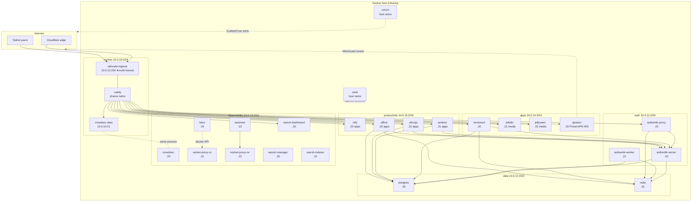
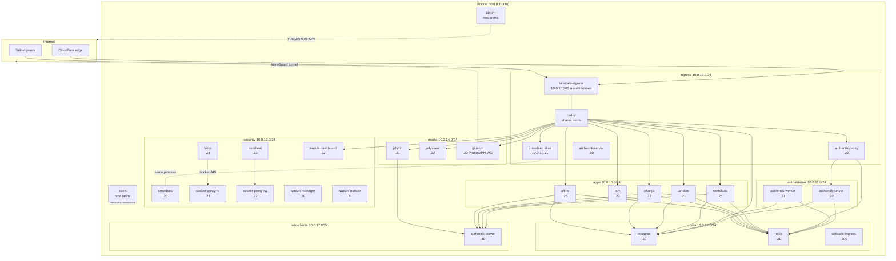

# Network Micro-Segmentation Implementation Plan

> **For agentic workers:** REQUIRED SUB-SKILL: Use superpowers:subagent-driven-development (recommended) or superpowers:executing-plans to implement this plan task-by-task. Steps use checkbox (`- [ ]`) syntax for tracking.

**Goal:** Replace the flat 7-network Docker Compose topology with 8 semantically named networks, fix two silent bugs (Caddy/Souin Redis cache and authentik-migration connectivity), and enable Redis caching for Tandoor and Vikunja.

**Architecture:** All changes are confined to `unified-stack/docker-compose.yml` (network declarations + service membership blocks), `unified-stack/.env.example` (two new Redis DB vars), and `unified-stack/README.md` (Mermaid diagram). Subnets are preserved — only network names and service memberships change, so existing static IPs remain valid. The full stack must restart atomically to adopt the renamed networks.

**Tech Stack:** Docker Compose YAML, bash (deploy verification)

---

## File Map

| File | What changes |
|------|-------------|
| `unified-stack/docker-compose.yml` | Top-level `networks:` block; service `networks:` blocks for every container; Redis env vars for tandoor and vikunja |
| `unified-stack/.env.example` | Add `REDIS_DB_TANDOOR=6` and `REDIS_DB_VIKUNJA=7` |
| `unified-stack/README.md` | Mermaid network-topology diagram + "Adding a New Service" instructions |

## Network rename map

| Old name | New name | Subnet (unchanged) |
|----------|----------|--------------------|
| `auth` | `auth-internal` | 10.0.11.0/24 |
| `observability` | `security` | 10.0.13.0/24 |
| `apps` | `media` | 10.0.14.0/24 |
| `productivity` | `apps` | 10.0.15.0/24 |
| `talk` | `cloud` | 10.0.16.0/24 |
| *(new)* | `oidc-clients` | 10.0.17.0/24 |

**Validation command** (run from repo root after each task):
```bash
docker compose -f unified-stack/docker-compose.yml config -q && echo "syntax OK"
```

---

### Task 1: Rename top-level network declarations + add `oidc-clients`

**Files:**
- Modify: `unified-stack/docker-compose.yml:52-94`

- [ ] **Step 1: Replace the entire `networks:` block at the top of the file**

Find this exact block (lines 52–94):

```yaml
networks:
  ingress:
    driver: bridge
    ipam:
      config:
        - subnet: 10.0.10.0/24
          gateway: 10.0.10.10
  auth:
    driver: bridge
    ipam:
      config:
        - subnet: 10.0.11.0/24
          gateway: 10.0.11.10
  data:
    driver: bridge
    ipam:
      config:
        - subnet: 10.0.12.0/24
          gateway: 10.0.12.10
  observability:
    driver: bridge
    ipam:
      config:
        - subnet: 10.0.13.0/24
          gateway: 10.0.13.10
  apps:
    driver: bridge
    ipam:
      config:
        - subnet: 10.0.14.0/24
          gateway: 10.0.14.10
  productivity:
    driver: bridge
    ipam:
      config:
        - subnet: 10.0.15.0/24
          gateway: 10.0.15.10
  talk:
    driver: bridge
    ipam:
      config:
        - subnet: 10.0.16.0/24
          gateway: 10.0.16.10
```

Replace with:

```yaml
networks:
  ingress:
    driver: bridge
    ipam:
      config:
        - subnet: 10.0.10.0/24
          gateway: 10.0.10.10
  auth-internal:
    driver: bridge
    ipam:
      config:
        - subnet: 10.0.11.0/24
          gateway: 10.0.11.10
  data:
    driver: bridge
    ipam:
      config:
        - subnet: 10.0.12.0/24
          gateway: 10.0.12.10
  security:
    driver: bridge
    ipam:
      config:
        - subnet: 10.0.13.0/24
          gateway: 10.0.13.10
  media:
    driver: bridge
    ipam:
      config:
        - subnet: 10.0.14.0/24
          gateway: 10.0.14.10
  apps:
    driver: bridge
    ipam:
      config:
        - subnet: 10.0.15.0/24
          gateway: 10.0.15.10
  cloud:
    driver: bridge
    ipam:
      config:
        - subnet: 10.0.16.0/24
          gateway: 10.0.16.10
  oidc-clients:
    driver: bridge
    ipam:
      config:
        - subnet: 10.0.17.0/24
          gateway: 10.0.17.10
```

- [ ] **Step 2: Validate syntax**

```bash
docker compose -f unified-stack/docker-compose.yml config -q && echo "syntax OK"
```

Expected: `syntax OK`  
If it fails: Docker will complain that service `networks:` blocks reference undefined network names — that's expected until Tasks 2–9 are complete. The command will error; fix any actual YAML syntax errors first.

> **Note:** After this step, `docker compose config` will report errors because service blocks still reference the old network names (`auth`, `observability`, `apps`, `productivity`, `talk`). This is expected and will be resolved task-by-task. Only run the validation after ALL tasks are complete.

- [ ] **Step 3: Commit**

```bash
git add unified-stack/docker-compose.yml
git commit -m "feat(networks): rename and add oidc-clients network declarations"
```

---

### Task 2: tailscale-ingress — fix memberships (remove auth, add data, rename 5 networks)

**Files:**
- Modify: `unified-stack/docker-compose.yml:130-142`

This is the most impactful service change. Caddy shares tailscale-ingress's network namespace — every network tailscale-ingress joins, Caddy can reach. Removing `auth` (→ becomes `auth-internal`) and adding `data` fixes the Souin Redis cache bug.

- [ ] **Step 1: Replace tailscale-ingress networks block**

Find (lines 130–142):

```yaml
    networks:
      ingress:
        ipv4_address: 10.0.10.200
      auth:
        ipv4_address: 10.0.11.200
      observability:
        ipv4_address: 10.0.13.200
      apps:
        ipv4_address: 10.0.14.200
      productivity:
        ipv4_address: 10.0.15.200
      talk:
        ipv4_address: 10.0.16.200
```

Replace with:

```yaml
    networks:
      ingress:
        ipv4_address: 10.0.10.200
      data:
        ipv4_address: 10.0.12.200
      security:
        ipv4_address: 10.0.13.200
      media:
        ipv4_address: 10.0.14.200
      apps:
        ipv4_address: 10.0.15.200
      cloud:
        ipv4_address: 10.0.16.200
```

- [ ] **Step 2: Commit**

```bash
git add unified-stack/docker-compose.yml
git commit -m "feat(networks): tailscale-ingress — remove auth, add data, rename networks"
```

---

### Task 3: Edge security services — `observability` → `security`

**Files:**
- Modify: `unified-stack/docker-compose.yml` (crowdsec, socket-proxy-ro, socket-proxy-rw, autoheal)

Four services in the edge/ingress zone that all rename from `observability` to `security`.

- [ ] **Step 1: crowdsec** (currently near line 251)

Find:
```yaml
    networks:
      observability:
        ipv4_address: 10.0.13.20
      ingress:
        ipv4_address: 10.0.10.21
```

Replace with:
```yaml
    networks:
      security:
        ipv4_address: 10.0.13.20
      ingress:
        ipv4_address: 10.0.10.21
```

- [ ] **Step 2: socket-proxy-ro** (currently near line 286)

Find:
```yaml
    networks:
      observability:
        ipv4_address: 10.0.13.21
```

Replace with:
```yaml
    networks:
      security:
        ipv4_address: 10.0.13.21
```

- [ ] **Step 3: socket-proxy-rw** (currently near line 323)

Find:
```yaml
    networks:
      observability:
        ipv4_address: 10.0.13.22
```

Replace with:
```yaml
    networks:
      security:
        ipv4_address: 10.0.13.22
```

- [ ] **Step 4: autoheal** (currently near line 350; uses list form, not dict)

Find:
```yaml
    networks:
      - observability
```

Replace with:
```yaml
    networks:
      - security
```

- [ ] **Step 5: Commit**

```bash
git add unified-stack/docker-compose.yml
git commit -m "feat(networks): edge security services — observability -> security"
```

---

### Task 4: Wazuh cluster + Falco suite + security tools — `observability` → `security`

**Files:**
- Modify: `unified-stack/docker-compose.yml` (11 services: wazuh-init, wazuh-indexer-1/2/3, wazuh-security-init, wazuh-manager, wazuh-dashboard, falco, falcosidekick, falcosidekick-ui, redis-falco, zeek-logs, dockhand)

All are purely mechanical `observability` → `security` renames. IPs are unchanged — the subnet (10.0.13.0/24) is preserved. Wazuh TLS certs hard-code IPs not network names, so no cert regeneration is needed.

Note: `zeek` uses `network_mode: host` and has no Docker network entry — leave it untouched.

- [ ] **Step 1: wazuh-init** (near line 577)

Find:
```yaml
    networks:
      observability:
        ipv4_address: 10.0.13.29
```
Replace with:
```yaml
    networks:
      security:
        ipv4_address: 10.0.13.29
```

- [ ] **Step 2: wazuh-indexer-1** (near line 595)

Find:
```yaml
    networks:
      observability:
        ipv4_address: 10.0.13.31
```
Replace with:
```yaml
    networks:
      security:
        ipv4_address: 10.0.13.31
```

- [ ] **Step 3: wazuh-indexer-2** (near line 611)

Find:
```yaml
    networks:
      observability:
        ipv4_address: 10.0.13.33
```
Replace with:
```yaml
    networks:
      security:
        ipv4_address: 10.0.13.33
```

- [ ] **Step 4: wazuh-indexer-3** (near line 627)

Find:
```yaml
    networks:
      observability:
        ipv4_address: 10.0.13.34
```
Replace with:
```yaml
    networks:
      security:
        ipv4_address: 10.0.13.34
```

- [ ] **Step 5: wazuh-security-init** (near line 684)

Find:
```yaml
    networks:
      observability:
        ipv4_address: 10.0.13.35
```
Replace with:
```yaml
    networks:
      security:
        ipv4_address: 10.0.13.35
```

- [ ] **Step 6: wazuh-manager** (near line 720)

Find:
```yaml
    networks:
      observability:
        ipv4_address: 10.0.13.30
```
Replace with:
```yaml
    networks:
      security:
        ipv4_address: 10.0.13.30
```

- [ ] **Step 7: wazuh-dashboard** (near line 771)

Find:
```yaml
    networks:
      observability:
        ipv4_address: 10.0.13.32
```
Replace with:
```yaml
    networks:
      security:
        ipv4_address: 10.0.13.32
```

- [ ] **Step 8: falco** (near line 807)

Find:
```yaml
    networks:
      observability:
        ipv4_address: 10.0.13.24
```
Replace with:
```yaml
    networks:
      security:
        ipv4_address: 10.0.13.24
```

- [ ] **Step 9: dockhand** (near line 1708)

Find:
```yaml
    networks:
      observability:
        ipv4_address: 10.0.13.23
```
Replace with:
```yaml
    networks:
      security:
        ipv4_address: 10.0.13.23
```

- [ ] **Step 10: falcosidekick** (near line 1738)

Find:
```yaml
    networks:
      observability:
        ipv4_address: 10.0.13.25
```
Replace with:
```yaml
    networks:
      security:
        ipv4_address: 10.0.13.25
```

- [ ] **Step 11: redis-falco** (near line 1760)

Find:
```yaml
    networks:
      observability:
        ipv4_address: 10.0.13.28
```
Replace with:
```yaml
    networks:
      security:
        ipv4_address: 10.0.13.28
```

- [ ] **Step 12: falcosidekick-ui** (near line 1787)

Find:
```yaml
    networks:
      observability:
        ipv4_address: 10.0.13.26
```
Replace with:
```yaml
    networks:
      security:
        ipv4_address: 10.0.13.26
```

- [ ] **Step 13: zeek-logs** (near line 1815)

Find:
```yaml
    networks:
      observability:
        ipv4_address: 10.0.13.27
```
Replace with:
```yaml
    networks:
      security:
        ipv4_address: 10.0.13.27
```

- [ ] **Step 14: Verify no `observability:` network keys remain**

```bash
grep -n "^\s*observability:" unified-stack/docker-compose.yml
```

Expected: no output (zero matches).

- [ ] **Step 15: Commit**

```bash
git add unified-stack/docker-compose.yml
git commit -m "feat(networks): wazuh + falco + security tools — observability -> security"
```

---

### Task 5: Authentik cluster — remap networks

**Files:**
- Modify: `unified-stack/docker-compose.yml` (authentik-migration, authentik-server, authentik-worker, authentik-proxy)

Four services with the most complex changes: new network additions, IP assignments, and removal of the `auth` membership.

- [ ] **Step 1: authentik-migration** — remove `auth`, keep `data` only (near line 877)

Find:
```yaml
    networks:
      - auth
      - data
```
Replace with:
```yaml
    networks:
      - data
```

- [ ] **Step 2: authentik-server** — rename `auth` → `auth-internal`; add `ingress` and `oidc-clients` (near line 907)

Find:
```yaml
    networks:
      auth:
        ipv4_address: 10.0.11.20
      data:
```
Replace with:
```yaml
    networks:
      auth-internal:
        ipv4_address: 10.0.11.20
      ingress:
        ipv4_address: 10.0.10.50
      data:
      oidc-clients:
        ipv4_address: 10.0.17.10
```

- [ ] **Step 3: authentik-worker** — rename `auth` → `auth-internal` (near line 944)

Find:
```yaml
    networks:
      auth:
        ipv4_address: 10.0.11.21
      data:
```
Replace with:
```yaml
    networks:
      auth-internal:
        ipv4_address: 10.0.11.21
      data:
```

- [ ] **Step 4: authentik-proxy** — leave `auth`, join `ingress` instead (near line 981)

Find:
```yaml
    networks:
      auth:
        ipv4_address: 10.0.11.22
      data:
```
Replace with:
```yaml
    networks:
      ingress:
        ipv4_address: 10.0.10.22
      data:
```

- [ ] **Step 5: Verify no `auth:` key remains (only `auth-internal:` should)**

```bash
grep -n "^\s*auth:" unified-stack/docker-compose.yml
```

Expected: no output.

- [ ] **Step 6: Commit**

```bash
git add unified-stack/docker-compose.yml
git commit -m "feat(networks): authentik cluster — auth-internal, ingress, oidc-clients"
```

---

### Task 6: Nextcloud — move from media subnet to apps subnet

**Files:**
- Modify: `unified-stack/docker-compose.yml:1041-1047`

Nextcloud is currently on the `apps` network (10.0.14.x), which is being renamed to `media`. Nextcloud is not a media service — it moves to `apps` (10.0.15.x, ex-`productivity`) at a new IP (10.0.15.26). It also joins `oidc-clients` and `cloud` (ex-`talk`).

- [ ] **Step 1: Replace nextcloud networks block**

Find (near line 1041):
```yaml
    networks:
      apps:
        ipv4_address: 10.0.14.20
      auth:
      data:
      talk:
        ipv4_address: 10.0.16.20
```
Replace with:
```yaml
    networks:
      apps:
        ipv4_address: 10.0.15.26
      cloud:
        ipv4_address: 10.0.16.20
      data:
      oidc-clients:
        ipv4_address: 10.0.17.20
```

- [ ] **Step 2: spreed-signaling** — rename `talk` → `cloud` (near line 1113)

Find:
```yaml
    networks:
      talk:
        ipv4_address: 10.0.16.30
```
Replace with:
```yaml
    networks:
      cloud:
        ipv4_address: 10.0.16.30
```

- [ ] **Step 3: janus** — rename `talk` → `cloud` (near line 1150)

Find:
```yaml
    networks:
      talk:
        ipv4_address: 10.0.16.31
```
Replace with:
```yaml
    networks:
      cloud:
        ipv4_address: 10.0.16.31
```

- [ ] **Step 4: Commit**

```bash
git add unified-stack/docker-compose.yml
git commit -m "feat(networks): nextcloud+spreed-signaling+janus — talk->cloud, nextcloud add oidc-clients"
```

---

### Task 7: Media cluster — `apps` → `media`; jellyfin gains `oidc-clients`

**Files:**
- Modify: `unified-stack/docker-compose.yml` (gluetun, jellyfin, jellyseerr)

- [ ] **Step 1: gluetun** (near line 1208)

Find:
```yaml
    networks:
      apps:
        ipv4_address: 10.0.14.30
```
Replace with:
```yaml
    networks:
      media:
        ipv4_address: 10.0.14.30
```

- [ ] **Step 2: jellyfin** — rename `apps` → `media` and add `oidc-clients` (near line 1421)

Find:
```yaml
    networks:
      apps:
        ipv4_address: 10.0.14.21
```
Replace with:
```yaml
    networks:
      media:
        ipv4_address: 10.0.14.21
      oidc-clients:
        ipv4_address: 10.0.17.25
```

- [ ] **Step 3: jellyseerr** (near line 1454)

Find:
```yaml
    networks:
      apps:
        ipv4_address: 10.0.14.22
```
Replace with:
```yaml
    networks:
      media:
        ipv4_address: 10.0.14.22
```

- [ ] **Step 4: Commit**

```bash
git add unified-stack/docker-compose.yml
git commit -m "feat(networks): media cluster — apps->media, jellyfin gains oidc-clients"
```

---

### Task 8: Apps cluster — `productivity` → `apps`; Redis env vars for tandoor + vikunja; `oidc-clients` for OIDC apps

**Files:**
- Modify: `unified-stack/docker-compose.yml` (ntfy, tandoor, vikunja, affine, immich-server, immich-machine-learning, n8n)

Seven services. ntfy, immich-ml, and n8n are mechanical renames. tandoor and vikunja also gain Redis env vars. affine, immich-server gain `oidc-clients`. Remove `auth` membership from all services that had it.

- [ ] **Step 1: ntfy** — rename `productivity` → `apps` (near line 1498)

Find:
```yaml
    networks:
      productivity:
        ipv4_address: 10.0.15.20
```
Replace with:
```yaml
    networks:
      apps:
        ipv4_address: 10.0.15.20
```

- [ ] **Step 2: tandoor** — rename `productivity` → `apps`, remove `auth`, add `oidc-clients`; add Redis env vars (near line 1531)

**Environment block** — add four vars after `SHOPPING_MIN_AUTOSYNC_INTERVAL`:

Find:
```yaml
      SHOPPING_MIN_AUTOSYNC_INTERVAL: "5"
      TZ: ${TZ}
```
Replace with:
```yaml
      SHOPPING_MIN_AUTOSYNC_INTERVAL: "5"
      TZ: ${TZ}
      REDIS_HOST: redis
      REDIS_PORT: "6379"
      REDIS_PASSWORD: ${REDIS_PASSWORD}
      REDIS_DB: ${REDIS_DB_TANDOOR}
```

**Networks block** (near line 1554):

Find:
```yaml
    networks:
      productivity:
        ipv4_address: 10.0.15.21
      auth:
      data:
```
Replace with:
```yaml
    networks:
      apps:
        ipv4_address: 10.0.15.21
      data:
      oidc-clients:
        ipv4_address: 10.0.17.23
```

- [ ] **Step 3: vikunja** — rename `productivity` → `apps`, remove `auth`, add `oidc-clients`; add Redis env vars (near line 1594)

**Environment block** — add five Redis vars after `VIKUNJA_LOG_LEVEL`:

Find:
```yaml
      VIKUNJA_LOG_LEVEL: info
      # OIDC
```
Replace with:
```yaml
      VIKUNJA_LOG_LEVEL: info
      VIKUNJA_KEYVALUE_TYPE: redis
      VIKUNJA_REDIS_HOST: redis
      VIKUNJA_REDIS_PORT: "6379"
      VIKUNJA_REDIS_PASSWORD: ${REDIS_PASSWORD}
      VIKUNJA_REDIS_DB: ${REDIS_DB_VIKUNJA}
      # OIDC
```

**Networks block** (near line 1615):

Find:
```yaml
    networks:
      productivity:
        ipv4_address: 10.0.15.22
      auth:
      data:
```
Replace with:
```yaml
    networks:
      apps:
        ipv4_address: 10.0.15.22
      data:
      oidc-clients:
        ipv4_address: 10.0.17.22
```

- [ ] **Step 4: affine** — rename `productivity` → `apps`, remove `auth`, add `oidc-clients` (near line 1670)

Find:
```yaml
    networks:
      productivity:
        ipv4_address: 10.0.15.23
      auth:
      data:
```
Replace with:
```yaml
    networks:
      apps:
        ipv4_address: 10.0.15.23
      data:
      oidc-clients:
        ipv4_address: 10.0.17.21
```

- [ ] **Step 5: immich-server** — rename `productivity` → `apps`, add `oidc-clients` (near line 1862)

Find:
```yaml
    networks:
      productivity:
        ipv4_address: 10.0.15.24
      data:
```
Replace with:
```yaml
    networks:
      apps:
        ipv4_address: 10.0.15.24
      data:
      oidc-clients:
        ipv4_address: 10.0.17.24
```

- [ ] **Step 6: immich-machine-learning** — rename `productivity` → `apps` (list form, near line 1886)

Find:
```yaml
    networks:
      - productivity
```
Replace with:
```yaml
    networks:
      - apps
```

- [ ] **Step 7: n8n** — rename `productivity` → `apps` (near line 1931)

Find:
```yaml
    networks:
      productivity:
        ipv4_address: 10.0.15.25
      data:
```
Replace with:
```yaml
    networks:
      apps:
        ipv4_address: 10.0.15.25
      data:
```

- [ ] **Step 8: Verify no old network names remain as YAML keys**

```bash
grep -n "^\s*productivity:\|^\s*auth:\s*$\|^\s*talk:" unified-stack/docker-compose.yml
```

Expected: no output.

- [ ] **Step 9: Full syntax validation**

```bash
docker compose -f unified-stack/docker-compose.yml config -q && echo "syntax OK"
```

Expected: `syntax OK` (first time this should pass cleanly since all service references are now updated).

- [ ] **Step 10: Commit**

```bash
git add unified-stack/docker-compose.yml
git commit -m "feat(networks): apps cluster — productivity->apps, oidc-clients, Redis for tandoor+vikunja"
```

---

### Task 9: `.env.example` — add Redis DB vars for Tandoor and Vikunja

**Files:**
- Modify: `unified-stack/.env.example:186`

- [ ] **Step 1: Add the two new Redis DB entries**

Find (near line 186):
```
REDIS_DB_IMMICH=4
```
Replace with:
```
REDIS_DB_IMMICH=4
REDIS_DB_TANDOOR=6
REDIS_DB_VIKUNJA=7
```

(DB 5 is already reserved for Falco/redis-falco. DB 6 and 7 are new.)

- [ ] **Step 2: Commit**

```bash
git add unified-stack/.env.example
git commit -m "feat(env): add REDIS_DB_TANDOOR=6, REDIS_DB_VIKUNJA=7"
```

---

### Task 10: README — update network topology diagram and "Adding a New Service" instructions

**Files:**
- Modify: `unified-stack/README.md:18-89` (Mermaid diagram)
- Modify: `unified-stack/README.md:548-553` ("Adding a New Service" step 3)

- [ ] **Step 1: Replace the Mermaid network topology diagram**

Find the entire block from ` ```mermaid` through the closing ` ``` ` on line ~89:

```

```

Replace with:

```

```

- [ ] **Step 2: Update "Adding a New Service" instructions**

Find (near line 548):
```
3. Add the app's service in `docker-compose.yml`. Join its own layer (create one if needed:
   `10.0.14.0/24` for media, `10.0.15.0/24` for productivity, etc.) + `data` for
   Postgres/Redis access. For native-OIDC apps also add the `auth` network so the app
   can reach `authentik-server` directly for token validation.
4. Add tailscale-ingress multi-home: add the new layer to its `networks:` list.
```
Replace with:
```
3. Add the app's service in `docker-compose.yml`. Join its own layer (create one if needed:
   `10.0.14.0/24` for media, `10.0.15.0/24` for apps, etc.) + `data` for
   Postgres/Redis access. For native-OIDC apps also add the `oidc-clients` network so the
   app can reach `authentik-server:9000` for token validation without exposing authentik-worker.
4. Add tailscale-ingress multi-home: add the new layer to its `networks:` list.
```

- [ ] **Step 3: Commit**

```bash
git add unified-stack/README.md
git commit -m "docs(readme): update network diagram + service-addition instructions for new topology"
```

---

### Task 11: Deploy to streamer + verify all services healthy

**No file changes.** This task runs the deployment and verifies the outcome.

Before running: make sure `REDIS_DB_TANDOOR` and `REDIS_DB_VIKUNJA` are set in the live `.env` on streamer. The `.env.example` was updated in Task 9 but the live file must be manually updated.

- [ ] **Step 1: Push commits to remote**

```bash
git push
```

- [ ] **Step 2: Add new env vars to live .env on streamer**

```bash
ssh rooter@streamer -i ~/.ssh/streamer \
  "grep -q REDIS_DB_TANDOOR /home/rooter/git/finnsbeincaddy/unified-stack/.env || \
   echo -e '\nREDIS_DB_TANDOOR=6\nREDIS_DB_VIKUNJA=7' >> /home/rooter/git/finnsbeincaddy/unified-stack/.env"
```

Expected: no output (vars appended or already present).

- [ ] **Step 3: Pull latest on streamer**

```bash
ssh rooter@streamer -i ~/.ssh/streamer \
  "cd /home/rooter/git/finnsbeincaddy && git pull"
```

Expected: `Already up to date.` or a list of updated files.

- [ ] **Step 4: Validate compose config on streamer**

```bash
ssh rooter@streamer -i ~/.ssh/streamer \
  "cd /home/rooter/git/finnsbeincaddy/unified-stack && docker compose config -q && echo 'syntax OK'"
```

Expected: `syntax OK`. If errors appear, fix them before proceeding.

- [ ] **Step 5: Deploy (full restart — expect 2–5 min downtime)**

```bash
ssh rooter@streamer -i ~/.ssh/streamer \
  "cd /home/rooter/git/finnsbeincaddy/unified-stack && docker compose down && docker compose up -d"
```

Expected: Docker tears down all containers and networks, recreates with new names, starts all services.

- [ ] **Step 6: Wait ~90 seconds for services to become healthy, then check**

```bash
ssh rooter@streamer -i ~/.ssh/streamer \
  "docker compose -f /home/rooter/git/finnsbeincaddy/unified-stack/docker-compose.yml ps --format 'table {{.Name}}\t{{.Status}}'"
```

Expected: all containers show `Up` or `Up (healthy)`. No `Restarting` or `Exit`.

If any container shows `Restarting`, check logs:
```bash
ssh rooter@streamer -i ~/.ssh/streamer "docker logs <container-name> --tail 30 2>&1"
```

- [ ] **Step 7: Verify Caddy can reach Redis (Souin cache fix)**

```bash
ssh rooter@streamer -i ~/.ssh/streamer \
  "docker exec caddy wget -qO- http://127.0.0.1:2019/config/ 2>&1 | head -c 200"
```

Expected: JSON config blob (Caddy admin API responding = Caddy healthy). Then check Caddy logs for Redis connection:

```bash
ssh rooter@streamer -i ~/.ssh/streamer \
  "docker logs caddy --tail 50 2>&1 | grep -i 'redis\|souin\|cache'"
```

Expected: no `connection refused` or `failed to connect` errors for Redis.

- [ ] **Step 8: Verify authentik-migration ran successfully**

```bash
ssh rooter@streamer -i ~/.ssh/streamer \
  "docker logs authentik-migration --tail 20 2>&1"
```

Expected: migration output ending with exit 0 (container will be stopped/exited since `restart: no`). No `network` or `connection` errors.

- [ ] **Step 9: Verify `oidc-clients` network exists**

```bash
ssh rooter@streamer -i ~/.ssh/streamer \
  "docker network ls | grep oidc"
```

Expected: one line showing `unified-stack_oidc-clients`.

- [ ] **Step 10: Verify old networks are gone**

```bash
ssh rooter@streamer -i ~/.ssh/streamer \
  "docker network ls | grep -E 'auth$|observability|productivity|^.*_apps|^.*_talk'"
```

Expected: no output (old bridges removed).
